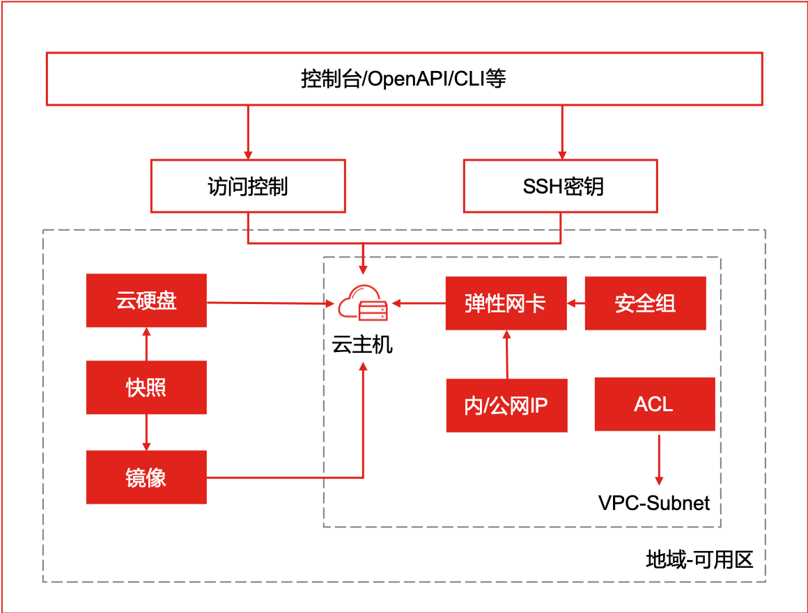

## 云主机产品介绍

&emsp;&emsp;云主机（Cloud Virtual Machines,CVM）是京东云提供的一种基础计算服务单元，提供处理能力可弹性伸缩的计算服务。云主机涉及多种概念，如下图所示，包括镜像、云硬盘、VPC/子网等，每种资源都提供多种配置选项，您可以根据实际需要进行选择。  
  
&emsp;&emsp;云主机管理方式比物理服务器更简单高效，您可根据实际需要对这些资源进行灵活的组合，您可通过控制台、OpenAPI或CLI随时创建指定数量的云主机，在使用过程中可以根据业务规模随时调整实例规格，对于过剩或闲置的资源也可以进行释放以便节约投入成本。京东云云主机为您快速部署应用提供稳定可靠的基础能力，使您更专注于核心业务创新。

### 1、地域及可用区  
&emsp;&emsp;京东云云主机机房分布在全球多个位置，这些位置称为地域。每个地域（region）都是一个独立的地理区域，每个地域都是完全独立的。 
&emsp;&emsp;京东云支持您在不同地域部署云业务，同时为了避免单地域部署可能带来的单点风险，建议在部署方案设计阶段考虑多地域多可用区部署。实例创建后，不支持更换地域或更换可用区。  
&emsp;&emsp;可用区（Availability Zone）是电力及网络之间互相独立的物理区域，相同可用区内的实例之间较之同地域不同可用区内实例之间的网络延时更小。同地域内不同可用区之间提供内网互通环境，可用区之间可做到故障隔离。
- 若您的业务要求有较高容灾能力，建议将实例部署在同一地域不同可用区内；
- 若您的业务要求有较低网络时延，建议将实例部署在同一可用区内。

### 2、京东云地域及可用区分布

<table border=1 >
 <col width=128pt>
 <col width=134pt>
 <col width=158pt>
 <col width=65pt>
 <tr>
   <td colspan=2><b>地域名称及编码</b></td>
  <td><b>可用区名称及编码</b></td>
  <td><b>所在城市</b></td>
 </tr>
 <tr >
  <td rowspan=10>中国大陆地域</td>
  <td rowspan=3>
  华北-北京 cn-north-1</td>
  <td >可用区A cn-north-1a</td>
  <td >北京</td>
 </tr>
 <tr>
  <td>可用区B cn-north-1b</td>
  <td>北京</td>
 </tr>
 <tr >
  <td>可用区C cn-north-1c</td>
  <td>北京</td>
 </tr>
 <tr>
  <td>华东-宿迁 cn-east-1</td>
  <td>可用区A cn-east-1a</td>
  <td>宿迁</td>
 </tr>
 <tr>
  <td rowspan=3>华东-上海 cn-east-2</td>
  <td>可用区A cn-east-2a</td>
  <td>上海</td>
 </tr>
 <tr>
  <td>可用区B cn-east-2b</td>
  <td>上海</td>
 </tr>
 <tr>
  <td>可用区C cn-east-2c</td>
  <td>上海</td>
 </tr>
 <tr>
  <td rowspan=3>华南-广州  cn-south-1</td>
  <td>可用区A cn-south-1a</td>
  <td>广州</td>
 </tr>
 <tr>
  <td>可用区B cn-south-1b</td>
  <td>广州</td>
 </tr>
 <tr>
  <td>可用区C cn-south-1c</td>
  <td>广州</td>
 </tr>
  
</table>
 

### 3、实例规格类型

&emsp;&emsp;实例是京东云为您业务提供计算服务的最小单位，不同实例通过其规格类型及具体规格来标识相应的计算、内存、存储及网络能力。同时，您创建实例时指定的实例类型决定了实例的硬件配置，您可基于需要部署运行的应用类型及规模选择适当的实例规格类型及具体规格。  
&emsp;&emsp;根据不同应用场景可以分为：  
- **通用型，vCPU与内存比约为1:4**  
&emsp;&emsp;适用场景包括：1）各种类型和规模的企业级应用；2）中小型数据系统、缓存、搜索集群；3）数据分析和计算；4）计算集群、依赖内存的数据处理  
- **计算优化型，vCPU与内存比约为1:2**  
&emsp;&emsp;适用场景包括：1）小规模机器学习、数据分析；2）小规模爬虫；3）小规模批量计算  
- **内存优化型，vCPU与内存比约为1:8**  
&emsp;&emsp;适用场景包括：1）高性能数据库、内存数据库；2）数据分析与挖掘、分布式内存缓存；3）Hadoop、Spark群集以及其他企业大内存需求应用  

&emsp;&emsp;更详细的分类，请参考云主机产品资料中，关于实例规格类型的描述，https://docs.jdcloud.com/cn/virtual-machines/instance-type-family
