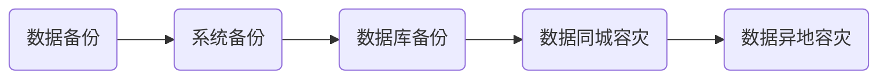

## 中小企业数据备份/容灾
企业在选择备份/容灾解决方案时，首先要确定的是：企业对系统和数据安全要求的级别是什么？有两个指标可以衡量，RTO和RPO，其中：
- RTO（Recovery Time Objective），是指灾难发生后，从IT系统当机导致业务停顿之时开始，到IT系统恢复至可以支持各部门运作、恢复运营之时，此两点之间的时间段称为RTO。
- RPO（Recovery Point Objective），是指从系统和应用数据而言，要实现能够恢复至可以支持各部门业务运作，系统及生产数据应恢复到怎样的更新程度。这种更新程度可以是上一周的备份数据，也可以是上一次交易的实时数据。

可以看出来，RTO和RPO服务于不同的目标，RTO涉及应用程序和系统，但主要描述应用程序停机时间的限制。RPO主要与失败事件后丢失的数据量有关。

对于企业来说，最理想的状态是，RTO=0，RPO=0，但要实现这个目标，需要复杂的底层技术支持，包括存储虚拟化、重复数据删除、存储卷的快照和复制，以及低延迟/高带宽的网络支持。商业化的软件公司，如veritas、emc、veeam等，基于自身的技术领先优势，提供了一体化的备份管理软件/存储设备方案，但成本高昂，客户不仅需要支付一次性的软件/硬件采购费用，还需要每年缴纳固定比例的技术服务费，并且每隔3～5年就面临着设备的更新换代和软件大版本的升级，基本等同于一次全新的采购。

综合以上情况，企业需要制定合理的RTO和RPO目标，以实现备份/容灾需求和成本支出的平衡，按照技术实现难度（从低到高）和成本（从小到大）排序，可选的备份方案有：

### 一、数据备份（文件备份）
商业化的软件公司，提供了集中化的备份管理平台，可以实现同时管理多个业务系统和集中的备份任务管理。操作简单，但成本较高。
对于中小企业来说，核心的业务系统和数据量有限，可以考虑使用操作系统自带或开源的备份工具，需要用户进行一些手工操作，成本可控。京东云可配合提供多种类型的存储，在保证数据高可用的同时，提供更低成本的存储空间。

windows server 2008及以上环境

1、使用开源的Rclone工具，将对象存储oss挂载为windows下的一个虚拟磁盘。

2、使用windows server 2008自带的windows server backup工具，它可以帮助你备份整个Windows Server、选定的卷、系统状态、特定文件或文件夹，或创建裸机备份以进行裸机恢复。除此之外，你还可以还原系统状态、卷、文件或文件夹以及某些软件。

https://www.abackup.com/easybackup-tutorials/windows-server-file-backup-631.html

缺点：新的备份，会覆盖前一个备份。

linux环境

1、使用开源的s3fs工具，将对象存储oss挂载为linux下的一个虚拟磁盘。

https://docs.jdcloud.com/cn/object-storage-service/s3fs

2、使用dump和restore工具，实现卷的备份

https://blog.csdn.net/gushendezhufu/article/details/126247714

