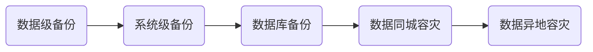

## 中小企业数据备份/容灾
企业在选择备份/容灾解决方案时，首先要确定的是，**企业对系统和数据安全要求的级别是什么？**

有两个指标可以衡量，RTO和RPO，其中：
- **RTO（Recovery Time Objective）**，是指灾难发生后，从IT系统当机导致业务停顿之时开始，到IT系统恢复至可以支持各部门运作、恢复运营之时，此两点之间的时间段称为RTO。
- **RPO（Recovery Point Objective）**，是指从系统和应用数据而言，要实现能够恢复至可以支持各部门业务运作，系统及生产数据应恢复到怎样的更新程度。这种更新程度可以是上一周的备份数据，也可以是上一次交易的实时数据。

从这两个指标的定义可以看出来，RTO和RPO服务于不同的目标，RTO涉及应用程序和系统，但主要描述应用程序停机时间的限制。RPO主要与失败事件后丢失的数据量有关。

对于企业用户来说，从业务连续性角度考虑，最理想的状态是：**同时满足RTO=0和RPO=0**。为了实现这个目标，需要复杂的底层技术支持，包括存储虚拟化、重复数据删除、存储卷的快照和复制，以及低延迟/高带宽的网络环境。

商业化的软件公司，如veritas、emc、veeam等，基于自身的技术领先优势，提供了一体化的备份管理软件/存储设备方案，但综合使用成本高昂，包括：
- 客户不仅需要支付一次性的软件/硬件采购费用 
- 还需要每年缴纳固定比例的技术服务费，一般为采购价格的15%
- 并且每隔3到5年，就面临着设备的更新换代和软件大版本的升级，基本等同于一次全新的采购。

综合以上情况，企业需要制定合理的RTO和RPO目标，以实现备份/容灾需求和成本支出的平衡，按照技术实现难度（从低到高）和成本（从小到大）排序，可选的备份方案有：

京东云基于底层云计算平台的容错设计，可以帮助客户实现从简单的“**数据备份**”到复杂的”**同城/异地容灾架构**“，并且客户只需要为存储容量付费。涉及产品和功能包括，云主机镜像、云硬盘快照、对象存储、数据库DBS、跨Region的数据同步。
### 一、数据级备份（文件备份）
商业化的软件公司，提供了集中化的备份管理平台，可以实现同时管理多个业务系统和集中的备份任务管理。操作简单，但成本较高。
对于中小企业来说，核心的业务系统和数据量有限，可以考虑使用操作系统自带或开源的备份工具，需要用户进行一些手工操作，成本可控。京东云可配合提供多种类型的存储，在保证数据高可用的同时，提供更低成本的存储空间。

**1.1 windows操作系统（windows server 2008及以上）**

1、使用开源的Rclone工具，将对象存储oss挂载为windows下的一个虚拟磁盘。

2、使用windows server 2008自带的windows server backup工具，它可以帮助你备份整个Windows Server、选定的卷、系统状态、特定文件或文件夹，或创建裸机备份以进行裸机恢复。除此之外，你还可以还原系统状态、卷、文件或文件夹以及某些软件。

https://www.abackup.com/easybackup-tutorials/windows-server-file-backup-631.html

缺点：新的备份，会覆盖前一个备份。

**1.2 linux操作系统**

1、使用开源的s3fs工具，将对象存储oss挂载为linux下的一个虚拟磁盘。

https://docs.jdcloud.com/cn/object-storage-service/s3fs

2、使用dump和restore工具，实现卷的备份

https://blog.csdn.net/gushendezhufu/article/details/126247714

### 二、系统级备份（系统镜像/快照）
京东云提供系统镜像和云硬盘快照的功能，可以方便、快捷的对数据进行全量和增量备份，可以防止系统出现操作失误或者系统故障导致的数据丢失，如操作系统补丁、应用程序版本更新、病毒/勒索软件攻击、运维人员误操作等。

系统镜像和快照，属于磁盘层面的复制技术，不需要区分云主机的操作系统类型：

**1、云主机镜像**

通过对实例制作镜像或从外部环境导入均可获得私有镜像，用户对私有镜像拥有绝对的使用和管理权限，可以将其复制到其他地域、共享给其他用户、导出京东云或进行删除，京东云早期提供的本地系统盘镜像，可以通过镜像类型转换功能生成云盘系统盘镜像继续使用。
 

**2、云硬盘快照**

云硬盘快照用于对云硬盘上的数据进行备份，以便恢复云硬盘上的数据或者批量复制云硬盘。云硬盘快照上的数据记录了开始制作云硬盘的时刻云硬盘上的所有数据。
 

**注：制作云硬盘快照时，首次快照将备份全量数据，后续每次备份均为增量备份。**

### 三、数据库备份
1、针对客户自建数据库系统的场景，使用数据库备份DBS产品，提供物理备份和逻辑备份两种模式。可以实时备份数据到云端或异地机房，为数据库提供持续性、低成本的数据保护，帮助企业快速构建数据库备份中心，满足业务和监管备份合规性要求。

https://docs.jdcloud.com/cn/dbs/product-overview

2、如果使用了京东云的RDS数据库实例，产品默认提供了数据库备份/恢复管理的功能，可以手工执行备份，也可以创建定时备份任务。

https://docs.jdcloud.com/cn/rds/snapshot-backup

3、对于有自己的数据库备份脚本，可以定期生成备份文件的客户，可以使用京东云对象存储oss产品，在备份脚本中增加上传到京东云对象存储空间的功能即可。

https://docs.jdcloud.com/cn/object-storage-service/manage-oss-with-s3browser

### 四、数据同城容灾
1、云主机镜像和运硬盘快照，支持跨AZ的数据共享，可以实现同城容灾的能力。用户只需要为快照产生的对象存储空间付费，不需要为容灾架构付费。

https://docs.jdcloud.com/cn/virtual-machines/backup-and-restore

2）使用RDS数据库的备份功能，备份文件存放在对象存储中，文件在同一个Region内可见，可以实现同城的数据容灾能力。
https://docs.jdcloud.com/cn/rds/sqlserver-create-from-backup

### 五、数据异地容灾
京东云的对象存储产品，支持跨Region的数据同步和增量复制能力，可以实现异地数据容灾。

1、可以在对象存储产品的管理界面，针对存放文件的Bucket设置异地数据同步的任务，不限制产品。

https://docs.jdcloud.com/cn/object-storage-service/set-bucket-cross-region-replication-2

2、对于核心的RDS数据库产品，将跨Region的备份操作集成在了数据库管理页面，一键开启数据库的异地数据容灾能力。

https://docs.jdcloud.com/cn/rds/create-cross-region-synchronization-service
