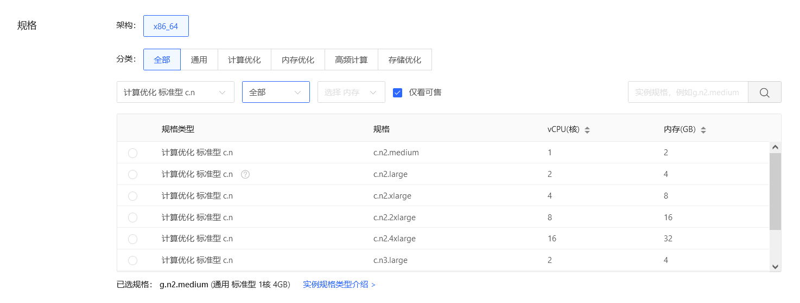
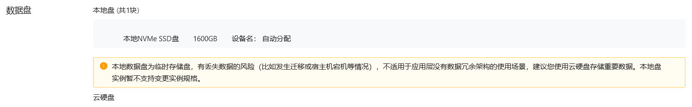
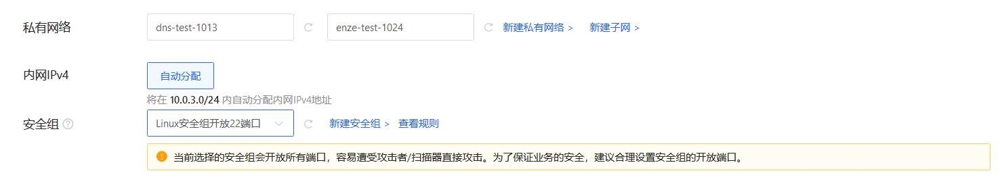
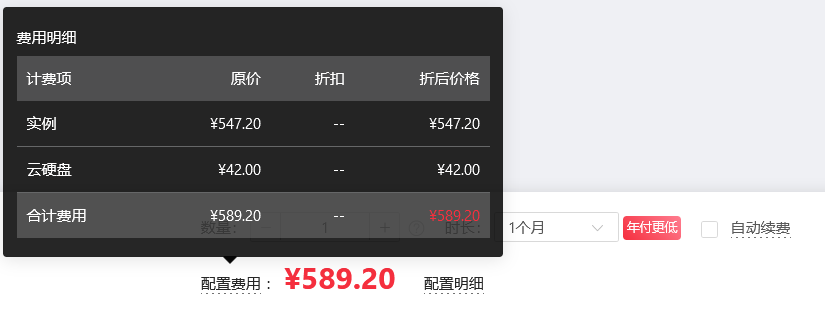

# 创建Windoews实例
## 操作入口
- 直接访问[实例控制台](https://coccns-console.jdcloud.com/host/compute/list)，进入合作云主机实例列表页面，点击创建。
- 访问[京东云控制台](https://console.jdcloud.com)点击左侧导航栏【弹性计算】-【云主机】-【实例】进入实例列表页。点击[更多地域]跳转合作云主机列表页，选中地域后点击创建。
## 操作步骤
步骤1：基础配置
- 基础配置包括计费模式、地域和可用区、实例规格、镜像、存储。

步骤2：网络配置
- 网络配置包括云主机私有网络、子网、IP地址选择，以及根据是否需要访问公网为云主机绑定弹性公网IP。

步骤3：系统配置
- 系统配置包括登录信息、主机名称。

### 步骤1：基础配置
1. 选择计费模式：
 * 包年包月和按配置计费，包年包月为预付费模式，按一个整月进行购买付费；按配置计费为后付费模式，按照实际使用的时长（精确至秒）每小时进行扣费。目前仅支持包年包月的计费模式，请参见[计费规则](../Pricing/Billing-Rules.md)。
2. 选择地域与可用区：
 * 在此步骤可以选择实例对应的地域（中国-香港11、亚太-曼谷11、亚太-新加坡11）及可用区，请注意“不同地域资源内网不互通，创建之后不可更改”，如果所选地域限额已满，可以通过[提交工单](https://ticket.jdcloud.com/myorder/submit)提升限额。

3. 选择实例规格：
 * 实例规格列表展示了实例规格对应的配置信息，包含CPU核数、内存以及价格信息。用户可以根据不同业务场景选择实例规格及相应配置，详情请参见[实例规格](../Introduction/Instance-Type-Family.md)。

4. 选择镜像：
- 提供以下镜像类型：**官方镜像**、**私有镜像**两类镜像，详细区分请参见[镜像概述](../Operation-Guide/Image/Image-Overview.md)。
 * 对于初次使用京东云的用户可以选择京东云提供的“官方镜像”，您可以根据需要选择对应的系统，并选择合适的版本。
 * 如果您已经创建好自己的实例，并配置好相应的环境，可以将此实例进行制作私有镜像操作，同时基于此镜像批量创建有相同系统及环境配置的主机。

5. 配置实例存储：
- 系统盘
  - 仅支持使用云硬盘系统盘，可选第二代通用型SSD云盘、性能型SSD云盘及增强型SSD云盘，容量范围40GB~500GB。设备名默认/dev/vda。         
- 数据盘
  - 数据盘分为本地数据盘和云盘数据盘。
  - 仅存储优化型实例规格自带本地数据盘，数量和容量由具体实例规格决定。本地数据盘为临时存储盘，有丢失数据的风险（比如发生迁移或宿主机宕机等情况），不适用于应用层没有数据冗余架构的使用场景。
  - 云盘数据盘默认不挂载，最多支持挂载7块云硬盘作数据盘。可选第二代通用型SSD云盘、性能型SSD云盘及增强型SSD云盘，容量范围20GB-32000GB。数据盘挂载到云主机后，需要进入云主机操作系统挂载。 
。
  * 云硬盘费用与实例独立，具体价格信息请查阅[云硬盘价格](http://docs.jdcloud.com/cn/cloud-disk-service/billing-rules)。
### 步骤2：网络配置
1. 配置实例网络：  
  * 选择私有网络及子网：您须先行创建VPC及子网。选择子网后，系统会判断该子网下可以创建的云主机数量，如果暂时没有子网，可以通过快速入口新建子网。详细请参见[私有网络](http://docs.jdcloud.com/cn/virtual-private-cloud/product-overview)和[子网](http://docs.jdcloud.com/cn/virtual-private-cloud/subnet-features)。
  * 内网IP分配方式：“自动分配”
  * 选择安全组：实例在创建时必须绑定一个安全组，若当前地域下未创建自定义安全组，可以在系统创建的三个默认安全组中选择一个绑定（每个私有网络创建成功之后都会自动创建三个默认安全组），也可以通过快速入口前往安全组页面[创建安全组](http://docs.jdcloud.com/cn/virtual-private-cloud/security-group-configuration)。由于官方镜像系统内防火墙默认关闭，建议绑定仅开放22端口（Linux）或3389端口（Windows）的安全组，实例创建之后再根据访问需求创建新的安全组并绑定。  
   
2. 配置公网带宽：
- 若您的合作云主机需公网访问能力，则须为合作云主机分配公网IP。
  * 带宽计费方式：固定带宽。按固定带宽计费指的是按照购买时设置的带宽上限值付费，而与实际访问公网所用带宽无关。
  * 线路：基于BGP协议三线接入，动态路由，访问稳定。               
  * 带宽范围：1Mbps~200Mbps。
- 在创建主机过程中可以暂不购买公网IP，完成主机创建后，再进行绑定。弹性公网IP带宽费用与实例费用独立。具体价格信息请查阅[弹性公网IP价格](../../../Networking/Elastic-IP/Pricing/Price-Overview.md)。      
  
### 步骤3：系统配置
1. 设置登录信息：
 - 合作云主机 
 - Windows系统的云主机，仅支持密码登录。可以选择“自定义”设置密码，也可以选择“自动生成”（系统将自动生成随机密码，并以短信和邮件发送给您）。   
  
2. 设置实例名称
  * 实例名称：您需要设置创建的云主机名称，1~64字符，可以包含中文、数字、大小写字母、英文下划线“_”、中划线“-”或点“.”，不能以“.”作为首尾。 
  
### 确认购买信息
1. 确认云主机数量及购买时长：
  * 购买数量受限该地域您云主机、云硬盘、公网IP限额以及所选子网剩余IP数量，若限额不够，可通过[提交工单](https://ticket.jdcloud.com/myorder/submit)提升限额。
  * 若购买包年包月实例，则需要设置购买时长，最短为1个月，最长为3年，购买时长超过1年有较大优惠。若需要更长服务时长请[提交工单](https://ticket.jdcloud.com/myorder/submit)。
  * 若您账户金额充足，可以在到期前按购买时长自动续费，资源创建后，自动续费属性和时长均可修改。
2. 确认配置费用和配置明细：
  
### 下单购买
- 点击立即购买跳转订单确认页，完成付款后即可创建云主机。
  

## 相关参考

[地域与可用区](../Introduction/Regions-and-AvailabilityZones.md)

[计费规则](../Pricing/Billing-Rules.md)

[合作镜像概述](../Operation-Guide/Image/Image-Overview.md)

[实例规格](../Introduction/Instance-Type-Family.md)

