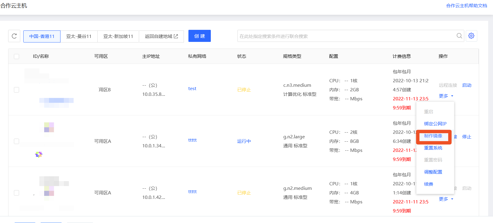
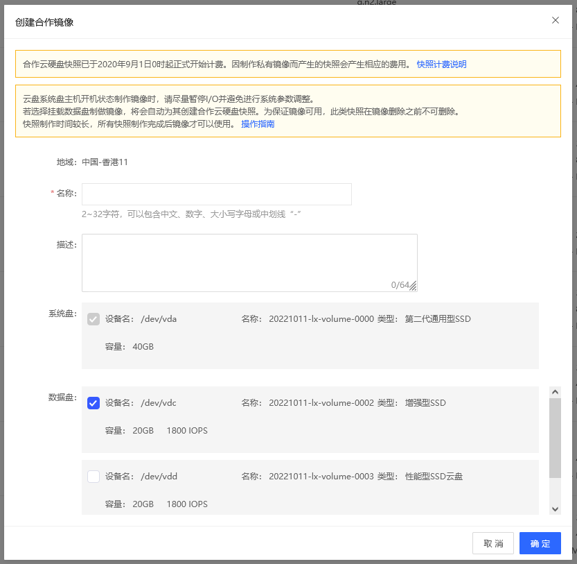
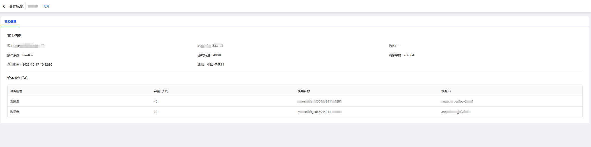

# 基于实例创建合作私有镜像
实例创建后，可定期或在实例系统环境或软件更新后通过制作私有镜像来为实例数据进行备份，私有镜像可用于批量部署或系统异常时的备份恢复。

## 前提条件及限制
* 云盘系统盘实例，支持 **运行中** 和 **已停止** 状态下制作私有镜像；
* 若实例系统盘为云硬盘或实例挂载了数据盘，则除私有镜像配额外，还需要占用云硬盘快照配额，因此请在操作前确保镜像和云硬盘快照配额充足；
* 单地域私有镜像配额为10，如需创建更多请提交工单提升配额。

## 操作影响
* 制作镜像耗时取决于磁盘数据容量，磁盘容量较大时制作时间可能较长，请耐心等待。
* 如镜像制作失败，状态会变更为 **错误**，错误状态下的镜像会自动删除创建过程中创建的云硬盘快照，且不占用镜像和快照的配额，请确认后删除即可。

## 操作步骤
1. 访问[实例控制台](https://coccns-console.jdcloud.com/host/compute/list)，进入合作云主机实例列表页面。或访问[京东云控制台](https://console.jdcloud.com)点击左侧导航栏【弹性计算】-【云主机】-【实例】进入实例列表页。点击[更多地域]跳转合作云主机实例列表页。
2. 选择要创建私有镜像的实例，点击 **更多-制作镜像**。
 
4. 在创建镜像的弹窗中，完成对私有镜像“名称”、“描述”的补充，点击 **确定**，开始私有镜像创建。
 
4. 除系统盘外，可以选择一同备份实例当前挂载的云硬盘数据盘（本地数据盘不支持快照功能），数据盘将以快照的形式与系统盘镜像进行关联，并显示在私有镜像详情页中的“设备映射信息”中，作为后续使用该私有镜像创建实例时数据盘的预设配置，方便快速整机部署。如果您希望对数据盘的容量进行修改可在基于该镜像创建主机时调整。
5. 制作整机镜像耗时较长，为避免制作失败，请在制作过程中不要对实例和云硬盘进行其他操作。

