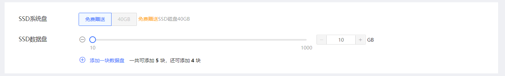
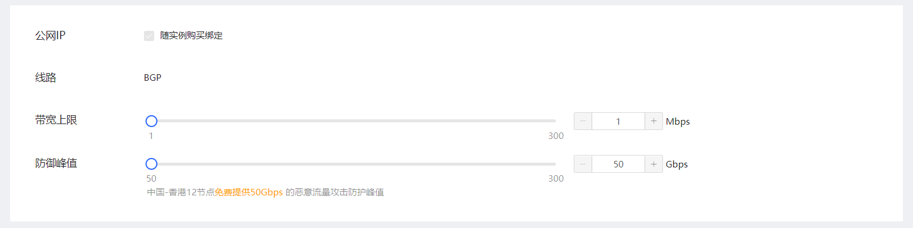

# 创建实例
## 操作入口
- 1·登录京东云官网。选择产品-供应链-伙伴云主机，点击立即购买进入伙伴云主机购买页面。
- 2.访问[实例控制台](https://cnsx-console.jdcloud.com/compute/vm/list)，或访问[京东云控制台](https://console.jdcloud.com)点击左侧导航栏【供应链】-【伙伴云主机】-【实例】进入实例列表页。点击【创建】按钮，进入伙伴云主机购买页面。建议您根据业务情况选择实例所在地域。
## 配置项
1. 选择计费模式：
 * 目前仅支持包年包月，包年包月为预付费模式，按一个整月进行购买付费。
2. 选择地域与可用区：
 * 在此步骤可以选择实例对应的地域（中国-香港12）及可用区，请注意“不同地域资源内网不互通，创建之后不可更改”，如果所选地域限额已满，可以通过[提交工单](https://ticket.jdcloud.com/myorder/submit)提升限额。
3. 选择CPU：
 * 可选1~16C（分别为1核、2核、4核、8核、16核）
4. 选择内存：
 * 与CPU联动，CPU与内存比为1:1、1:2、1:4或1:8（分别为1G、2G、4G、8G、16G、32G、64G）
5. 选择镜像：
 * 京东云提供“官方镜像”，您可以根据需要选择对应的系统，并选择合适的版本。
6. 设置登录信息：
 * 当前仅支持密码登录，可以选择“自定义”设置密码，也可以选择“自动生成”（系统将自动生成随机密码，并以短信和邮件发送给您），密码除了用于SSH登录实例时的密码，也是控制台通过VNC登录实例的密码。 

7. SSD系统盘
  - SSD硬盘，固定40GB大小（中国-香港12节点免费赠送）。设备名默认/dev/vda。         
8. SSD数据盘
  - SSD硬盘，可添加1-5块，单块盘容量范围为10GB~1000GB。数据盘挂载到云主机后，需要进入云主机操作系统挂载。 
  

9. 公网IP：
 * 购买伙伴云主机需同步绑定公网IP。
10. 线路：
 * 基于BGP协议三线接入，动态路由，访问稳定。               
11. 设置带宽上限： 
 * 带宽范围：1Mbps~200Mbps；带宽为按照购买时设置的带宽上限值付费，而与实际访问公网所用带宽无关。（当购买带宽 ＜10M 时，默认带宽下行速度为10M，上行速度为购买带宽，购买带宽≥10M以上时，网络上下行一致）
12. 设置防御峰值：
 * 防御范围：50~300Gbps；为恶意流量攻击防护的峰值（中国-香港12节点免费提供50Gbps）
  

13. 设置实例名称：
  * 您需要设置创建的伙伴云主机名称，名称不可为空，只支持中文、数字、大小写字母、英文下划线“ _ ”、中划线“ - ”及点“.”，且不能以“.”作为结尾，且不能超过128字符。批量创建多台云主机时，可在非首位位置添加[start_number]来设置有序名称。具体操作可查阅[设置有序名称或主机名称](https://docs.jdcloud.com/cn/virtual-machines/set-ordered-name)。
14. 描述：
  * 选填，256字符以内。
  

## 下单购买
  - 点击立即购买跳转订单确认页，完成付款后即可创建伙伴云主机。

