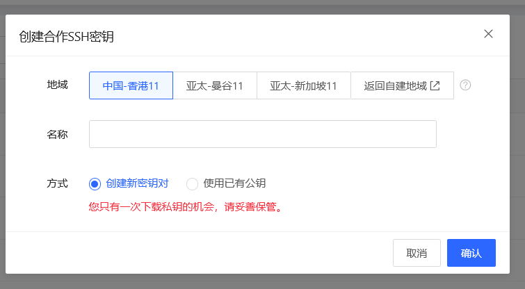
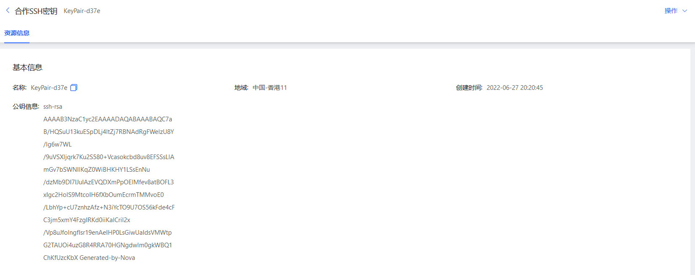

# 创建合作SSH密钥

您可将本地使用的密钥公钥导入至平台后使用，或由系统生成一个密钥对。密钥创建后可以在实例创建时选择使用。

## 前提条件及限制

* 单地域密钥上限为20，如需创建更多请提交工单提升配额。

## 操作步骤
1. 访问 [京东云控制台]，点击顶部导航栏**弹性计算-合作云主机-合作SSH密钥**进入密钥列表页。
2. 选择要使用密钥的地域， 点击**创建**。
3. 在弹窗中填写密钥名称，须保证名称在当前地域下唯一。
4. 选择密钥创建方式： 
   * 创建新密钥对：系统会自动为您创建一个密钥对，并保存公钥，私钥会自动下载至本地由您自行保管，需注意的是，私钥只有一次下载机会且京东云不会留存，请妥善保存。
   * 使用已有公钥：将您本地的公钥文件上传到京东云，以此种方式创建时请确保您本地保存有与公钥配对的私钥。
   
5. 创建成功后，可以在密钥的详情页内查看公钥信息。
 
