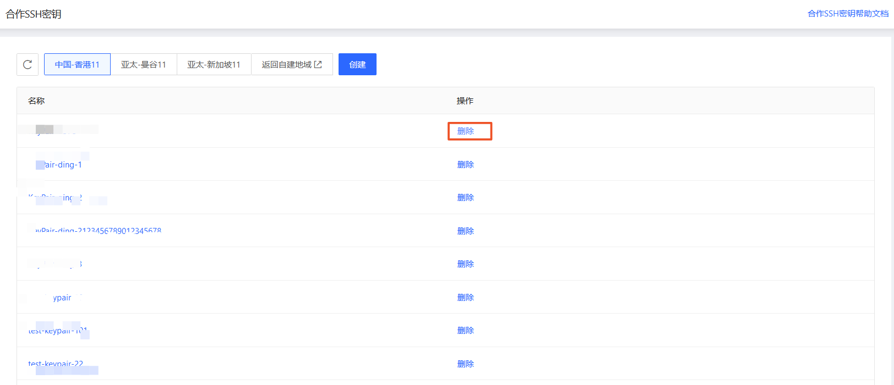

# 删除合作SSH密钥

已创建的合作SSH密钥如不再使用支持进行删除。

## 操作步骤

1. 访问 [合作SSH密钥控制台][1]，或访问 [京东云控制台][2] 点击顶部导航栏 **弹性计算-合作云主机-合作SSH密钥** 进入密钥列表页。

2. 选择地域后找到需要删除的密钥，点击操作中的 **删除**。

3. 在确认弹窗中，点击 **确认**，即可删除密钥。

[1]:https://coccns-console.jdcloud.com/service/ssh/list
[2]:https://console.jdcloud.com
