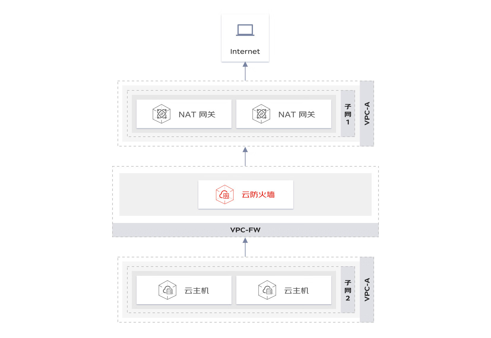
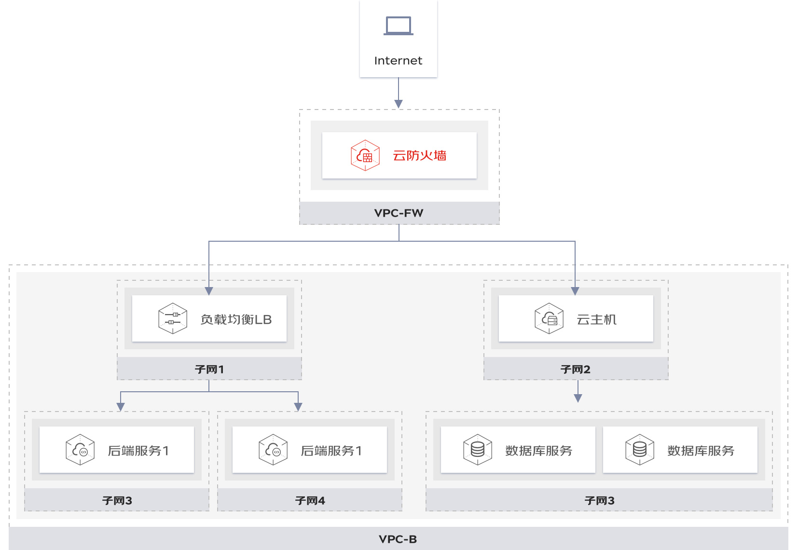
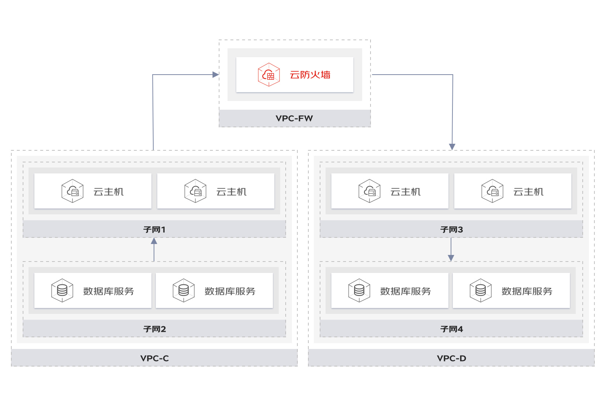

# 应用场景
​		京东云防火墙产品，针对用户上云经常遇到安全问题，提供了三种典型使用场景。

#### 南北向边界访问控制

​		针对用户对外访问互联网的连接进行边界访问控制，提供VPC内资产对公网访问的行为梳理与策略管控。能够从容应对云上资产对外暴露所面临的安全问题，有效防范云上公网资产暴露风险隐患，帮助用户全面梳理外到内，内到外的访问策略。

#### 南北向威胁攻击拦截

​		针对用户云上建站等对外提供服务的场景，云防火墙可对任何可疑的入侵行为和潜在的威胁提供告警，帮助用户精准识别和拦截所有攻击和威胁。能够快速发现恶意威胁，扩大威胁和攻击流量的拦截面，检测更多的入侵行为和潜在威胁。记录互联网流量会话日志，有效溯源安全威胁。

#### 东西向安全隔离防护（预计2023年H1上线，敬请期待）

​		针对用户不同VPC间存在隔离管控的需要，通过将云防火墙部署在多个VPC之间，实现VPC间的隔离管控与横向攻击防护。能够解决VPC间的管控与防护，可以帮助用户检测和管控多个VPC间的通信流量

