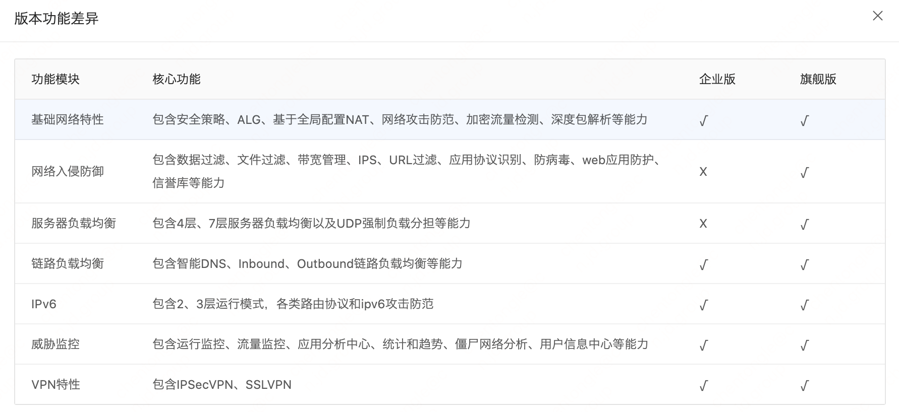
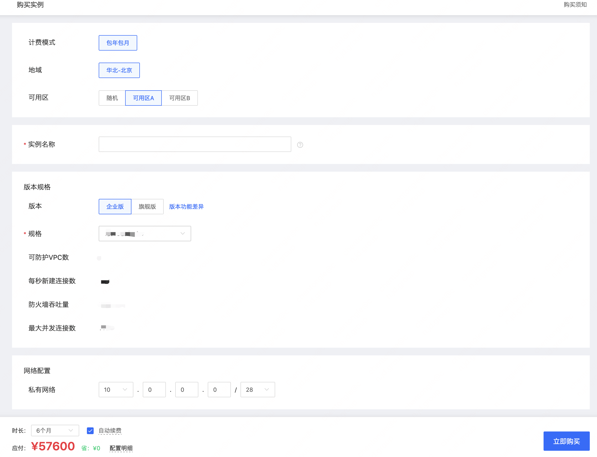

# 创建云防火墙
​		以下为京东云防火墙产品创建、选配、下单流程。

### 创建

​		针对用户对外访问互联网的连接进行边界访问控制，提供VPC内资产对公网访问的行为梳理与策略管控。能够从容应对云上资产对外暴露所面临的安全问题，有效防范云上公网资产暴露风险隐患，帮助用户全面梳理外到内，内到外的访问策略。

### 选择版本规格

​		云防火墙目前为用户提供两种可供选择的版本形态，企业版、旗舰版。

#### 云防火墙企业版

​		云防火墙企业版主要适用于中小企业统一互联网出入管控与东西向流量管控，

##### 		访问精细控制

​				集中配置管理互联网到业务（南北向）和业务与业务之间（东西向）的访问控制策略

##### 		网络攻击防范

​				针对各类网络攻击行为进行有效防范

##### 		等保合规必备

​			满足等保2.0网络边界安全防控要求

#### 云防火墙旗舰版

​		云防火墙旗舰版主要适用于大型企业统一策略配置、应用攻击拦截与协议识别以及上网行为管理。

##### 		应用攻击拦截

​				基于预置模板与自定义IPS策略，灵活选择IPS工作模式，进行网络应用层攻击防御

##### 		上网行为管理

​				针对触发行为严格管理，数据过滤、文件过滤、URL过滤与带宽管理，支持应用协议识别解析（端口、内容特征、应用组、网卡的应用统计）

#### 版本功能差异

| 功能模块     | 核心功能           | 企业版 | 旗舰版 | 备注                                                         |
| ------------ | ------------------ | ------ | ------ | ------------------------------------------------------------ |
| 基础网络特性 | 安全策略           | √      | √      | 包含安全域、ipv4/ipv6安全策略、安全策略匹配条件、操作和动作 智能策略管理、安全策略策略组、策略导入/导出、统计和日志 |
| 基础网络特性 | ALG                | √      | √      | 包含NAT44支持ALG协议、NAT64支持ALG协议、NAT64支持ALG协议     |
| 基础网络特性 | 基于全局配置NAT    | √      | √      | 包含源地址转换、目的地址转换、双向转换、NAT静态映射、NAT64策略 NAT66策略、不做转换、命中统计、DNS  mapping、支持NAT日志 |
| 基础网络特性 | 网络攻击防范       | √      | √      | 包含畸形包（单包）攻击、DDOS支持协议、DDOS阈值自动学习、客户端验证功能 SCAN扫描攻击、例外列表、黑名单、连接数限制、反向路径检查（URPF）、风险分析 |
| 基础网络特性 | 加密流量检测       | √      | √      | 包含针对SSL加密流量监测、部署模式、ipv6                      |
| 基础网络特性 | 深度包解析         | √      | √      | 包含定长扫描、隧道报文检测、DPI  bypass、ipv6、HTTPS解析     |
| 网络入侵防御 | 数据过滤、文件过滤 | X      | √      | 包含基于HTTP、FTP、SMTP/POP3/IMAP等协议的文件过滤            |
| 网络入侵防御 | 带宽管理           | X      | √      | 包含带宽通道、带宽策略、接口带宽限制、报表等                 |
| 网络入侵防御 | IPS                | X      | √      | 包含IPS策略、IPS工作模式、IPS特征、IPS特征动作、IPS白名单、报表等 |
| 网络入侵防御 | URL过滤            | X      | √      | 包含基于URL分类过滤、白名单模式、告警信息模板、HTTPS流量过滤功能 内嵌白名单、URL模糊匹配、URL分类查询、动作 |
| 网络入侵防御 | 应用协议识别       | X      | √      | 包含APR特征库、基于端口的应用层协议识别（PBAR） 基于内容特征的应用层协议识别（NBAR） 支持应用组、支持基于接口的应用统计 |
| 网络入侵防御 | 防病毒             | X      | √      | 包含支持协议、基于流特征的病毒检测、文件病毒检测、云端联动、病毒告警 应用/病毒/MD5例外、特征库手动、自动升级、检测率与检测性能调整 解压参数设置、病毒日志记录、病毒统计报表等 |
| 网络入侵防御 | web应用防护        | X      | √      | 包含web应用防护特征库、web应用攻击分类/保护对象、自定义特征、CC攻击防护 SQL语句分析检测、Web应用防护白名单、WAF日志展示HTTP报文详情 |
| 网络入侵防御 | 信誉库             | X      | √      | 包含信誉特征库、信誉库类型、统计和动作                       |
| 负载均衡     | 服务器负载均衡     | X      | √      | 包含健康检查算法、调度算法、持续性、4层服务器负载均衡、UDP强制负载分担 7层服务器负载均衡、HTTP  Proxy、TCP连接复用、SSL  卸载、HTTPS代理 服务器连接数限制、服务器连接速率限制、带宽限制、基于用户的连接数限制 主备实服务器组、支持VPN、NAT64、ALG、中间件、应用优化、license控制 支持irule脚本、支持ipolicy、支持基于应用模板的部署、SLB  VIP安全防护、IPv6服务器负载均衡 |
| 负载均衡     | 链路负载均衡       | √      | √      | 包含调度算法、链路故障处理方式、智能DNS（inbound链路负载均衡） outbound链路负载均衡、DNS透明代理等 |
| 高可靠       | 双机热备           | √      | √      | 需要选择购买两台云防火墙，单机版无该功能 2023年H1上线该功能，敬请期待 |
| 高级隔离管控 | 主动防御           | √      | √      | 包含并发连接数限制、新建速率限制、自动加入黑名单、IP新建速率限速、服务器外联防护 |
| IPv6         | IPv6               | √      | √      |                                                              |
| 威胁监控     | 运行监控           | √      | √      | 包含设备状态监控、系统日志监控、系统流量监控、系统并发会话监控 系统新建会话监控、接口信息、license信息、上网行为监控、系统信息 |
| 威胁监控     | 流量监控           | √      | √      | 包含实时用户排行、实时应用排行，威胁监控（安全状态监控、风险主机TOP10） |
| 威胁监控     | 应用分析中心       | √      | √      | 包含支持应用分析、用户分析、源地址分析、目的地址分析、安全策略分析 源安全域分析、目的安全域分析、威胁分析 |
| 威胁监控     | 统计和趋势         | √      | √      | 包含流量统计、威胁统计、安全策略统计、URL过滤统计、文件过滤统计 服务器负载均衡统计、出链路负载均衡统计、DNS透明代理统计、新建连接速率排行 |
| 威胁监控     | 僵尸网络分析       | √      | √      | 包含僵尸网络相关的安全日志进行综合分析                       |
| 威胁监控     | 用户信息中心       | √      | √      | 包含查看用户的上网行为、支持整体/单个用户上网信息展示        |
| VPN特性      | VPN协议            | √      | √      | 包含L2TP VPN、GRE VPN                                        |
| VPN特性      | IPSEC VPN          | √      | √      | 包含部署方式（网关、单臂、对等、总部分支）、认证加密算法、IKE  SA协商 IKE扩展认证、ipsec  SA协商、隧道监控、日志、网络特性、Ipsec特性、ADVPN 自动生成安全策略、ipsec诊断、XAUTH、ipv6相关、国密 |
| VPN特性      | SSL VPN            | √      | √      | 包含组网方式（网关、单臂）、IP接入方式、日志、用户管理、Web接入方式 接入限制、客户端类型方式开关、INODE智能终端接入、用户认证方式 用户授权、IPV6  SSLVPN、国密算法、支持集群、管理审计、ipv6 |

#### 下单购买

| 字段      | 样例           | 备注                                                         |
| --------- | -------------- | ------------------------------------------------------------ |
| 计费模式  | 包年包月       | 当前产品仅支持包年包月                                       |
| 地域      | 华北-北京      | 地域会在产品上线后陆续支持 支持顺序：华南-广州、华东-宿迁、华东-上海、华北-北京 |
| 可用区    | 随机           | 支持随机创建某一个可用区，也可以支持选择特定可用区创建       |
| 实例名称  | 自定义         | 名称只支持中文、数字、大小写字母、下划线“_”及中划线“-”且不能超过32个字节 |
| 版本      | 企业版         | 可按需选择企业版、旗舰版，可点击查看版本功能差异 注：企业版6个月起售；旗舰版1个月起售。 |
| 规格      | 硬件资源规格   | 企业版：4核8G、8核16G 旗舰版：12核24G、16核32G            |
| 可防护VPC | 2个            | 企业版：2个 旗舰版：5个                                   |
| 性能指标  | 新建/吞吐/并发 | 每秒新建连接数： 每秒钟可以通过防火墙建立起来的完整TCP/UDP连接数量 防火墙吞吐量： 吞吐量是指防火墙在状态检测机下能够处理一定包长数据的最大转发能力 业界一般采用大包衡量防火墙对报文的处理能力 最大并发连接数： 并发连接数是指防火墙可以同时容纳的最大连接数，一个连接就是一个TCP/UDP的访问  |
| 网络配置  | 私有网络       | 配置待创建的云防火墙实例的私有网络的CIDR，配置会同步下发到防火墙实例 |

