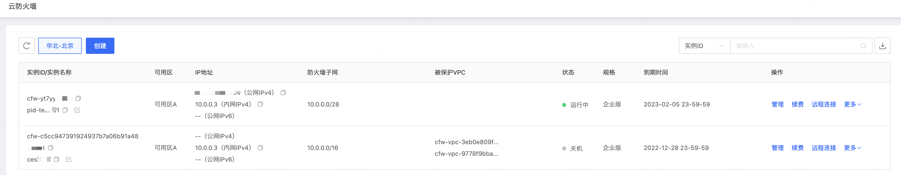
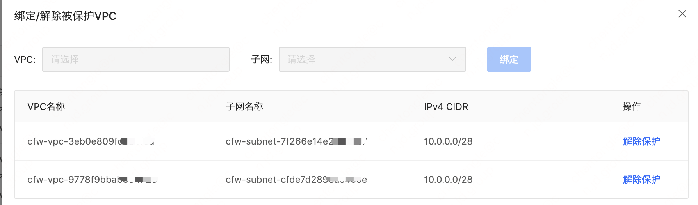

# 实例管理
​		在云防火墙实例列表，可以针对已创建的云防火墙实例进行管理，包含登录防火墙系统web页面、续费、远程登录防火墙实例CLI命令行、绑定/解绑被保护VPC。

#### 管理云防火墙

​		通过点击管理，可以直接跳转防火墙系统策略配置页面，默认用户名/密码:admin/vw@CakD3!wYr，初次登录系统后会提示修改默认密码，修改的密码需要满足密码复杂度的要求。

#### 绑定/解绑被保护VPC

​		通过点击更多-绑定被保护VPC，可以将用户需要保护的VPC绑定到云防火墙实例上，**需要注意的是需要在云防火墙上提前做好路由策略配置，以保证绑定后网络正常，业务连续稳定**。

​		通过点击更多-解绑被保护VPC，可以将用户已经绑定到该云防火墙实例上的VPC进行解绑，解绑后，该VPC将不再收到云防火墙的安全防护。**同样需要注意的是，操作解除被云防火墙保护的VPC子网，需要提前重新配置该子网路由表，以确保您业务连续性，请谨慎操作。**

			

#### 续费

​		通过点击续费，可以直接跳转续费管理，进行产品续费

#### 远程连接VNC

​		通过点击远程连接，可以直接跳转防火墙系统CLI命令行，进行命令行操作配置。
