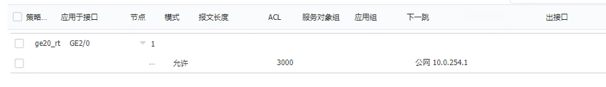

# 云防火墙入门指南
### 创建云防火墙实例

​		访问云防火墙控制台，配置名称、规格、可用区等参数之后创建购买云防火墙实例，详细步骤参见[创建云防火墙流程](https://docs.jdcloud.com/cn/cloudfw/00-creatfw)

> 请注意：**云防火墙配置的VPC不能和待防护VPC重合**。
>
> 例如：待防护的VPC是10.0.0.0/16，那么云防火墙配置的VPC就不能和10.0.0.16重合，云防火墙网络配置的VPC仅用于管理口通信，建议配置一个范围较小的段，减少网段占用，比如172.0.0.0/28。

### 创建互联子网和防护端点

​		在待防护的VPC中新建子网(**以下称为互联子网**)，返回云防火墙控制台，操作实例绑定VPC。

​		绑定待防护VPC，在待防护VPC的互联子网下会新建一张弹性网卡(以下称为防护端点)，用来处理流量，所有在此VPC中的子网，都可以通过配置路由来让子网受到云防火墙的保护。

			

> 需要注意的是：
>
> ①  待防护VPC下的互联子网不能和租户的业务子网重叠。
>
> 例如：待防护VPC(10.0.0.0/16)，已有业务子网1(10.0.0.0/24)、业务子网2(10.0.1.0/24)，那互联子网不能和上述业务子网段重叠。
>
> ②  每个待防护VPC只需要操作实例绑定一次，在待防护VPC互联子网中创建一个防护端点，即可保护整个VPC。
>
> ③  云防火墙实例支持创建多个防护端点，同时保护多个VPC，各VPC之间网段不能重叠，需要提前规划好网络。

### 配置防护端点

​		配置云防火墙防护端点的IP和路由用于将云防火墙处理后的流量进行转发（发送到其实际目的端），此步骤可以通过页面方式也可以通过命令行方式来进行配置，以下介绍通过web页面方式配置步骤，命令行配置步骤参见**云防火墙-命令行方式配置防护端点** 。

#### 配置1：创建安全域及策略

​		通过云防火墙控制台管理操作，进入云防火墙管理页面配置安全域，将防护端点加入到安全域中。

			

​		新建安全域：点击「网络」->「安全域」->「新建」

			

​		配置安全域的名称，将新接口即防护端点添加到三层成员列表中，其余配置实际使用时根据自身需要配置。

​		配置策略，允许安全域「trustip」报文通过：「策略」->「安全策略」->「新建」->「新建策略」

​		配置“名称”和“动作”，“确定”创建新策略

#### 配置2：配置接口IP

​		通过访问京东云[弹性网卡控制台](https://cns-console.jdcloud.com/host/eni/list)，找到待防护VPC互联子网下的弹性网卡，查看分配的内网ip。

​		返回云防火墙web管理页面，在「网络」->「接口」->「接口」将查到的内网IP正确填写到云防火墙的接口上，点击「确定」后完成配置。

#### 配置3：配置策略路由

##### 配置3-1：配置ACL对象		

​		通过配置基于源IP的策略路由用来将待防护VPC子网访问公网的流量重新路由转发到公网。

​		在云防火墙管理页面「对象」->「ACL」->「IPv4」->「新建」->选择「高级ACL」->「配置名称/ID」，点击「确定」来创建一个新ACL对象。

​		在弹出页面选择「**匹配源IP地址/通配符掩码**」->输入**匹配源IP(填待防护子网网段)**，点击「确定」，在ACL对象3000下创建一个新的acl规则，匹配源ip在10.0.0.0/24网段的分组报文。

​		新弹出的页面点击「取消」，即可完成ACL对象部分配置。

##### 配置3-2：关联策略路由		

​		**策略路由关联接口**，通过「网络」->「路由」->「策略路由」->「IPv4策略路由」，点击「新建」进行配置「策略名称」选择应用于「接口名」点击「新建」策略节点

​		在新建策略节点页面，配置「NodeID」->选择「匹配IPv4 ACL」->在下拉列表中选择上面新建的ACL对象“3000”->“新建”报文转发的下一跳地址

​		在报文转发的下一跳地址页面配置VRF为「公网」，设置IP地址为「**新增接口的网关地址**」(这里使用的是ge2/0 ip：10.0.254.3 gw：10.0.254.1)，直连下一跳选择「否」点击「确定」完成策略路由配置。

> 需要注意的是：**网关地址为子网CIDR的第2个地址**；
>
> 子网CIDR的第一个地址为网络地址，最后一个地址为广播地址，第二个IP地址为固定网关地址。
>
> 例如：子网的CIDR为10.1.0.0/24，其中10.1.0.0为网络地址，10.1.0.255为广播地址，10.1.0.1为网关地址。

#### 配置4：配置静态路由

​		配置静态路由（反向路由）将公网返回的流量重新发送给待防护VPC子网。在「网络」->「路由」->「静态路由」，点击「新建」创建静态路由。

​		配置路由「目的ip地址」和「掩码长度」用于表示**待防护子网**，下一跳所属配置为「公网」，下一跳IP地址配置为「**防护端点所在子网的网关地址**」，这个防护端点所在子网地址是10.0.254.3，因此网关地址为10.0.254.1，最后点击「确定」完成静态路由配置。

​		点击保存配置，完成防护端点配置。

### 配置互联子网路由

​		**将云防火墙防护后的流量指向待防护子网的下一跳。**

（1）查看待防护子网(待保护的业务云主机所在的子网)使用的路由表

例：被保护云主机“svc-02”，所在子网“vpc-1-subn-2”

​		通过[云主机控制台](https://cns-console.jdcloud.com/host/compute/list)进入子网控制台，查看子网使用的路由规则

（2）通过[云防火墙控制台](https://cloudfw-console.jdcloud.com/list)，查看防护端点所在互联子网

例：防火墙实例绑定

（3）通过[子网控制台](https://cns-console.jdcloud.com/host/subnet/list)，找到该互联子网关联路由表

例：防火墙实例绑定的互联子网为“vpc-1-subn-7”，找到其关联路由表

（4）确保该路由表表项与待防护子网表项一致，**即可完成此部分配置**

例：被保护云主机“svc-02”，所在子网“vpc-1-subn-2”关联路由表表项为：

互联子网“vpc-1-subn-7”关联路由表项为：

保证这两张路由表表项一致即可，建议互联子网直接使用和待防护子网相同的路由。

### 配置待防护VPC子网路由

#### 子网路由

​		将待防护VPC子网流量引导进云防火墙，进入京东云[路由表控制台](https://cns-console.jdcloud.com/host/routeTable/list)，新建路由表，选择待防护VPC。

​		配置路由策略，目的0.0.0.0/0，下一跳类型「弹性网卡」，下一跳指定弹性网卡名称，弹性网卡名称通过访问私有网络[弹性网卡控制台](https://cns-console.jdcloud.com/host/eni/list)，根据防护端点对应的VPC、所属子网和内网IP，找到网卡ID/名称。

​		访问[子网控制台](https://cns-console.jdcloud.com/host/subnet/list)，找到待防护子网，选择更换路由表，将路由表更换为新建路由表。

#### 公网路由

​		将访问待防护VPC的公网流量路由转发引流至云防火墙，进入[路由表控制台](https://cns-console.jdcloud.com/host/routeTable/list)，创建「路由」私有网络选择「待防护VPC」，绑定对象类型选择「公网网关」，配置公网路由名称，确定创建待防护VPC公网入方向路由。

​		路由策略配置，目的端IP是待防护子网IP段，下一跳类型选择「弹性网卡」，下一跳选择弹性网卡名称/ID。

