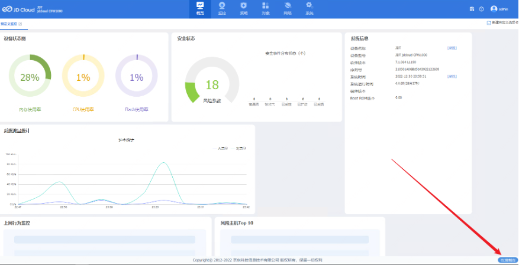
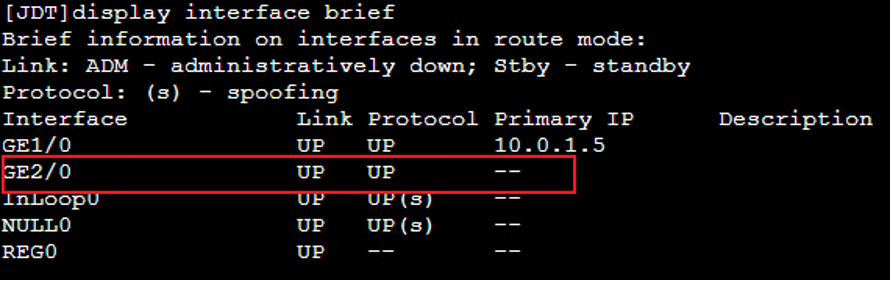
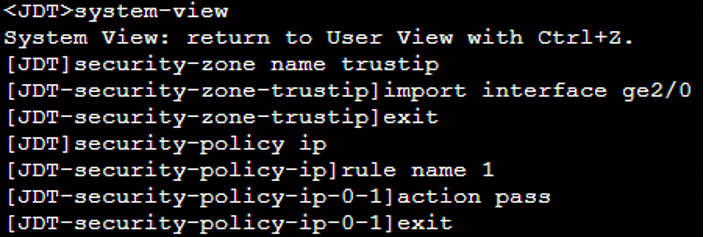
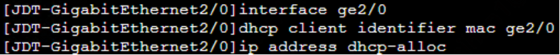
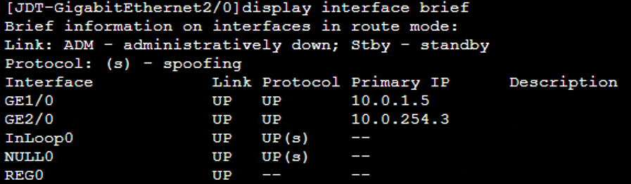

## CLI命令行配置防护端点

### 配置防护端点(命令行)

​		配置云防火墙防护端点的IP和路由，用于将云防火墙处理后的流量发送到其实际目的端。通过云防火墙控制台管理操作进入管理页面,通过页面右下角“CLI控制台”进入设备命令行

​		云防火墙每绑定一个VPC,都需要确认新增防护端点对应的接口名称,接口命名方式按照GE<x>/0,每次绑定x都会递增,使用命令将接口信息列出，找到新增接口。

​			

### 安全域

​		配置名为trustip的安全域,将防护端点对应的接口ge2/0加入到安全域中,新建策略“1”放行所有流量。

> \#进入系统视图
>
> system-view
>
> \#创建名为trustip的安全域,名称自定义,满足1-31个字符即可
>
> security-zone name trustip
>
> \#向安全域中添加接口成员
>
> import interface ge2/0
>
> \#返回系统视图
>
> exit
>
> \#配置ipv4安全策略
>
> security-policy ip
>
> \#新建名称为“1”的安全策略,名称自定义,满足1-127个字符或
>
> rule name 1
>
> \#配置策略放过
>
> action pass
>
> \#返回系统视图
>
> exit

### 接口IP

​		使用DHCP方式获取接口IP

> \#进入接口ge2/0配置视图
>
> interface ge2/0
>
> \#配置DHCP客户端使用接口ge2/0 mac做识别标记
>
> dhcp client identifier mac ge2/0
>
> \#配置接口ge2/0使用DHCP方式获取IP
>
> ip address dhcp-alloc

​		大约5秒钟后使用命令查看接口IP

> \#查看简要接口状态
>
> display interface brief

### 策略路由

​		配置基于源IP的策略路由用来将待防护VPC业务子网访问公网的流量重新发送到公网。

> \#配置高级ACL策略3001,自定义命名,范围3000-3999
>
> acl advanced 3001
>
> \#添加匹配源IP为业务子网(10.0.0.0/24)的规则1,规则编号范围0-65534,
>
> rule 1 permit ip source 10.0.0.0 0.0.0.255
>
> exit
>
> \#配置策略路由rt-eflect节点1匹配到规则则允许通过,策略路由名称自定义,命名规则1-19个字符,节点编号范围0-65535
>
> policy-based-route rt-reflect permit node 1
>
> \#定义匹配规则为编号3001的acl规则
>
> if-match acl 3001
>
> \#指定动作,下一跳为互联子网网关10.0.254.1
>
> apply next-hop 10.0.254.1
>
> exit
>
> \#进入ge2/0接口视图
>
> interface GigabitEthernet 2/0
>
> \#使用策略路由rt-reflect
>
> ip policy-based-route rt-reflect
>
> exit

### 静态路由

​		配置静态路由将公网返回的流量重新发送给待防护VPC业务子网。

> \#配置静态路由,到10.0.0.0/24业务网段分组,下一跳是互联子网网关10.0.254.1
>
> ip route-static 10.0.0.0 255.255.255.0 10.0.254.1
>
> exit
>
> \#保存配置
>
> save
