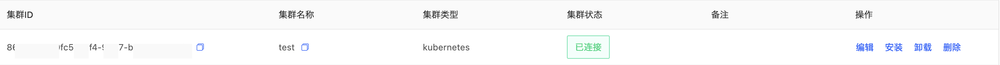

# 容器网络拓扑

帮助用户完成对容器所运行时和基础服务安全配置检测，将容器告警信息、攻击情况呈现展示。

### 运行时安全

用户登录主机安全控制台后，点击**容器网络拓扑-运行时安全**展示容器告警信息、攻击情况；此页面可总览到所有告警及相关告警详情，告警详情支持详情与建议、忽略本次、误报、已下线处理操作；支持容器ID、详情时间段、告警子类、等级、状态进行查询，点击可跳转查看详情处理。

【自定义设置】

用户在自定义设置时，通过添加敏感目录白名单、授信特权容器、自定义进程集合完成设置。

### 合规基线

登录主机安全控制台后，点击**容器网络拓扑-合规基线**进入合规基线页面；此页面展示新增合规基线检查结果，支持单项立即执行、编辑、删除操作。点击单任务可查看详情，详情包含：通过率、未通过项、合规容器占比、合规容器及对应操作。 

### 集群管理

登录主机安全控制台后，点击**容器网络拓扑-集群管理**进入集群管理页面；展示已创建的集群，支持单项编辑、安装、卸载、删除操作。单任务展示：集群ID、集群名称、集群类型、集群状态、备注信息。

1.**创建集群**

在集群管理页面点击创建集群, 输入集群名称和备注, 点击确定。

2.**获取安装命令**

在集群管理页面选择已创建的集群, 点击操作列的安装按钮, 在弹出的页面输入您的AccessKey；然后根据您的集群环境选择使用 helm安装或者使用kubectl安装获取对应的安装命令。 

      注意：请勿使用主账号的 AccessKey。如何获取最小权限的AccessKey请参考本页下方“使用子用户实现最小权限授权”。

3.**在您的 kubernetes 集群执行安装命令**

复制步骤2获取的安装命令, 在您的集群环境中执行并观察安装结果, 如果安装成功, 在集群管理页面将会看到集群状态为已连接。

4.**获取卸载命令**

在集群管理页面选择您要卸载本产品的集群, 点击卸载按钮后, 根据您安装时使用的安装方式, 选择对应的卸载方式使用helm卸载或者使用kubectl卸载,复制卸载命令,在您的集群环境中执行并观察卸载结果。

### 使用子用户实现最小权限授权

本产品的安装, 依赖拥有主机安全服务createWebSocket接口的访问权限的AccessKey,本部分文档描述了如何获取具有最小权限授权的AccessKey。

1.**创建子用户**

在 [访问控制](https://iam-console.jdcloud.com/subUser/list) 控制台用户管理页面创建仅授予编程访问权限的子用户。

2.**创建授权策略**

在[访问控制](https://iam-console.jdcloud.com/policy/list) 控制台策略管理页面, 创建主机安全服务的createWebSocket 接口授权策略, 并根据具体需求添加全部资源的权限或某一集群的权限。

3.**授权策略给子用户**

在[访问控制](https://iam-console.jdcloud.com/subUser/list) 用户管理页面用户详情页, 为步骤1创建的子用户授予步骤2创建的策略。

4.**创建 AccessKey**

在[访问控制](https://iam-console.jdcloud.com/subUser/list) 用户管理页面，用户的安全凭证标签页, 创建 AccessKey。然后使用创建的 AccessKey ID 和 AccessKey Secret 去获取集群安装命令。

#### 拓扑可视

登录主机安全控制台后，点击**容器网络拓扑-拓扑可视**展示默认集群的应用拓扑，1.可通过右上角切换已创建的集群；2.拓扑可视可通过左侧切换应用拓扑、应用结构、服务拓扑、pod拓扑展示；其中拓扑展示可通过双击节点居中，显示节点及关联节点，单击显示节点详情。

#### 隔离策略

登录主机安全控制台后，点击**容器网络拓扑-隔离策略**展示隔离策略列表，支持点击单项隔离策略下拉展示关联的出/入站访问规则信息，支持对策略和规则进行编辑和删除操作。

1.**新建隔离策略**

点击隔离策略列表的“新建”按钮创建隔离策略，支持界面配置和专业模式两种方式。

#### 报表统计
