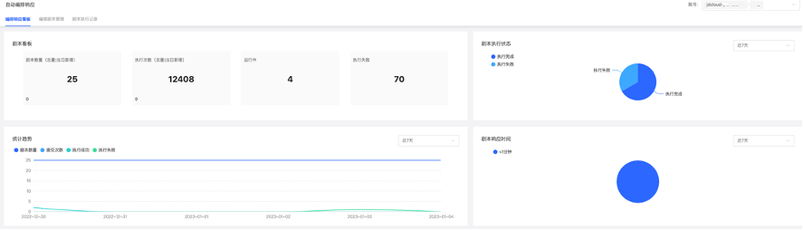
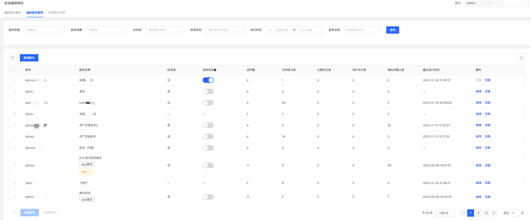
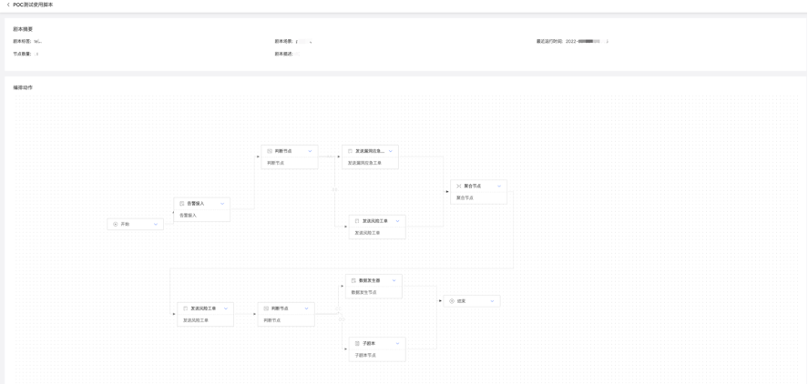
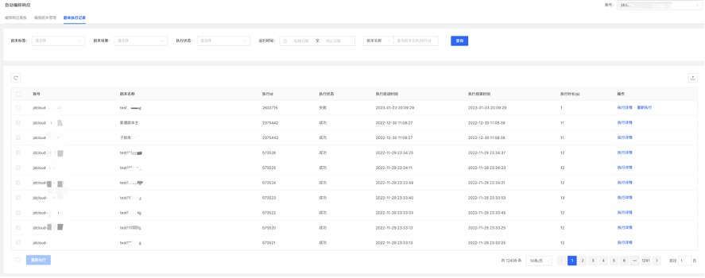
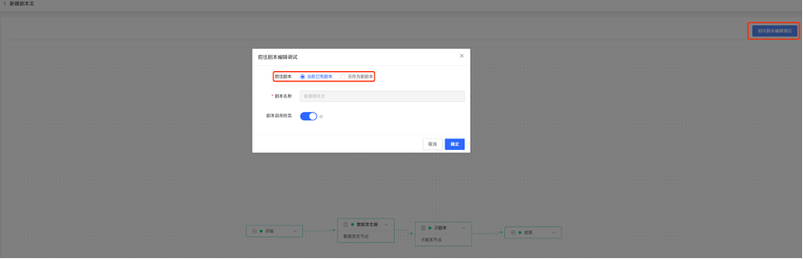

# 调查响应-自动化编排响应

### 功能说明

自动化编排响应处置能力：结合自身安全治理的丰富经验，为用户提供自动化编排处置与响应能力，方便用户针对不同告警威胁类型有选择的进行自动化处置和响应，有效降低安全运营平均响应时长，提升威胁处置效率。

#### 编排响应看板

自动编排响应看板主要统计当前剧本数量、执行次数、正在执行数量、执行失败数量，同时统计执行成功失败占比、以及剧本响应时间分布，分别统计剧本数量、提交次数、执行成功、执行失败的趋势曲线。

#### 编排剧本管理

呈现已经创建的剧本列表，呈现每个剧本执行的优先级、当前启用状态、动作数量、执行过程统计（已完成、已提交、执行中、响应失败），最近运行时间，可以点击编辑按钮编辑剧本（前提是该剧本目前没有启用）、点击查看已创建剧本的流转路径。

#### 剧本执行记录

剧本执行记录，呈现每个剧本单次执行的情况，包括执行状态（成功、失败）执行启动时间、结束时间，执行时长（单位：s），点击可以查看执行详情，如果该剧本单次执行存在问题可以额，可以点击右上角的「前往剧本编辑调试」，可以选择前往当前已有剧本、另存为新剧本。

