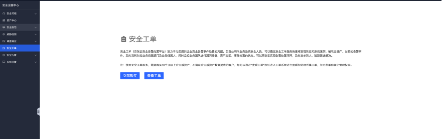
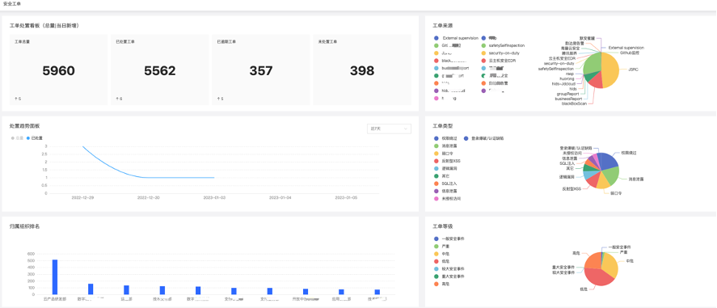
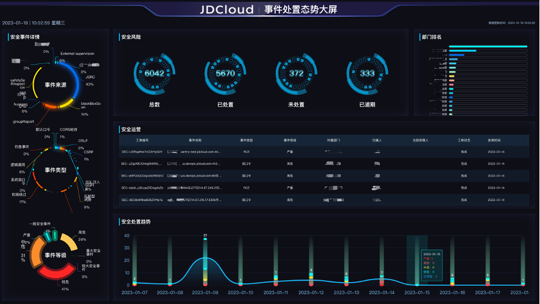
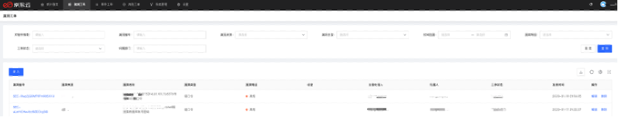
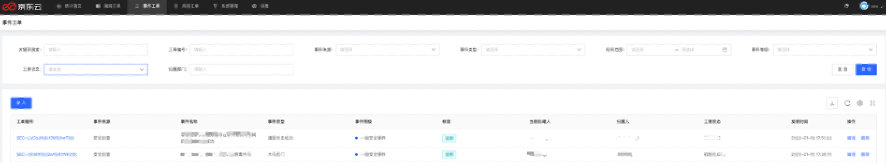
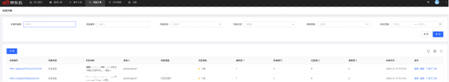
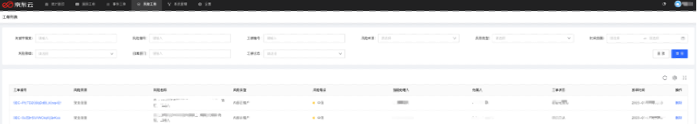

# 安全工单

### 功能说明

安全工单系统作为专门用来处理企业安全事件（这里只针对网络安全相关）的凭据，可以灵活对接用户自身组织结构，实现安全事件处置的自动化流转，提高安全事件推修效率，降低沟通成本。

#### 开通工单

安全工单（京东云安全告警处置平台）致力于为您提供企业安全告警事件处置的凭据。负责公司内业务系统安全人员，可以通过安全工单服务快速将发现的已知系统漏洞、被攻击资产、当前的告警事件，及时流转对应业务归属部门及业务归属人，同时监控业务团队进行漏洞修复、资产加固、事件处置的状态。可以帮助您实现告警处置闭环，及时发单到人、追踪跟进解决。

注：使用安全工单服务，需要购买10个及以上企业版资产，不满足企业版资产数量要求的客户，您可以通过“查看工单”按钮进入工单系统进行查看和处理所属工单，但无发单和其它管理权限。

#### 工单看板

工单处置看板实时统计工单总数量、已处置工单数量、已逾期工单数量、未处置工单数量，工单来源呈现工单由哪类检测引擎上报而来，同时按照工单类型、工单等级进行分布呈现。

#### 工单大屏

直观呈现安全工单系统当前工单事件处置态势，通过大屏的方式查看工单流转运营情况以及工单处置趋势和部门工单排名。

#### 工单处置

京东云安全运营中心工单系统，将工单分为三类漏洞工单、事件工单、风险工单（风险列表视角、工单列表视角）

漏洞工单：

风险工单：

风险工单-风险列表

风险工单-工单列表

