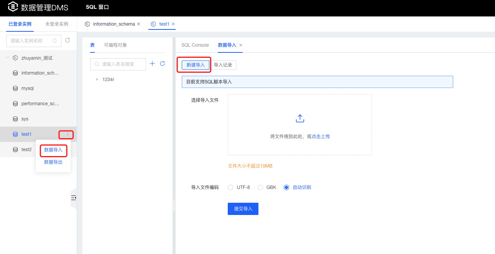

# 数据导入

### SQL脚本导入

1. 选择要导入数据的数据库；

2. 鼠标移动到数据库后面的操作icon，点击【数据导入】按钮，进入数据导入页面，选择”新建导入“，上传SQL文件，点击提交按钮数据库执行导入任务；

   

### 查看导入记录

1. 选择要导入数据的数据库；

2. 鼠标移动到数据库后面的操作icon，点击【数据导入】按钮，进入数据导入页面，选择”导入记录“，可以查看历史导入记录信息；

   

3. 点击【详情】可查看导入的执行时间、执行状态、异常信息等详情；

   
