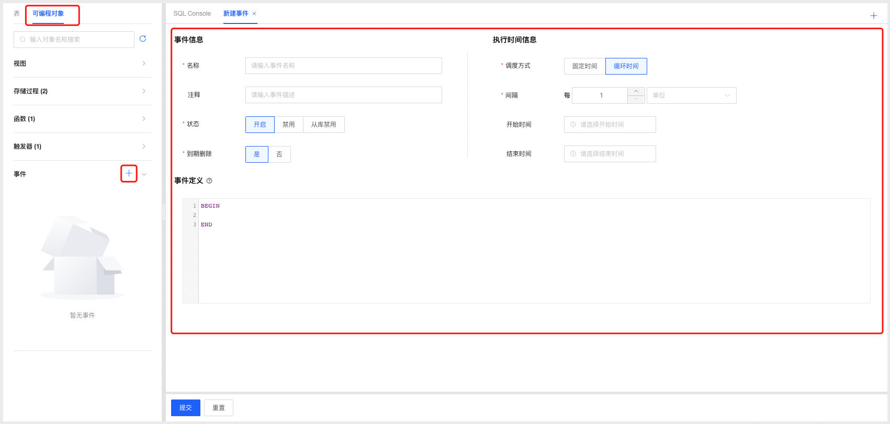
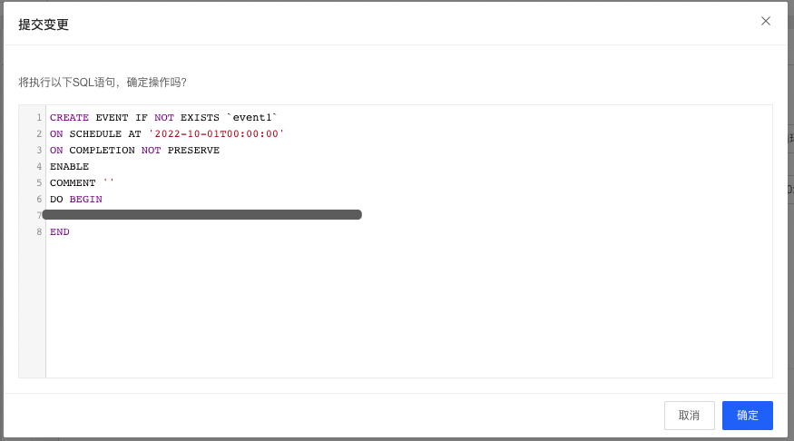
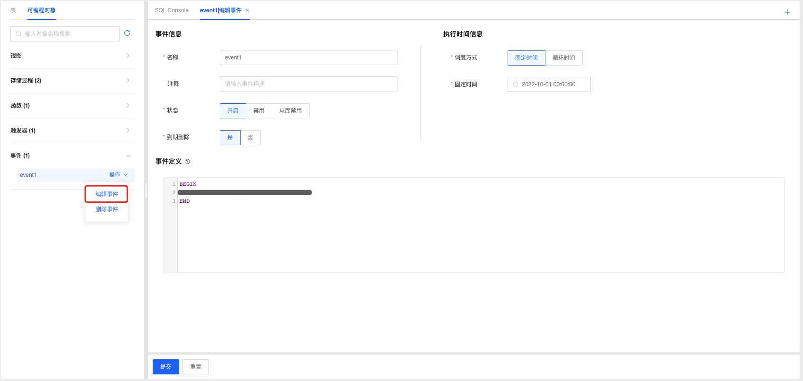
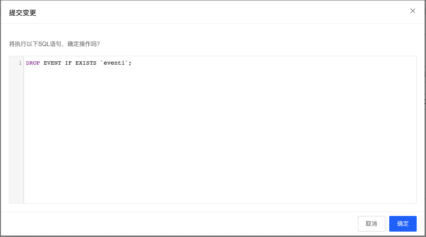

# 事件管理

DMS支持云数据库MySQL管理事件，开发人员可根据业务场景选择使用事件功能。

### 新建事件

1. 选择要创建事件的数据库，选择可编程对象Tab页，点击事件标签可查看当前数据库中已创建的事件；

2. 点击事件标签后的添加按钮，打开事件定义窗口；

   

3. 根据需要填写事件名称以及选择相关参数，填写事件定义信息；

4. 填写完成后点击提交按钮，系统根据用户填写的相关数据生成创建事件的SQL语句，确认无误后点击确认按钮提交系统创建事件；

   

5. 创建完成后系统自动刷新页面，可在事件标签下查看新创建的事件；

### 编辑事件

1. 选择要编辑的事件，点击操作选择【编辑事件】，进入编辑事件页面；

2. 根据需要调整事件参数和定义，填写完成后点击提交按钮，系统根据用户填写的相关数据生成创建事件的SQL语句，确认无误后点击确认按钮提交系统更新事件；

3. 事件编辑更新成功后，系统自动刷新页面，可在事件标签下查看编辑后的事件；

   

### 删除事件

1. 选择要删除的事件，点击操作选择【删除事件】，进入删除事件确认弹窗，点击确认后即可删除事件；

   

