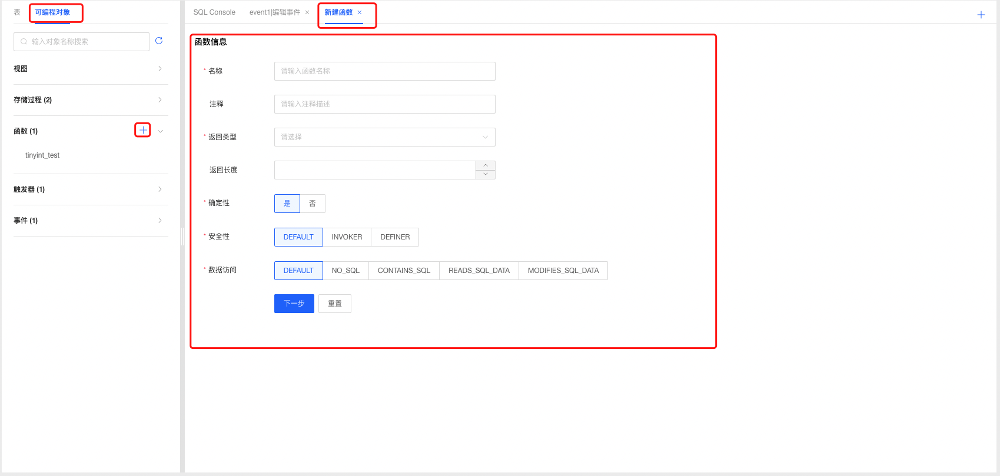
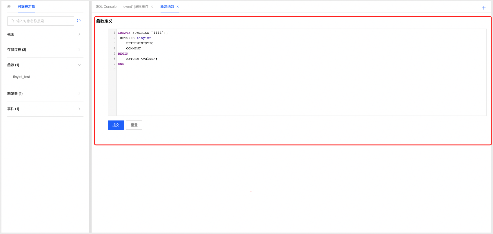
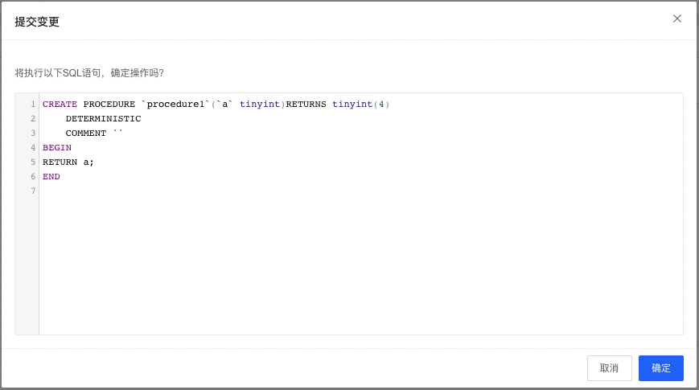
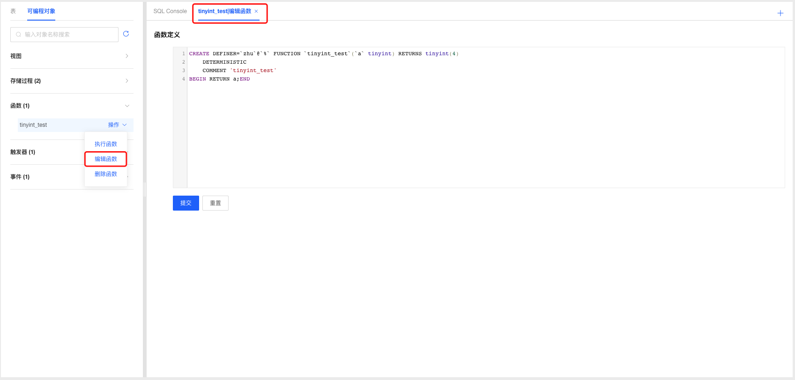
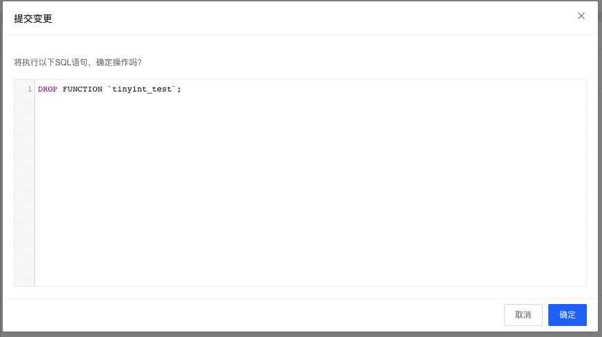
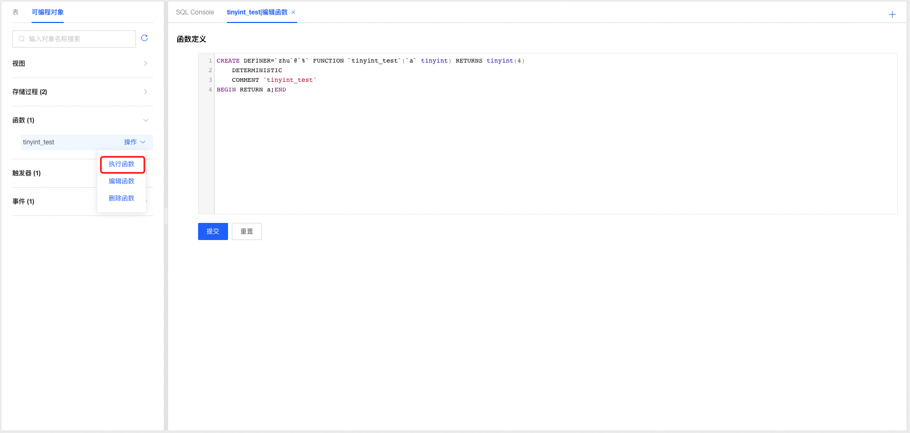
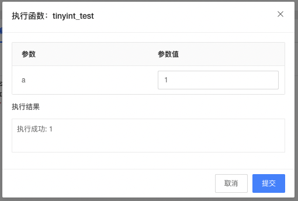

# 函数管理

DMS支持云数据库MySQL管理函数，开发人员可根据业务场景选择使用函数功能。

### 新建函数

1. 选择要创建函数的数据库，选择可编程对象Tab页，点击函数标签可查看当前数据库中已创建的函数；

2. 点击函数标签后的添加按钮，打开函数定义窗口；

   

   

3. 根据需要填写函数名称以及选择相关参数，填写函数定义信息；

4. 填写完成后点击提交按钮，系统根据用户填写的相关数据生成创建函数的SQL语句，确认无误后点击确认按钮提交系统创建函数；

   

5. 创建完成后系统自动刷新页面，可在函数标签下查看新创建的函数；

### 编辑函数

1. 选择要编辑的函数，点击操作选择【编辑函数】，进入编辑函数页面；

2. 根据需要调整函数参数和定义，填写完成后点击提交按钮，系统根据用户填写的相关数据生成创建函数的SQL语句，确认无误后点击确认按钮提交系统更新函数；

3. 函数编辑更新成功后，系统自动刷新页面，可在函数标签下查看编辑后的函数；

   

### 删除函数

1. 选择要删除的函数，点击操作选择【删除函数】，进入删除函数确认弹窗，点击确认后即可删除函数；

   

### 执行函数

1. 选择要执行的函数，点击操作选择【执行函数】，在执行函数弹窗中输入参数值，点击【提交】即可查看执行结果。

   

   

