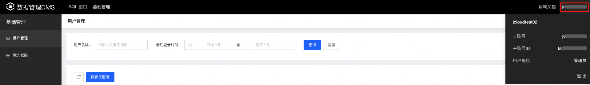

# 我的系统角色

数据库管理服务DMS提供以下几种系统角色，管理员、DBA、普通用户、结构只读。以下介绍查看您系统角色的具体步骤。

## 注意事项

修改系统角色需要联系管理员修改。具体步骤请参照[用户管理](./user-management.md)

### 查看我的系统角色

1. 用户进入DMS控制台后，鼠标移动到控制台右上角登陆账号信息处，即可查看当前登陆账号的用户角色信息；

