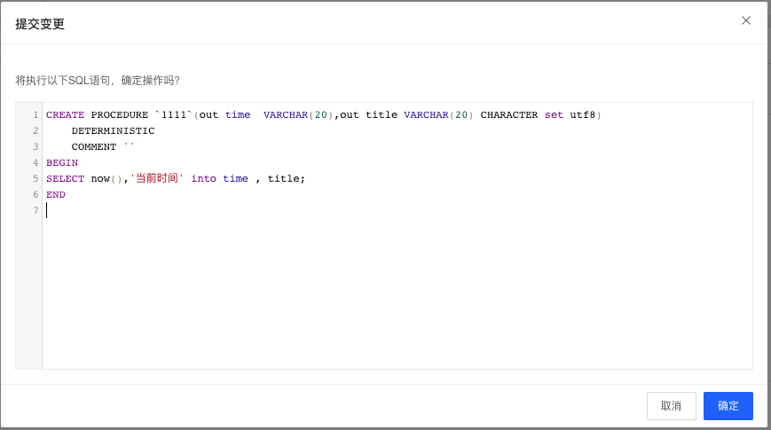
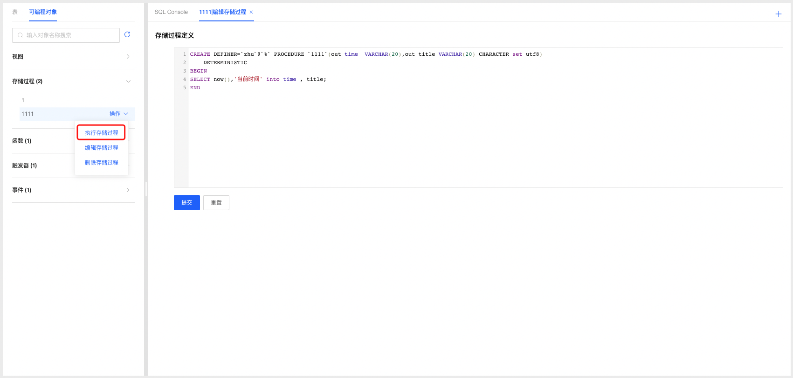

# 存储过程管理

DMS支持云数据库MySQL管理存储过程，开发人员可根据业务场景选择使用存储过程功能。

### 新建存储过程

1. 选择要创建存储过程的数据库，选择可编程对象Tab页，点击存储过程标签可查看当前数据库中已创建的存储过程；

2. 点击存储过程标签后的添加按钮，打开存储过程定义窗口；

   

   

3. 根据需要填写存储过程名称以及选择相关参数，填写存储过程定义信息；

4. 填写完成后点击提交按钮，系统根据用户填写的相关数据生成创建存储过程的SQL语句，确认无误后点击确认按钮提交系统创建存储过程；

   

5. 创建完成后系统自动刷新页面，可在存储过程标签下查看新创建的存储过程；

### 编辑存储过程

1. 选择要编辑的存储过程，点击操作选择【编辑存储过程】，进入编辑存储过程页面；

2. 根据需要调整存储过程参数和定义，填写完成后点击提交按钮，系统根据用户填写的相关数据生成创建存储过程的SQL语句，确认无误后点击确认按钮提交系统更新存储过程；

3. 存储过程编辑更新成功后，系统自动刷新页面，可在存储过程标签下查看编辑后的存储过程；

   

### 删除存储过程

1. 选择要删除的存储过程，点击操作选择【删除存储过程】，进入删除存储过程确认弹窗，点击确认后即可删除存储过程；

   

### 执行存储过程

1. 选择要执行的存储过程，点击操作选择【执行存储过程】，在执行存储过程弹窗中输入参数值，点击【提交】即可查看执行结果。

   

   

