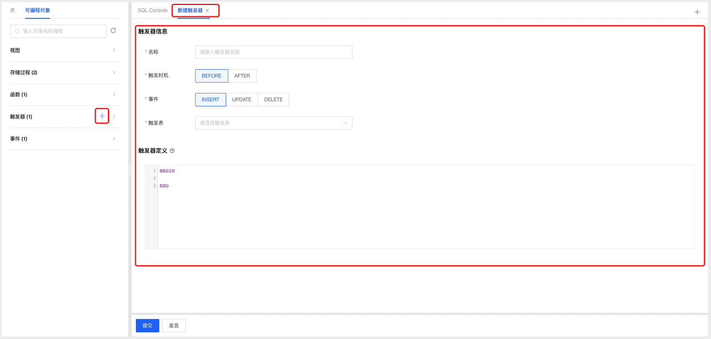
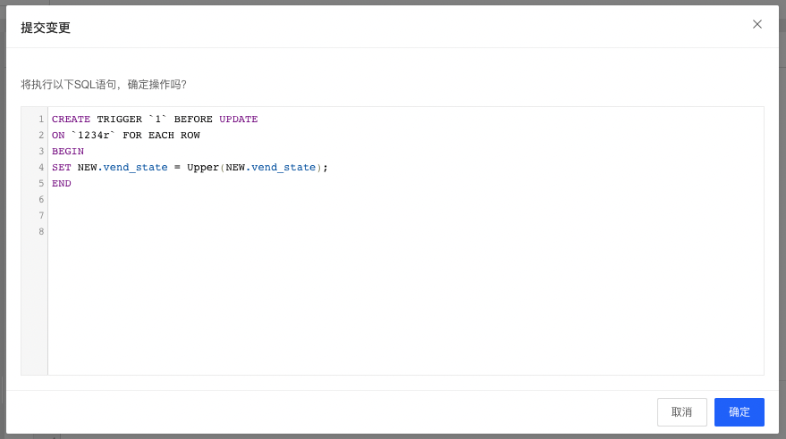
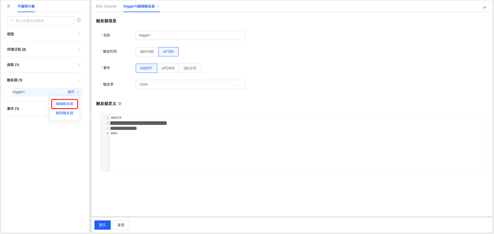
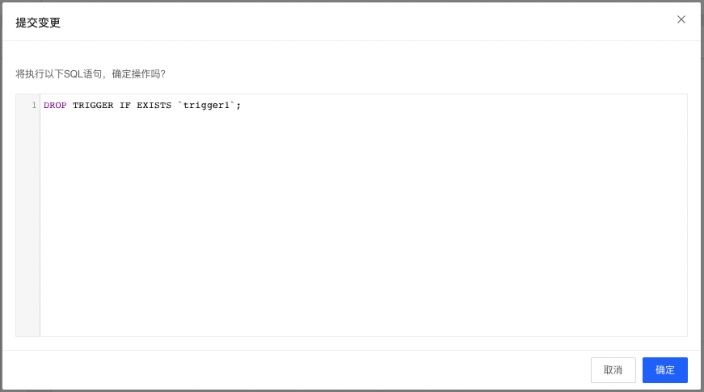

# 触发器管理

DMS支持云数据库MySQL管理触发器，开发人员可根据业务场景选择使用触发器功能。

### 新建触发器

1. 选择要创建触发器的数据库，选择可编程对象Tab页，点击触发器标签可查看当前数据库中已创建的触发器；

2. 点击触发器标签后的添加按钮，打开触发器定义窗口；

   

3. 根据需要填写触发器名称以及选择相关参数，填写触发器定义信息；

4. 填写完成后点击提交按钮，系统根据用户填写的相关数据生成创建触发器的SQL语句，确认无误后点击确认按钮提交系统创建触发器；

   

5. 创建完成后系统自动刷新页面，可在触发器标签下查看新创建的触发器；

### 编辑触发器

1. 选择要编辑的触发器，点击操作选择【编辑触发器】，进入编辑触发器页面；

2. 根据需要调整触发器参数和定义，填写完成后点击提交按钮，系统根据用户填写的相关数据生成创建触发器的SQL语句，确认无误后点击确认按钮提交系统更新触发器；

3. 触发器编辑更新成功后，系统自动刷新页面，可在触发器标签下查看编辑后的触发器；

   

### 删除触发器

1. 选择要删除的触发器，点击操作选择【删除触发器】，进入删除触发器确认弹窗，点击确认后即可删除触发器；

   

