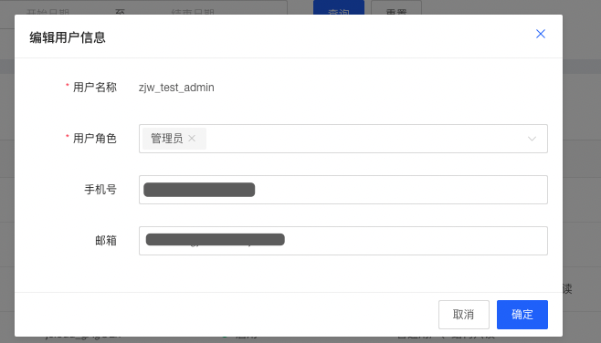
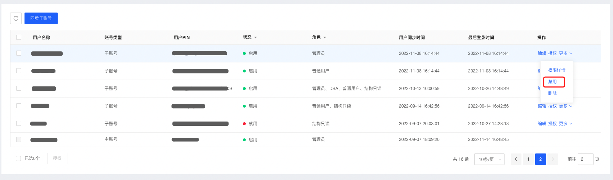
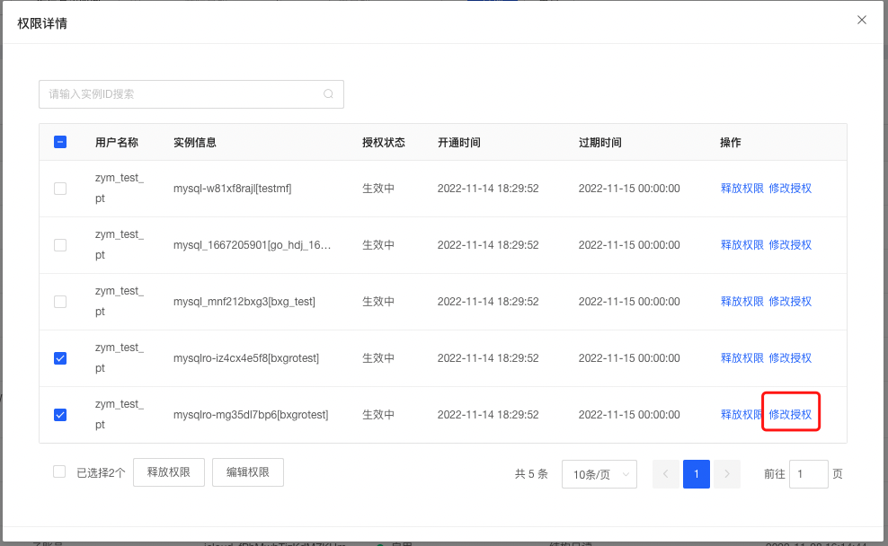

# 用户管理

用户管理模块是数据库管理服务DMS为客户提供系统使用人员的角色管理和权限管理功能。以下重点介绍用户管理模块的功能操作步骤。

## 前置条件

登陆账号为DMS的管理员。查看系统的具体步骤，请参见[系统角色](./system-role.md)。

## 注意事项

* 京东云主账号初始化为DMS系统管理员角色；
* 管理员可以编辑子账号角色为管理员；
* 子账号没有同步到用户管理中无法进入DMS系统，需要管理员同步子账号到用户管理中，且子账号状态为”启用“才可正常访问DMS系统；

## 登陆DMS控制台路径

* 控制台数据库RDS、分布式数据库TiDB、分析型云数据库ClickHouse - 实例列表 - 登陆数据库
* 控制台数据库RDS、分布式数据库TiDB、分析型云数据库ClickHouse - 实例详情 - 登陆数据库
* 控制台 - 云服务 - 数据库与缓存 - 数据库管理服务DMS

## 同步子账号

1. 管理员进入DMS控制台，打开基础管理-用户管理模块；

   

2. 点击同步子账号，弹窗中会自动带出当前主账号下未同步的子账号信息；

   

3. 选择要同步的子账号，编辑角色信息（默认为普通用户），点击【确定】同步账号。

## 编辑用户

### 编辑用户信息

1. 管理员进入DMS控制台，打开基础管理-用户管理模块；

2. 选择要编辑的用户，点击【操作-编辑】，在编辑用户弹窗中编辑用户信息；

   

3. 支持修改用户角色，用户角色可以添加多个，权限取多个角色的并集；

4. 支持修改用户手机号和邮箱信息，信息修改生效范围为DMS控制台，修改后的信息不会反向同步到「京东云控制台-访问控制-用户管理」中；

   

### 禁用用户

禁用用户后，该用户将无法登录DMS，但用户原有的权限配置、基本信息等数据不会被回收或删除，在启用用户后，用户可正常登陆DMS，原有权限不变；

1. 管理员进入DMS控制台，打开基础管理-用户管理模块；

2. 选择要禁用的用户，点击【操作-更多-禁用】即可完成禁用；

   

### 启用用户

用户被禁用后，可通过启用用户功能恢复用户的DMS访问权限以及原有配置的权限

1. 管理员进入DMS控制台，打开基础管理-用户管理模块；

2. 选择要启用的用户，点击【操作-更多-启用】即可完成启用；

   

### 删除用户

删除用户后，用户将无法登陆DMS，同时删除用户原有的权限配置信息、基本信息等；

1. 管理员进入DMS控制台，打开基础管理-用户管理模块；

2. 选择要删除的用户，点击【操作-更多-删除】，确认弹窗信息后即可完成删除操作；

   

   

## 授权用户

### 添加授权

本期授权暂时只支持授权**实例登陆权限**，其他授权后续陆续开通；**管理员**和**DBA**默认拥有全部实例的登陆权限，**普通用户**和**结构只读**需要授权实例登陆权限后才可通过数据库账号密码登陆数据库实例；

1. 管理员进入DMS控制台，打开**基础管理-用户管理**模块；

2. 选择要授权的用户，点击【操作-授权】，选择要授权的实例，以及实例登陆权限的到期时间后，点击【确定】即可完成授权；

3. 支持选择多个用户，批量对用户进行授权；

   

   

### 查看所有用户权限

管理员可以查看全部用户的权限信息；

1. 管理员进入DMS控制台，打开**基础管理-用户管理**模块；

2. 选择要查看授权详情的用户，点击【**操作-更多-权限详情**】，即可查看当前用户生效的授权信息；

   

   

### 释放授权

用户由于工作调整或变动需要释放某些实例的授权信息时，可操作释放授权；

1. 管理员进入DMS控制台，打开**基础管理-用户管理**模块；

2. 选择要查看授权详情的用户，点击【**操作-更多-权限详情**】，打开当前用户生效的授权信息弹窗；

3. 选择要释放的授权记录信息，点击【**释放授权**】即可完成释放操作，支持批量释放；

   

   

### 编辑授权

支持对已有授权信息编辑到期时间，延长或缩短授权的有效期时间；

1. 管理员进入DMS控制台，打开**基础管理-用户管理**模块；

2. 选择要查看授权详情的用户，点击【**操作-更多-权限详情**】，打开当前用户生效的授权信息弹窗；

3. 选择要编辑的授权记录信息，点击【**编辑授权**】，填写修改后的到期时间，点击【确定】完成修改；

   

   

