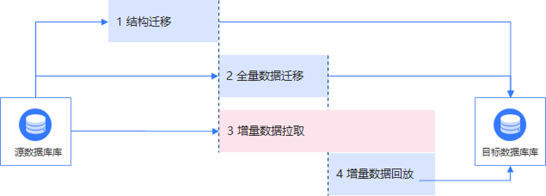
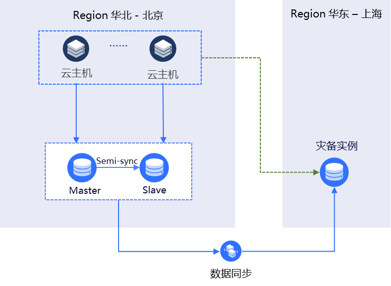
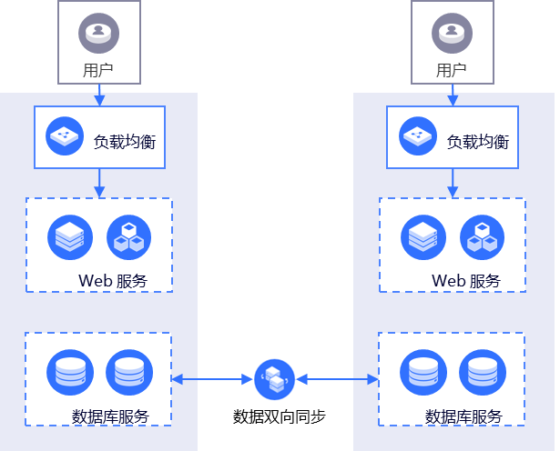

# 应用场景

以下说明数据传输 DTS 的使用场景。

## 数据迁移 - 不停机迁移

通过传统的业务迁移过程需要在迁移数据的时候停止对源数据库的数据写入操作，从而保证数据一致性。根据数据量和网络环境差异整个迁移过程可能需要持续数个小时甚至更久，对于一些对服务性要求较高的业务来说是不可接受的。

DTS可以支持在应用服务运行期间进行数据迁移。只需在应用服务切换时进行停机，这样可以将业务的千幻窗口期缩短到分钟级。相关迁移步骤如下图所示：

数据迁移过程包括三个阶段，即结构迁移、全量数据迁移和增量数据迁移。
  * 结构迁移：迁移源数据库的库表结构。
  * 全量迁移：迁移源数据库当前的全量数据集。
  * 增量数据拉取：增量迁移服务将持续获取全量数据迁移过程中源数据库的变更数据。全量数据迁移完成后，增量迁移服务持续获取源数据库变更，并回放到目标数据库。

增量阶段持续过程中，可执行数据校验任务，对源端数据分块进行校验，校验值会写入源端数据库并产生增量日志，DTS实例根据增量日志中的校验值计算目的端的校验值进行比对，将差异写入目的端，用户可根据差异进行数据检查、修复等。

## 数据同步 - 异地容灾

当应用程序部署在单一地域中，当该地域因断电断网等不可抗因素失去通信导致业务中断。
为规避这种地域级别的故障导致服务不可用，您可在另外一个地域构建灾备中心，以提高服务的高可用性。业务中心和灾备中心会通过DTS实现数据的实时同步更新，并保持地域间数据一致性。当业务中心发生故障时，可直接将业务流量切换到灾备中心从而快速恢复服务。

## 数据同步 - 异地多活

从业务场景特性和业务发展的角度考虑，单地域部署应用服务可能会面临如下几点问题：
1. 用户分布广阔，地理位置里中心节点较远的用户访问应用服务延迟较高影响用户的使用体验。
2. 单地域底层基础设施能力限制业务发展，如供电能力、网络带宽建设能力。
为解决上述问题，您可以异地构建多个业务单元。各个业务单元之间通过DTS实现数据的双向实时同步，保证全局数据的一致性。当某个业务单元出现故障，只需将该单元流量切换至其他业务单元即可，从而实现业务秒级恢复。除此之外，您还可以根据业务的特征将流量分配致不同的业务单元。例如，按照用户所在地域进行就近访问，从而降低网络延迟所带来的访问应用服务慢的问题。同时，各个业务单元分布在不同地域可优先解决单地域基础设置限制影响业务扩展的问题。

## 数据订阅 - 业务异步解耦

电商、物流行业涉及到多个业务逻辑，例如商城业务下游服务订阅上游价格变化、库存变化等。下游需要实时获取上游变化，否则可能导致价格变化缺少时效性和可用性。
为了提升时效性和可用性，可通过DTS数据订阅服务将有深度依赖关系的上下游业务通过实时消息推送的形式实现异步解耦提升时效性和可用性，当业务逻辑更加简单。
以下单系统为例，买家下单后直接返回下单结果，底层通过消息订阅实时获取订单变化，库存系统通过订阅这些变更数据从而触发库存、物流等业务逻辑，将各个业务模块解耦。

## 数据同步 - 数据横向扩展

当业务有大量读请求的时候，单个数据库无法承担全部的读写压力，可以借助DTS数据同步构建只读实例。业务侧可将读请求统一分发致这些只读实例中，从而实现数据库的横向扩展，分担主库的压力。

## 数据订阅 - 数据实时分析

自建BI系统复杂且不能满足用户对实时性的要求，我们可以通过DTS将关系型数据库中的数据订阅到kafka中，然后通过业务的SDK调用消息将消息写入分析型数据库中进行数据实时分析，可以快速搭建一套适配自身业务产品的数据分析系统。
