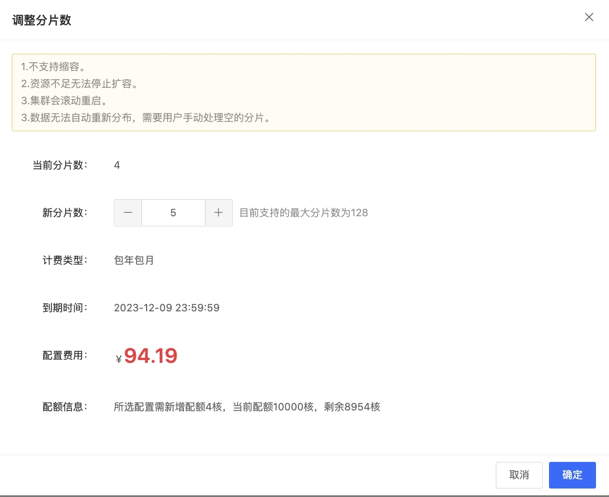

# 变更分片数

在使用分析型云数据库ClickHouse过程中，当集群当前的规模及配置不满足使用需求时，可优先选择分片扩容。变更分片数功能可以通过分析型云数据库ClickHouse管理控制台设置。 

## 注意事项

1.不支持缩容。
2.资源不足无法停止扩容。
3.集群会滚动重启。
3.数据无法自动重新分布，需要用户手动处理空的分片。
4.建议分布式表Distributed 全部是rand()规则可以扩分片，否则会发生新写入数据会出现数据混乱的情况

## 操作步骤

1. 登录[分析型云数据库ClickHouse 管理控制台](https://jchdb-console.jdcloud.com)。
2. 选择需要修改配置的目标实例，点击目标实例，进入实例详情页。
3. 点击 ***调整分片数 *** ，弹出框参数说明如下:
   * 当前分片数：实例当前分片数
   * 新分片数：扩容后分片数

