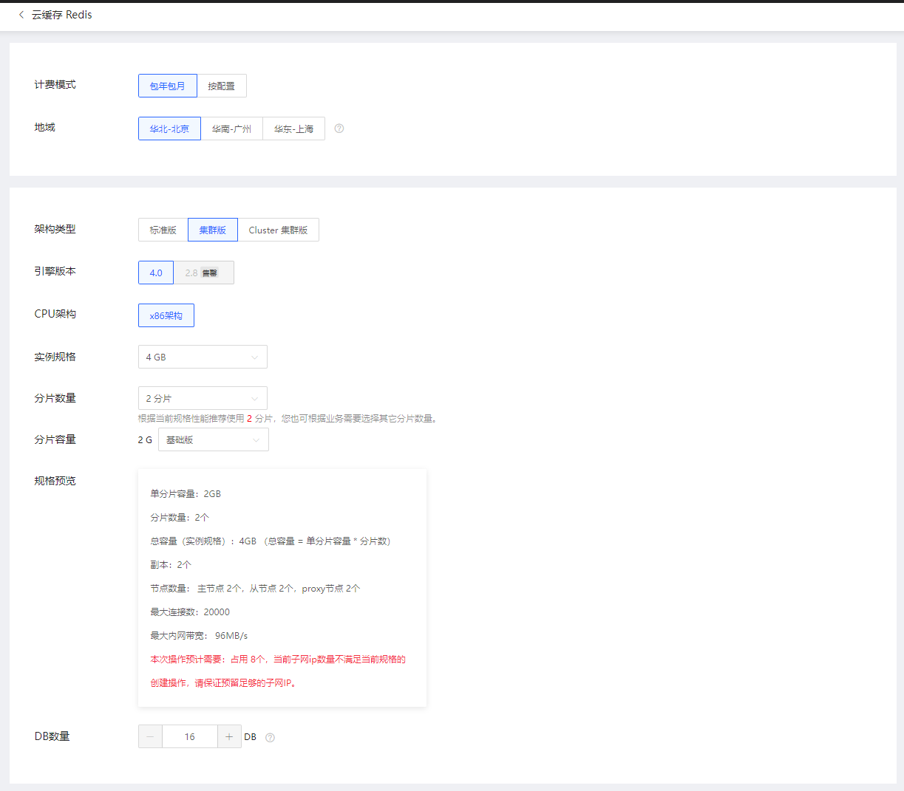
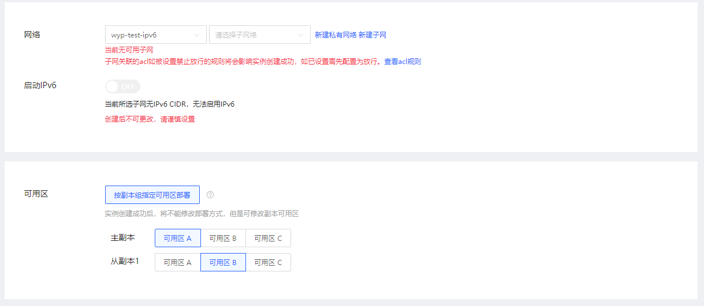
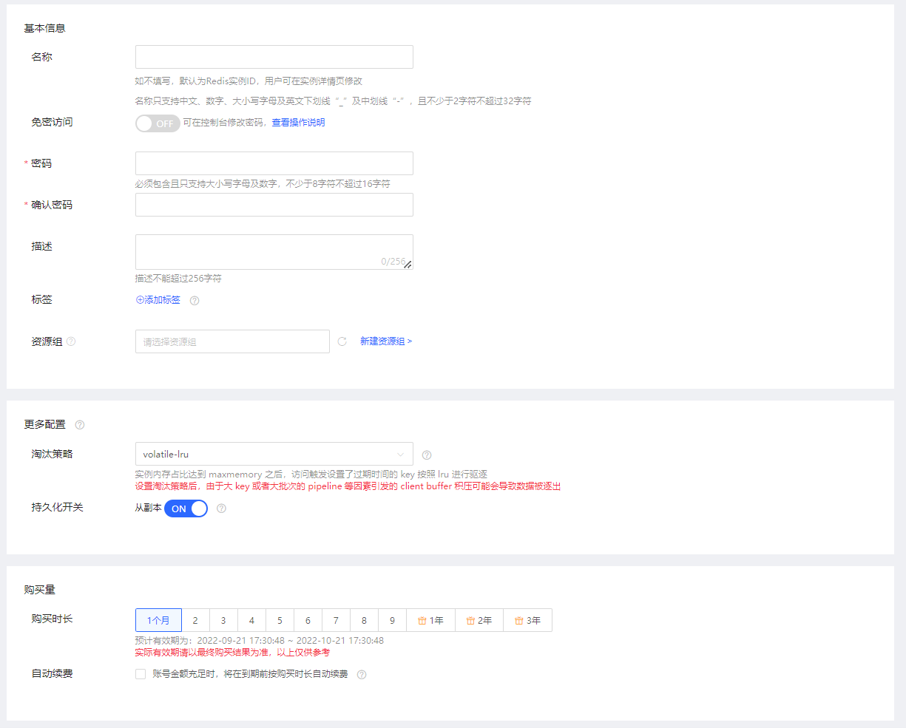
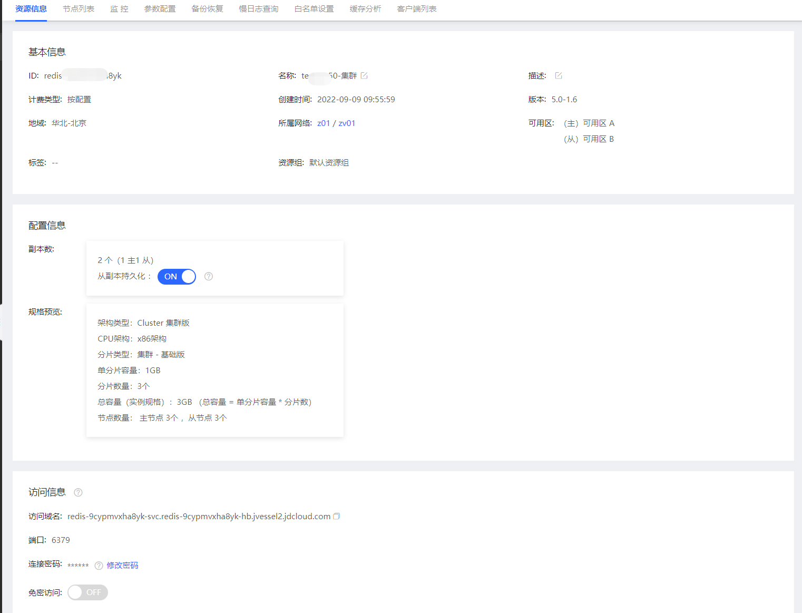
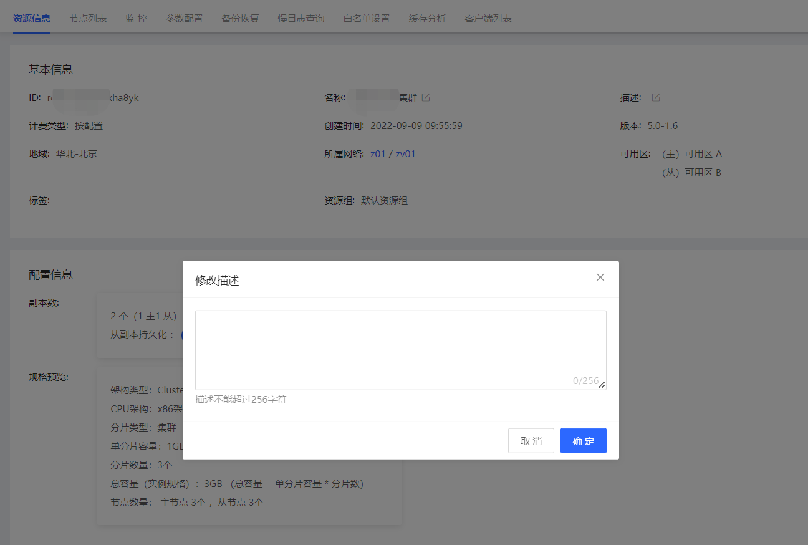

# 创建实例

您可以在云缓存Redis控制台或者通过API新建Redis实例，本文将为您介绍如何在控制台上创建Redis实例。

##  选择Redis实例架构和规格

在创建前，您需要结合您的业务对Redis实例的性能、规格大小、价格、QPS等因素进行选型。您可参考下列文档：

-  [实例架构](../Introduction/Features.md)  

-  [实例规格](../Introduction/Specifications.md)  

-  [Redis命令支持](../Introduction/Command-Supported.md)  

-  [使用限制](../Introduction/Restrictions.md)   

##  创建实例

在“实例列表”页面，点击“创建”按钮，跳转到新建实例页。创建页内容说明如下：

| 内容 | 说明  |  
|:--   |:-- |
| 计费模式    |  云缓存Redis目前支持包年包月和按配置计费。若您有长期稳定的业务量需求，建议选择包年包月；若您是短期需求，期望用完可立即释放实例，建议选择按配置计费。   |
| 地域        |   建议您选择与云服务器同一个地域，不同地域的云产品内网不通。   |
| 架构类型   |  目前可支持标准版、Proxy集群版、Cluster集群版。各版本差别可参考： [实例架构](../Introduction/Features.md)    |
| 引擎版本   |  兼容 Redis 2.8、4.0、5.0 。2.8版已暂停售卖，建议您选择4.0及以上版本。  |
| CPU架构    | 默认为x86架构 。还可支持信创架构，如有需要可联系客服。 |
| 实例规格    | 标准版支持1G-32G。Proxy集群版支持4G-4T。Cluster集群版支持3G-2T。 |
| 分片数量    | 您可根据对QPS的也无需求，选择相应的分片数量。 |
| 分片容量    | 指单分片的容量，将根据实例规格和分片数量自动算出。 |
| 副本数量    | 目前所有架构类型均默认2副本。 |
|规格预览     | 提供当前您所配置的实例规格配置，并会预判本次创建操作将占用的ip资源，如果子网ip不足将可能导致创建失败，您需提前预留足够ip。  |
| DB数量    | 当前所选架构类型下，将可配置的DB数量。对于Proxy集群版架构支持自定义16-256个DB；对于Cluster集群版架构只支持1个DB。 |

| 内容 | 说明  |  
|:--   |:-- |
| 网络   |   云缓存Redis 所属网络，建议您选择与云服务器同一个地域下的同一私有网络。 |
| IPv6   |  云缓存Redis 支持IPv6，但若当前所选子网不支持IPv6则无法启用IPv6。 |
| 可用区   |  当前云缓存Redis可支持按副本指定可用区部署。建议主副本、从副本选择不在同一可用区，以便增强在发生可用区中断情况时的容错性。目前创建后暂不支持修改。 |
     

| 内容 | 说明  |  
|:--   |:-- |
| 名称       |   实例的名称。创建后支持修改。 |
| 免密访问   |  创建成功后，实例的访问方式。创建后支持修改。  |
| 密码/确认密码   |  当关闭免密访问时，需要录入密码。 |
| 描述       |   创建后支持修改。 |     
| 标签       |   给实例打标签。创建后支持修改。  |     
| 资源组     |   实例归属的资源组。创建后支持修改。 |     
| 淘汰策略   |   实例内存占比达到 maxmemory 之后的key的淘汰策略。创建后支持修改。  |     
| 持久化开关 |   副本是否开启持久化功能。创建后支持修改。  |     
| 购买时长   |  当选择包年包月付费模式时，需选择当前实例的购买时长。  |     
| 自动续费   |   自动续费开关。创建后支持修改。  |     

3、点击 立即购买 ，进入“订单确认”页面。

4、在“订单确认”页面，确认实例信息，并阅读《缓存Redis服务条款》。

5、在列表查看创建实例的完成状态

-   如果状态显示为“创建中”，则请耐心等待几分钟

-   如果状态显示为"运行"，则创建已完成，实例可正常运行。

##  修改实例基本信息

实例创建成功后，实例名称和描述可以支持修改。用户在点击列表中名称一栏进入资源详情页，点击编辑按钮进行修改(资源描述信息操作方式相同)。

操作步骤：

  1、登录Redis 控制台

  2、选择目标实例，点击实例名称进入实例详情页面

  3、点击名称旁的修改按钮，输入新的名称，后点击确定保存

  4、修改描述和修改实例名操作方式相同

##  API

| 接口 | 说明  |  
|:--   |:-- |
| [createCacheInstance](http://docs.jdcloud.com/cn/jcs-for-redis/api/createcacheinstance?content=API)    |  创建一个指定配置的缓存Redis实例：可选择版本、类型、规格（按CPU核数、内存容量、磁盘容量、带宽等划分）。自定义分片规格可通过 describeSpecConfig  接口获取，规格代码请参考： [实例规格](../Introduction/Specifications.md)    |
| [describeSpecConfig](http://docs.jdcloud.com/cn/jcs-for-redis/api/describespecconfig?content=API)  | 查询缓存Redis实例的规格配置信息 |

##  常见问题

**Q：创建实例时，直接返回创建失败。**

A：可能由于当前可用区资源已不足，您可再选择其它可用区进行尝试。

**Q：创建实例耗时多久？**

A：正常情况下实例规格越大、分片数越多，都会导致创建时间越长。例如，创建64G以下规格大约5分钟左右，128G集群版大约15分钟左右，如果超过2小时实例仍显示在创建中，请联系客服。

**Q：首次创建实例成功后，为何会占用内存？**

A：在公有云上，为保障数据安全新建的Redis数据库是会有占用一小部分内存的。例如，云上创建1个4G实例，在初始化完成后会占用500M左右内存，主要是缓冲内存和Redis进程本身运行需要的内存。缓冲内存包括客户端缓冲区、复制积压缓冲区、AOF缓冲区等；其中，客户端缓冲存储客户端连接的输入输出缓冲；复制积压缓冲用于部分复制功能；AOF缓冲区用于在进行AOF重写时，保存最近的写入命令。

**Q：redis proxy 是什么？**

A：proxy是代理，会承接客户端的请求，转发给redis，也会把redis的响应转发给客户端。可参考：[Redis Proxy特性说明](Proxy-Info.md)

**Q：如何配置读写分离？**

A：目前Redis2.8、Redis4.0的标准版、Proxy集群版产品暂时不支持读写分离。

