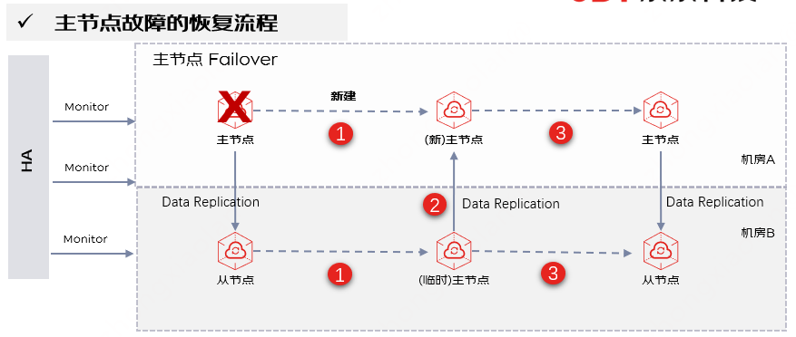
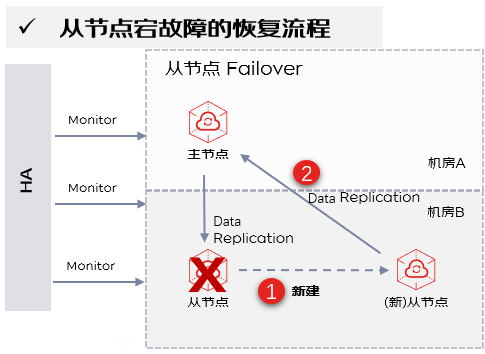

# 容灾恢复

云缓存Redis实例均为主从架构、支持主从多可用区部署、支持数据自动备份和恢复、支持自动切换来保障Redis的高可用，从而保障业务连续性。工作时主节点和从节点数据实时同步，当主节点故障时，系统将在15秒左右将从节点提升为主节点，开始提供服务。当完全恢复后，主从所在的AZ会跟创建时保持一致。

## 主节点恢复原理

**故障场景：** 例如 Redis进程crash，Redis节点失联（网络故障）。

**故障影响：** 

- 读写影响：主从切换时间在15-30s。

- 数据影响：由于Redis主从复制是异步的，主节点故障时未及时同步到从节点的数据将会丢失。

**故障恢复说明：** 当主节点发生故障时，系统将在15秒左右将从节点提升为临时主节点，开始提供服务；同时在主节点所在可用区新建1个节点，从临时主节点同步数据，等全量数据同步完成后，在合适的时候再做一次主从切换（大概会有1s以内只读），确保故障恢复主从节点的可用区分布与创建时保持一致。此外，您可以在报警监控中配置实例故障监控，见： [节点异常监控](https://docs.jdcloud.com/cn/jcs-for-redis/node-notice)

## 从节点恢复原理

**故障场景：** 例如 Redis节点失联（网络故障）。

**故障影响：** 

- 读写影响：主节点读写不受影响，从节点不可读，直到从节点恢复。

- 数据影响：数据没有任何丢失。

**故障恢复说明：**  当高可用HA模块侦测到从节点故障时，会自动新建1个从节点，连接主节点进行数据复制。从而保证从节点宕机下的高可用。

## 主从节点同时故障

**故障场景：** 主从所在物理机同时故障，或压力过大将Redis主从节点都打爆导致OOM。

**故障影响：** 

- 若开启AOF，集群将自动恢复。

- 若未开启AOF，Redis 4.0 将由平台运维进行恢复可用性，Redis 5.0将可直接恢复可用性。

**故障恢复说明：** 云缓存Redis可以识别到主从同时故障的场景，通过新建主从节点来恢复整个集群可用性。注意，在未开启AOF情况下会存在数据部分丢失，所以对于核心缓存数据不能丢的场景，建议开启AOF持久化。

