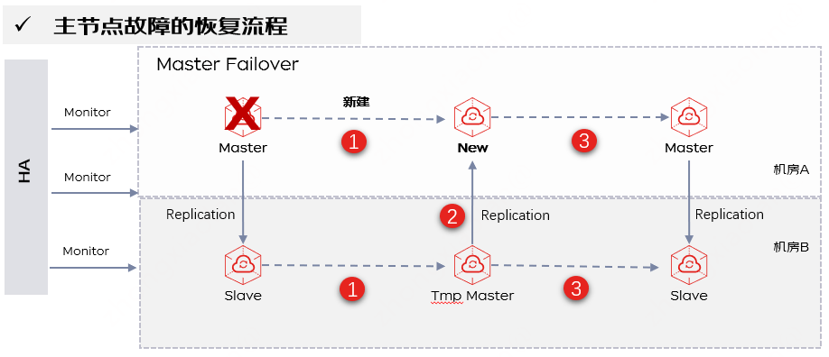
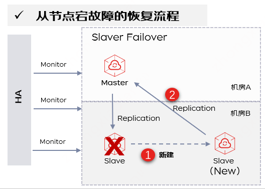

# 容灾恢复

京东云缓存Redis所有规格均为主从架构、支持主从多可用区部署、支持数据自动备份、支持自动切换来保障Redis的高可用。工作时主节点和从节点数据实时同步，主节点故障时系统自动进行秒级切换，从节点接管业务（期间会有秒级的闪断，重连即恢复）。完全恢复后，主从所在的AZ会跟创建时保持一致。

## 主节点恢复原理

**故障场景：** 例如 Redis进程crash，Redis节点失联（网络故障）。

**故障恢复说明：** 云缓存Redis采用了通过 高可用HA模块 侦测节点故障，当主节点发生故障时，系统会自动进行主从切换，将Slave提升为Master。同时会新建1个Slave节点，当复制数据完成后，新从节点会提升为新的主节点，而这时的主节点会回到Slave角色。通过该原理来保证主节点宕机下的高可用。如果实例架构为Proxy集群版，代理会自动监测故障，并做流量切换。此外，您可以在报警监控中配置实例故障监控，见：   [节点异常监控](https://docs.jdcloud.com/cn/jcs-for-redis/node-notice)

**故障恢复时长说明：** 平台可在5-30秒左右检测到故障并开始做主从切换、恢复数据面可用、故障节点的恢复处理等工作。

## 从节点恢复原理

**故障恢复说明：**  当高可用HA模块侦测到从节点故障时，会自动新建1个Slave节点，连接主节点进行数据复制。从而保证从节点宕机下的高可用。

## 主从节点同时故障

**故障场景：** 例如突发的流量或者访问大key导致Redis输出缓存区暴增，从而导致主从节点同时OOM故障

**故障恢复说明：** 云缓存Redis可以识别到主从同时故障的场景，通过新建主从节点来恢复整个集群可用性。注意，在未开启AOF情况下会存在数据部分丢失，所以对于核心缓存数据不能丢的场景，建议开启AOF持久化。

## 全部节点故障

**故障场景：** 例如机房故障、平台故障等

**故障恢复说明：** 在全部节点故障的情况下，云缓存Redis会重建集群，恢复集群可用性，在未开启AOF情况下会造成数据丢失。

