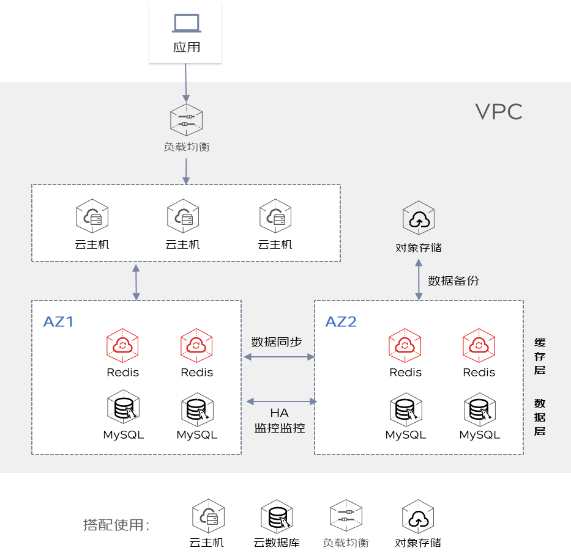

# 产品简介

京东云缓存Redis（JCS for Redis），是京东云打造的兼容开源 Redis 协议标准的高性能在线缓存服务，及时响应您海量用户的高并发访问需求。支持双机热备，提供自动容灾切换、数据备份、在线平滑扩缩容、实例监控等完善的缓存服务。历经数次京东大促考验，满足您的在线数据业务对高性能、高弹性、高可靠的需求。

| 云缓存Redis  |  说明  | 
|    :--- | :---  |	
|    兼容开源Redis版本 | Redis 2.8、Redis 4.0、Redis 5.0。  |	
|    架构类型 | 支持架构类型包括 标准版、Proxy集群版、Cluster集群版。  |	
|   规格 | 最小1G，最大4T ，可根据分片数和分片容量灵活 配置。  |	
|   部署方式 | 可支持按副本指定可用区部署、按集群指定可用区部署两种方式。   |	
|   高可用与容灾 | Redis通过主从架构，多可用区部署，双机热备、failover时自动切换，来实现高可用。  |	
|    计费与续费 | 云缓存 Redis 计费模式2种：按配置计费、按包年包月计费。按配置计费可转为包年包月计费模式，暂不支持包年包月转为按配置计费，可通过工单删除包年包月计费资源。  |	
 
##  产品特性
 
###  公有云Redis产品优势 

**便捷管理和运维**

托管部署服务，让您在控制台轻松实现对实例的生命周期管理、性能分析、备份管理、监控告警、参数配置等服务，无需自行安装、部署、运维，减少您的人力开销。

**自动容灾**

采用双机热备架构，主节点故障时，自动完成秒级切换，避免您的线上业务受到故障影响，全程无需您做任何操作。

**数据高可靠**

数据容量按需扩缩容，过程不影响您的线上业务正常运转。在集群架构下的容量调整，可按分片扩缩容，弹性扩展空间及吞吐性能，突破数据高 QPS 瓶颈。

**平滑扩缩容**

海量存储，无限容量。集群版采用分布式架构，数据分布在多台物理机上，突破单机物理限制，解决海量数据存储在 Redis 上的瓶颈。

**全面监控与预警**

多达40余项的数据指标监控，包括 CPU 负载、QPS、实例使用量、连接数、出入网流量等。可视化的数据监控一目了然。自定义告警功能，可帮助您提前预警、快速定位和解决问题。

**数据迁移**

借助 RDTS （ [Redis 的数据传输工具](../Data-Migration/Data-Migration-Overview.md) ）可将多种场景的源数据迁移至 Redis 中，极大简化您的数据库上云工作，迁移过程中可保障您的业务不停摆，实现在线的平滑迁移。

### 云Redis与开源Redis差异
相比自搭建Redis数据库，云Redis节省了开发、运维系统带来的人力和时间成本。
| 对比项 |  云缓存Redis  |   自建Redis      |
| :--- | :---  | :---  |
| 高可用	 | 双机热备，自动切换。当主节点发生故障后，从节点会被迅速提升为新的主节点，继续提供服务。	 | 自行安装、配置主从节点。 | 
| 高可靠	 | 服务数据持久化，实例跨可用区部署，保证数据的安全和业务的不间断运行。	 | 自行保障redis服务运行，依赖技术人员的数据库管理水平。 | 
| 高性能	 | 使用内存作为存储介质，利用 Redis 引擎的低延迟、高吞吐量特点，提供比关系型数据库高很多的性能；源码级护航，超高的性能可以满足您绝大部分场景需求；支持绝大多数Redis命令，轻松应对Redis大容量或高性能的业务需求；提供集群版规格扩展Redis性能，破除Redis单线程机制的性能瓶颈。	 | 需要额外自行研究核心代码、开发、维护、解决高速缓存问题。 | 
| 平滑扩容	 | 一键扩容，方便快捷。可根据使用情况弹性扩容，按需选择，按需升级，提高资源利用率，降低冗余费用；您可以登录控制台进行扩容操作，整个过程不影响您的线上业务 | 	在超出容量阈值后，需要新建足量资源、中断应用连接、迁移数据，过程影响业务正常访问。扩展周期长，资源利用率低。 | 
| 大容量	 | 海量存储，无限容量。集群版采用分布式架构，数据分布在多台物理机上，突破单机物理限制，解决海量数据存储在 Redis 上的瓶颈。 | 	受物理内存限制，需要自行解决容量以及稳定性问题。 | 
| 监控告警	 | 为用户提供多种类型的监控，包括如使用量、连接数、QPS、 Key数量等多种监控，可视化数据监控展示。全链路监控预警，帮助您提前预警提示风险、快速定位和解决问题。 | 	需自行开发监控系统，运维人员随时待命。 | 
| 低成本	 | 可轻松部署、运行和扩展缓存Redis，无需机器安装和数据库部署运维等工作；提供资源监控、稳定性维护等功能，降低日常维护工作量 | 	需要专人搭建服务，耗时耗力，人力成本高 | 
| 易运维	 | 提供了可视化易操作的控制台，方便用户快速创建和使用Redis服务，方便用户对缓存参数调优、一键备份恢复、查询大Key热Key、查看客户端IP列表等常见运维操作。提供7*24小时的人工客服和运维保障。 | 	人工运维，自行准备服务器和安装Redis服务。 | 

**说明：** 云缓存Redis可兼容开源Redis版本，连接数据库的方式也基本相同。通过Redis迁移工具，可支持将自建的standalone版本迁移到云缓存Redis 。

###  Redis与Memcached对比
目前Memcached的所有功能可视为已成为Redis的子集。二者主要有以下区别。

| 对比项 |  云缓存Redis  |   Memcached      |
| :--- | :---  | :---  |
| 适用场景	 | 数据结构复杂、需要持久化存储数据、存储大key的场景 | 数据结构模型简单，小型静态数据的缓存场景	 | 
| 对集群的支持	 | Redis已支持集群，并提供了标准版和集群版两种架构供用户选择	 | Memcached需要通过第三方集群工具进行管理	 | 
| 数据持久化 | 	支持RDB快照+AOF备份	 | 开源Memcached不支持持久化存储	 | 
| 线程/进程 | 	是单线程模型，采用IO多路复用，但其性能已足够优秀到不会成为瓶颈。	 | 支持多线程，可扩展，理论上性能更高	 | 
| 数据类型 | 支持如字符串（String）、链表（List）、集合（Set）、有序集合（SortedSet）、哈希表（Hash），充分满足业务需求	 | 支持简单的字符串	 | 
|  Lua脚本支持		 | 支持  	 |   不支持。	 | 
| 数据迁移		 | 支持 	 | 	开源Memcached不支持	 | 
| Key的Value限制		 | Key的值最大可以有1G。	 | 1M | 
| 多数据库		 | 	Proxy集群版可支持用户自定义DB数量，可支持16-256个。	 | 	不支持	 | 

##  相关产品

在使用云Redis过程中，通常还会涉及使用以下产品：

| 相关产品  |  说明  | 
|    :--- | :---  |	
|     [ 私有网络](https://docs.jdcloud.com/cn/virtual-private-cloud/product-overview)  	|    创建云Redis前，需要先创建VPC网络。|    
|     [ 云监控](https://docs.jdcloud.com/cn/monitoring/product-overview) |    监控云Redis 实例的运行情况，需要使用云监控服务。|    
|     [ 操作审计](https://docs.jdcloud.com/cn/audit-trail/product-overview) |    当您需要还原用户行为审计，对于安全分析、资源变更追查、合规审查有等需求时，可使用该产品进行操作记录查询。|    
|     [ 对象存储](https://docs.jdcloud.com/cn/object-storage-service/product-overview) |    当前Redis实例数据备份文件，是通过对象存储进行存储的。|    

