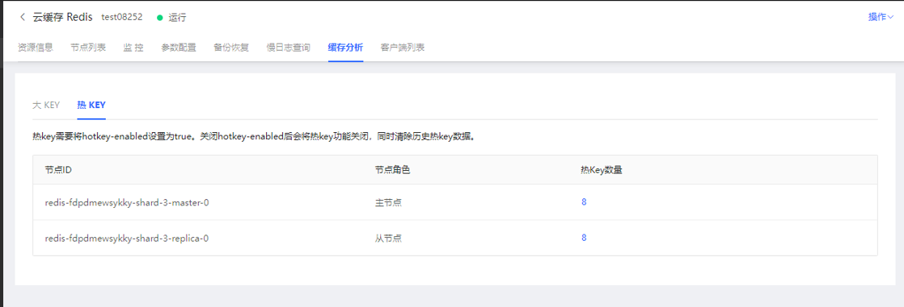

#  大key热key分析

大Key、热Key是影响实例性能的关键指标，缓存分析功能为客户提供了可视化的大Key、热Key分析，从Redis 5.0 开始提供了对 大Key和热Key的详细分析统计，用户可查看下载 大Key、热Key的相关数据。

##  大Key分析

1. 登录 Redis 控制台，选择Redis5.0及以上版本的目标实例，点击实例名称进入实例详情页面

2. 点击“缓存分析”页tab签，进入缓存分析页面，点击启动分析后，即可立刻开始执行大key分析。

 

大key分析支持自动分析、手动分析两种方式：

1）手动启动大Key分析时，可为每次分析配置不同阈值。

 

2）启动自动分析时，需设置每日分析时段，届时平台将启动自动分析。

 

3）分析完成后，可查看本次分析结果，可以看见节点上的大key分布详情

4）提供了下载分析结果功能，可查看大key分析详情。

##  热Key分析

使用热Key功能，需提前在“参数配置”中，将hotkey-enabled设置为true。

点击热key数量，可看到热key详情。

