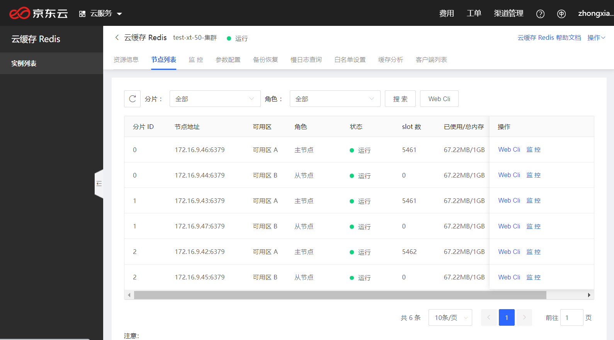
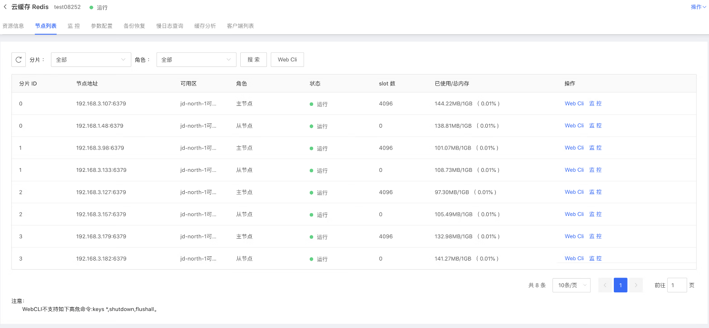
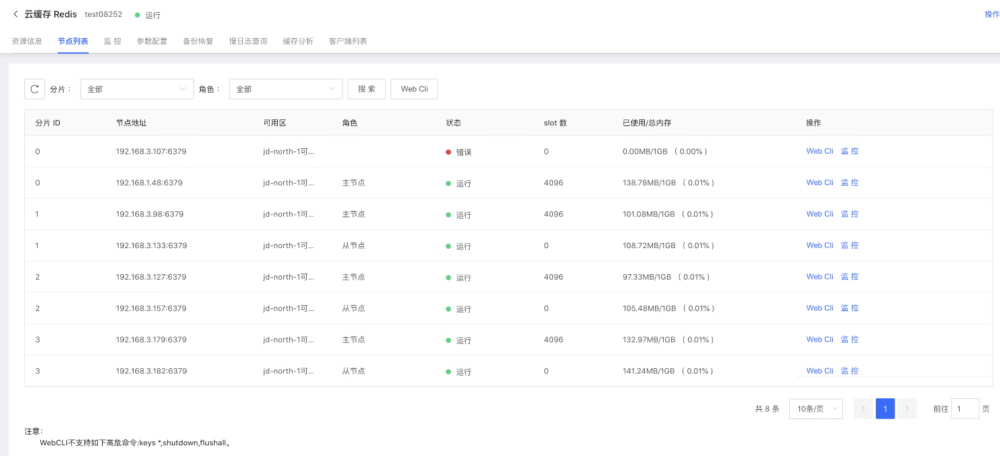
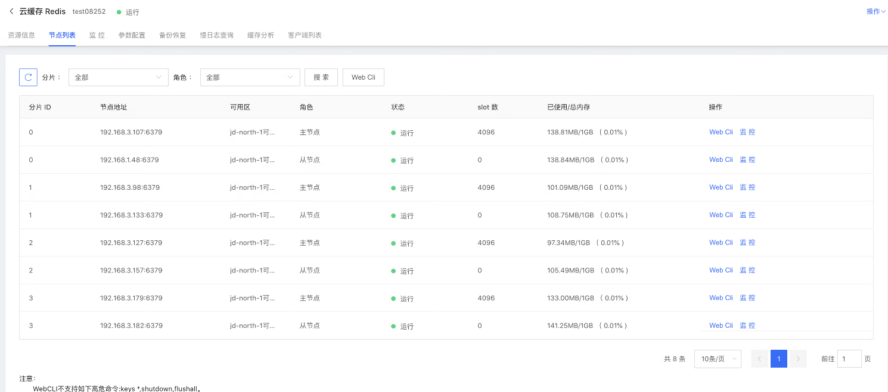

#  实例节点列表

在实例节点列表中，展示了当前Redis实例的所有节点的列表，提供了列表、节点检索、节点维度和实例维度的WebCli功能。该功能当前在Cluster集群版种提供。

- 提供的节点信息包含节点角色、节点地址、所在可用区、slot数、已使用内存信息等。

- 当实例规格较大分片数较多时，还可使用节点搜索功能，进行快速定位节点。

- 可通过WebCli进入某个节点进行数据查询。

##  操作说明

1.登录[Redis 控制台](https://redis-console.jdcloud.com/redis)。

2.在"实例列表"页面，选择目标实例，点击 实例名称，进入"实例详情"页面。在"实例详情"页面，点击 “节点列表” tab签页面，进入节点列表页面。

| 名称	 | 参数名 | 类型 	|   说明  | 
| :--- | :---  |:---  |:---  | 
|  分片ID    |  shardId  |  		String	  |  	节点分片ID，从0开始  |  	
|  节点地址   |  address	  |  	String	  |  	节点访问地址  |  	
|  可用区    |  az	  |  	String	  |  	节点所属AZ  |  	
|  角色    |  role  |  		String	  |  	节点角色，master表示主节点，slave表示从节点  |  	
|  节点状态    |  status	  |  	String	  |  	节点状态，running表示节点正常，error表示节点异常  |  	
|  Slot个数    |  slots  |  		Integer	  |  	节点负责的Slot个数  |  	
|  节点已使用内存   |  usedMemory  |  		Integer	  |  	节点已使用内存，单位Byte  |  	
|  节点总内存   |  maxMemory	  |  	Integer	  |  	节点总内存，单位Byte  |  	

3.当某节点发生故障时，会观测到某一节点状态异常，此时平台会自动触发高可用机制进行故障恢复。

- 为监测节点运行状态，您可配置节点异常监控指标获得监控报警，配置方式见： [节点异常监控](../Monitoring/Node-Notice.md)  

4.通过每个节点所在行的操作中，点击WebCli，可直接查看当前节点的信息。通过列表顶部的WebCli可查看当前实例维度的实例信息数据。

##  节点故障模拟

可参考以下操作来模拟节点故障。

1、	进入实例的节点列表页，可以查看到当前实例的所有节点信息，并且均为正常状态

 
2、	通过命令行删除一个主节点pod，

    kubectl delete pod redis-fdpdmewsykky-shard-0-master-0 -n redis-fdpdmewsykky
 
 
 
3、	回到控制台页面，可看到节点发生异常

 
 
4、	此时会自动触发Redis高可用机制，redis开始自动主从切换。

5、	待切换完成后，Pod会重新正常运行、在Redis节点列表页也可观测到节点开始正常运转。
 
 

