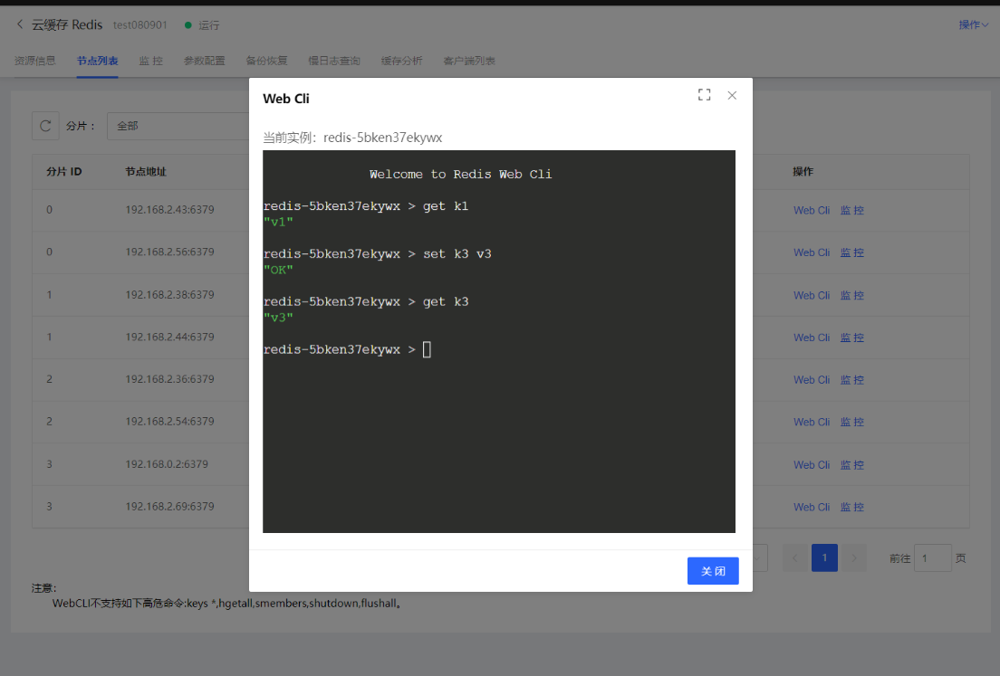
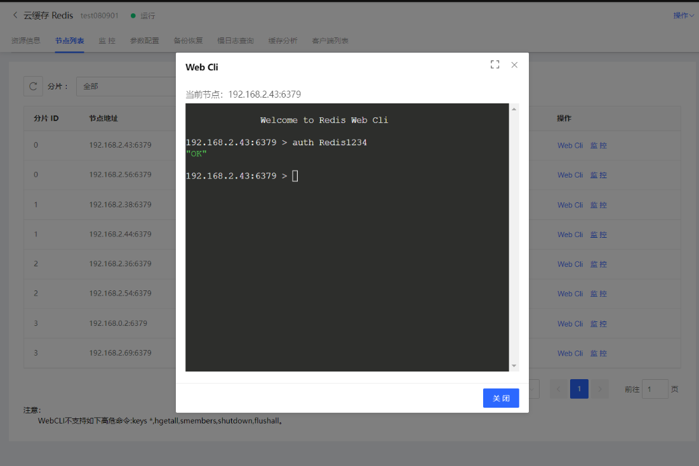

#  WebCli

控制台可支持WebCli方式连接和操作云缓存 Redis实例。

##  操作说明

当前控制台上WebCli 有两个入口：

入口1：对于标准版实例、 Proxy 集群版 4.0 的实例，进入某一实例详情页，选择 WebCli 的tab页，即可使用该功能进行数据操作。

注意：使用WebCli功能需开启密码访问，不止免密码模式下使用该功能。

入口2：对于 Cluster集群版 5.0 的 实例，进入某一实例详情页，选择 节点列表 的tab页 ，即可使用该功能进行数据操作。

在该场景下，WebCli提供了两种角度查看当前Redis实例：

- 实例维度。入口在Redis实例详情页的列表页中，搜索操作边。从该入口进入WebCli，可以查看到实例维度的信息
 
 
 
- 节点维度。入口在Redis实例详情页的列表页中，每个节点的操作栏中。从该入口进入WebCli，可以查看到某个具体节点的信息。
 
 
 

##  控制台 WebCLI 禁用命令说明
禁用命令如下：
|  禁用命令 |    禁用命令 |    禁用命令 |    禁用命令 |  
| :--- | :--- | :--- | :--- |
| discard | flushdb  | keys  | multi  |
| dump | psubscribe  | publish | pubsub  |
| exec  |punsubscribe  |quit  | subscribe  |
| flushall  |unsubscribe  | unwatch  | watch  |

