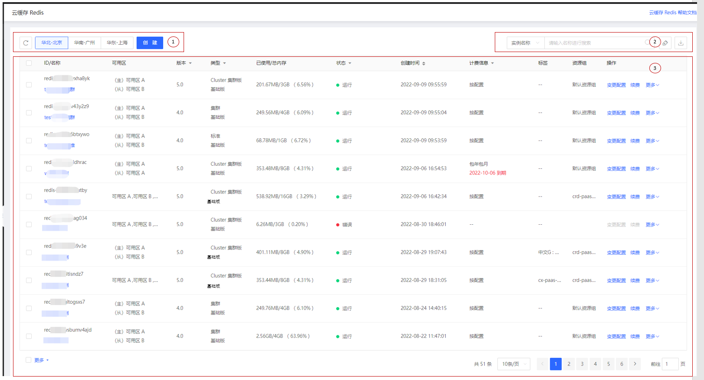

# 登录控制台

##  准备环境

1、已注册京东云账号，账户余额大于50元，可登录京东云控制台。

2、确认Redis实例归属的VPC。如您还没有VPC，可在控制台页面中选择“网络> 私有网络”，新建私有网络，用于对缓存实例进行安全网络隔离。

3、若您初次使用云缓存Redis，请先了解：

-  [实例架构](../Introduction/Features.md)  

-  [实例规格](../Introduction/Specifications.md)  

-  [Redis命令支持](../Introduction/Command-Supported.md)  

-  [使用限制](../Introduction/Restrictions.md)   

-  [Redis SLA](https://docs.jdcloud.com/cn/product-service-agreement/caching-redis-service-level-agreement-sla)

## 操作说明

入口：导航菜单 > 数据库与缓存 >  云缓存Redis

使用购买Redis服务的账号进行登录  [Redis 控制台](https://redis-console.jdcloud.com/redis) 

进入后，可看到云缓存Redis的资源列表。

**说明：**

-   区域1：该区域即为当前支持的Redis地域列表。需要在哪个地域创建实例，则单击即可进入至该地域的Redis实例列表。

-   区域2：搜索栏、标签栏、导出实例列表。

-   区域3：地域下的Redis实例列表。

