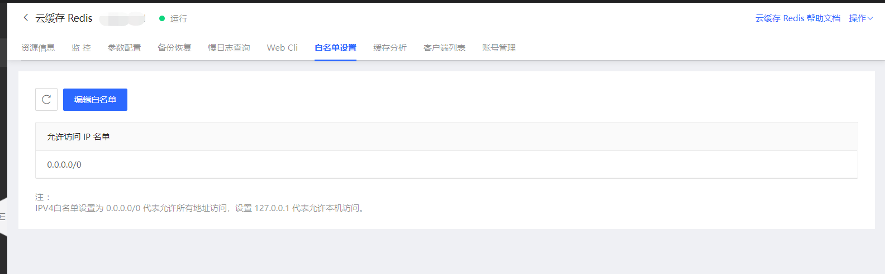
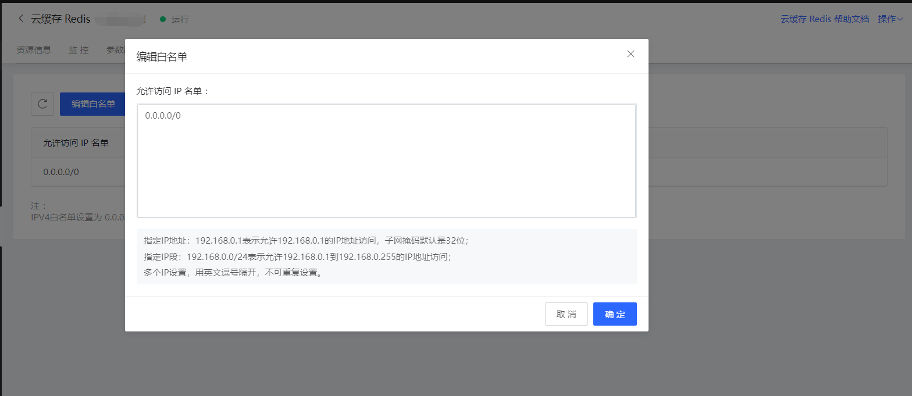

# 白名单设置 

实例创建成功后，平台默认禁止所有IP地址访问Redis实例，因此在开始使用Redis实例前，您需要将客户端的IP地址或IP地址段添加到Redis实例的白名单中。

您可以通过控制台操作添加白名单，也可直接通过调用API配置白名单。

## 操作步骤

1. 登录[Redis 控制台](https://redis-console.jdcloud.com/redis)

2. 选择目标实例，点击实例名称进入实例详情页面

3. 点击白名单设置页签，进入白名单设置页面。

- 白名单默认值是0.0.0.0/0，表示所有IP均可访问，用户可根据要求自行修改。

4. 点击编辑按钮，可进入编辑修改页面。注意：

- 0.0.0.0/0 是默认值， IP白名单设置为该值时代表允许所有地址访问，仅设置 127.0.0.1 代表禁止所有地址访问。

- 多个IP设置，用英文逗号隔开，不可重复设置。设置完点击保存即可生效。

## 相关API
| 接口 | 说明  |  
|:--   |:-- |
| [describeIpWhiteList](http://docs.jdcloud.com/cn/jcs-for-redis/api/describeipwhitelist?content=API)    |  表示获取Redis实例的IP白名单（只有白名单内的IP、网络才能访问该实例）  |
| [modifyIpWhiteList](https://docs.jdcloud.com/cn/jcs-for-redis/api/modifyipwhitelist?content=API)    |  修改Redis实例的IP白名单  |

