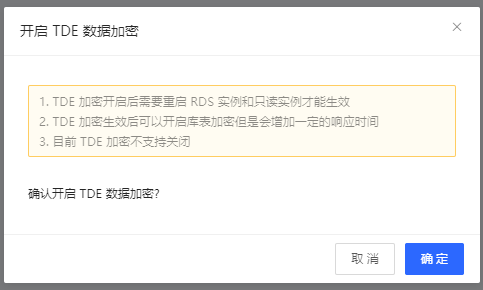

# MySQL 设置透明数据库加密 TDE

## TDE 简介

京东云数据库 RDS 支持使用透明数据加密 (TDE) 来加密运行 MySQL 的数据库实例中存储的数据。TDE 会在数据写入存储前自动加密这些数据，并在从存储中读取时自动解密这些数据。数据库文件的加密在页级别执行， 已加密数据库中的页在写入磁盘之前会进行加密，在读入内存时会进行解密。 TDE 不会增加已加密数据库的大小。

## 注意事项
1. TDE 在实例级别开启后不允许关闭
2. 当前仅 MySQL 5.7 支持 TDE 数据传输加密
3. TDE 加密开启后需要重启 RDS 实例和其关联的只读实例，请选择业务低估时间操作
4. 用户可在开启 TDE 后，通过 SQL 启用（或关闭）要加密的数据库
5. 开启 TDE 后，会增加显著 CPU 的的负荷，建议在测试后开启。如果数据库实例上拥有至少一个加密的数据库，那么也可能会降低未加密数据库的性能。因此，建议您加密数据库和未加密数据库保存在不同的数据库实例上。

## 限制
- 加密的数据库的备份无法通过“跨实例恢复”功能恢复到其他实例上
- 加密的数据库备份下载后，需要解密后才能恢复到本地的数据库。 解密的密钥请联系客户获取，后续会提供自助下载功能。
- 加密的数据库暂不支持跨域备份备份同步

## 开启TDE加密
1. 登录[云数据库RDS控制台](https://rds-console.jdcloud.com/rds/database)。
2. 点击实例名称进入实例详情页，进入到 **安全管理** 页面
3. 选择 **TDE透明数据加密** ，点击 **开关** 按钮，开启实例级别的TDE。


## 加密操作
登录数据库，执行如下命令对需要加密的标进行加密。

```SQL
ALTER TABLE t1 ENCRYPTION='Y';

```

## 解密操作

如果您要对TDE加密的表解密，需执行如下命令：

```SQL
ALTER TABLE t1 ENCRYPTION='N';

```

## 相关API

查看TDE开启状态：[describeTde](https://docs.jdcloud.com/cn/rds/api/describetde)

开启TDE：[enableTde](https://docs.jdcloud.com/cn/rds/api/enabletde)
