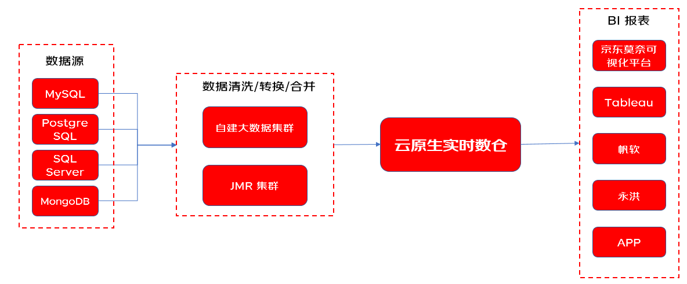
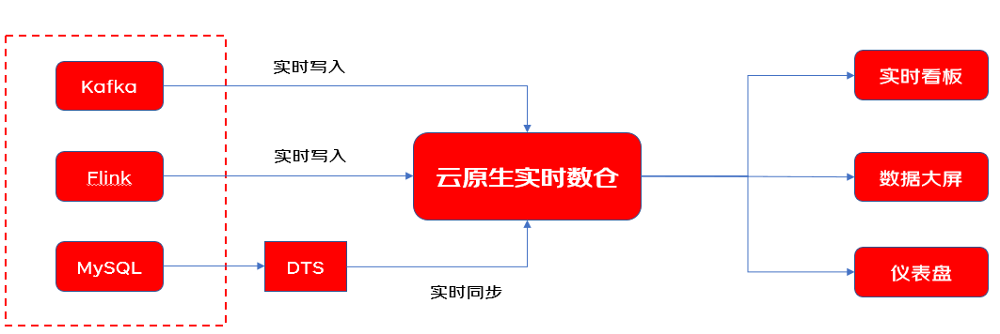
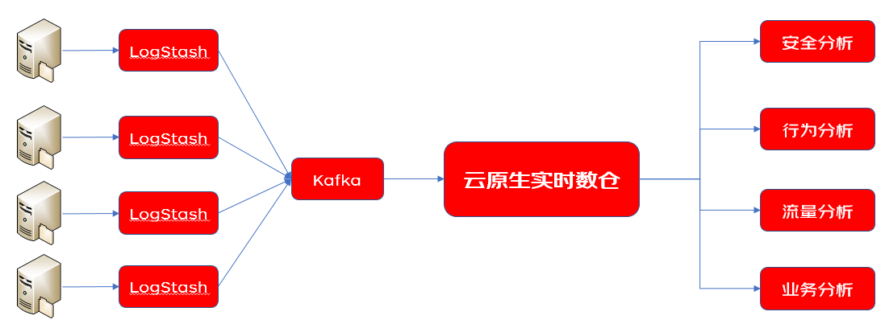

# 应用场景

## 高性能 BI 报表 
适合需要对海量数据进行各种在线分析，实时/准实时的生成各种 BI 报表的场景。云原生实时数仓 Starwift 支持 SQL，其卓越的查询分析性能可满足业务系统对数据进行准实时分析能力的需求，并且支持各种主流的 BI 报表工具。

## 实时数据分析
可无缝对接Kafka，Flink 等实时数据流产品，并且可以通过 DTS 工具将 RDS 数据库中的增量数据实时同步到 Starwfit中进行计算分析。 Starwift 的并行计算引擎可以对数据进行高性能的处理，满足实时看板，数据大屏及仪表盘的对数据实时统计分析的需求。

## 日志分析
Starwift 支持数据的高速写入，并且具有良好的数据压缩率，相比其他日志分析方案，Starwift 具有更佳的分析性能和更低的使用成本。

