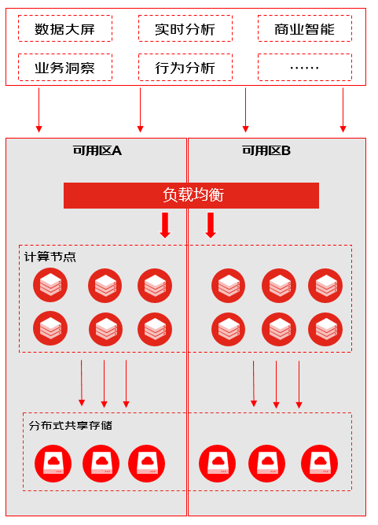

# 产品概述

**云原生实时数仓 Starwfit** 是京东云自主研发的新一代云原生数据仓库，可为用户提供高性能的实时数据分析能力。 Starwift 采用了计算与存储的分析架构，海量数据存储在自研的共享存储上，扩缩容无须数据的迁移和重分布，具有秒级弹性伸缩的能力，让资源轻松面对轻松随需应变。同时Starwfit采用了分布式架构和向量化计算引擎，实现了多核、多节点并行化处理，数据的查询分析能力比传统的数据库仓库快数十到数百倍，可以轻松支撑万亿数据规模的实时分析场景。

## 产品优势
- **高性能**  
  - 采用了列式存储和高效的数据压缩算法，提升了IO的效率；
  - 支持多核，多节点的大规模并行处理；
  - 采用了向量化的计算引擎，极大的提升了整体性能；
- **秒级弹性伸缩**
  - 计算资源能够秒级的扩容或缩容，动态的满足业务灵活多变的需求；
  - 用户可根据负荷波峰波谷的业务特性，有效的分配资源，提升资源利用率；
- **低成本**
  - 采用自研的高性能共享存储，数据的存储成本相比其他同类数据仓库下降 50% 以上；
  - 存储只按实际的数据量计费，不再为没用到的空间付费;
  - 计算资源可以在业务负荷低时动态缩容，负荷高时动扩容，降低资源使用成本；
- **便捷运维**
  - 存储自动扩容，用户无须预测和关注存储空间；
  - 提供集群和点级别的可视化监控平台，帮助业务及时感知整体运行状态；
  - 可自定义告警规则，并通过短信，Email等方式进行通知，及时发现潜在风险；
- **使用安全**
  - 宿主机位于防火墙保护之下，只开放必需的端口，且安装有各种系统补丁，修补安全漏洞，能够抵御各种恶意攻击，保障数据库安全。
  - 集群默认运行在逻辑隔离的私有网络（VPC）中，避免了数据库直接暴露在公网上，可规避绝大部分攻击。
  - 通过IP白名单可定义和强化安全策略，进一步加强数据库的安全性。

## 产品架构
Starwift 的架构图如下

