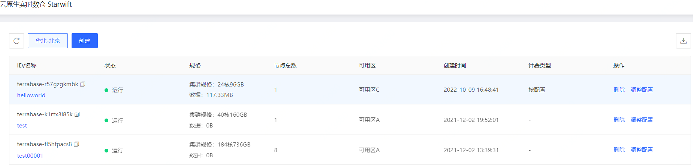
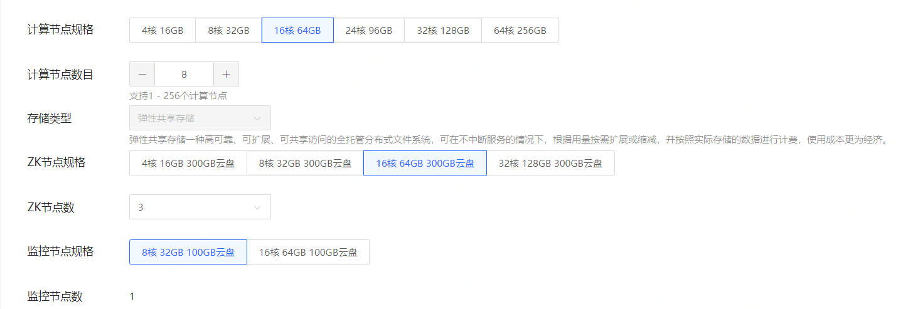
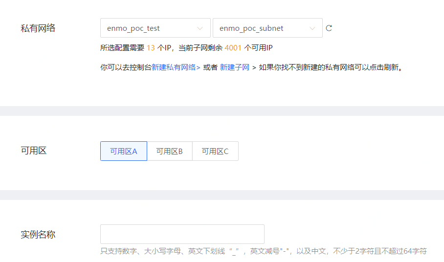

# 新建实例
在控制台上新创建一个 Starwift 实例。

## 操作步骤
#### 1. 进入实例列表页
当前页面会显示当前区域下的各个实例的概要信息，包括计费信息和过期时间等。点击 **创建** 按钮，新建一个 Starwift 实例。

#### 2. 选择计费方式及地域
进入到数据库配置页面，选择计费方式（包年包月或按配置），地域，可看到当前地域上CPU核数的配额。 用户创建的实例的总核数不能超过当前地域下的剩余配额。 如果配额不足，可通过工单申请提升。

> **注意**
> 
> 不同地域间的内网互不连通，建议选择最靠近您的地域，可降低访问时延、提高速度。

#### 3. 配置节点规格及数目
1）设置计算节点的规格数目

2）设置 ZooKeeper 节点的规格和数目。 通常情况下3个 ZK 节点即可满足绝大部分场景的需求

3）设置监控节点的规格。 监控节点用于收集和上报集群的监控信息。每个实例只需要1个监控节点。

#### 4. 配置 网络，可用区及实例名称
1） Starwift只支持在私有网络中创建。如果用户没有私有网络及子网，可以通过 **"新建私有网络”** 和 **“新建子网”** 的链接创建私有网络和子网。创建完成后，点击 **“刷新”**，就可以看到新创建的私有网络和子网了。

2）设置实例部署的可用区。目前 Starwift 暂时仅支持单可用区部署。 

3）输入实例名称

#### 5. 确认购买

信息输入完成后，可查看点击页面右边的价格信息，并点击 **立即购买**。 在订单确认页面，确认购买信息无误后，点击 **立即支付**。 支付成功后自动返回实例列表页面，能看到实例状态为 **"创建中"**。稍等一会后，实例创建完成，显示 **“运行”** 中

