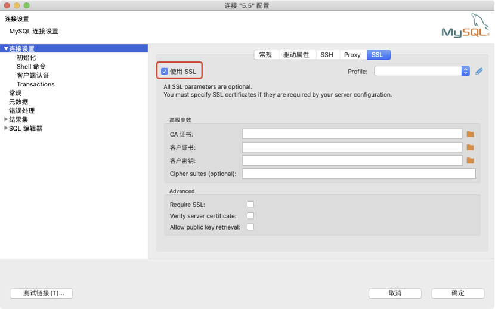

# TiDB配置SSL证书

## 配置SSL证书

云数据库TiDB连接方式支持明文的，也支持加密的，如果要支持加密的连接方式，需要在连接参数中配置 SSL 证书。 采用加密的连接方式，即使你通过公网访问云数据库TiDB，即使数据传输内容被截获，传输内容也是被加密的，无法被识别。

## 注意事项

* 新购实例 SSL 功能默认关闭，如果要启用，需要手动开启

* 开启SQL拦截的高安全模式后将无法开启SSL

* 开启SSL需要重启实例，请谨慎操作

* SSL功能支持关闭操作

## 操作步骤

1. 登录数据库控制台
2. 点击需要设置SSL证书的实例名称进入实例详情
3. 选择安全模式下的开启SSL
4. 点击开启SSL开关进行SSL证书开启
5. 点击下载SSL证书
6. 打开所下载的.pem文件，获取对应证书

## 设置SSL CA证书

开通SSL加密后，应用或者客户端连接TiDB的时候，需要配置SSL CA证书。下面以tidb命令行和Navicat为例，介绍SSL CA证书安装方法。

## MySQL命令行方式设置

下面以tidb为例，通过命令行的方式连接数据库

```sql
  # SSL 证书为上一步下载的证书文件所在路径    
  mysql -h [域名] -P [端口] -u [用户名] -p [密码] --ssl-ca [SSL 证书] 
```

连接完毕之后，可以通过`SHOW STATUS LIKE "%Ssl%"`; 了解当前连接的详细情况，包括是否使用了安全连接、安全连接采用的加密协议、TLS 版本号等。

以下是一个安全连接中执行该语句的结果。由于客户端支持的 TLS 版本号和加密协议会有所不同，执行结果相应地也会有所变化。             

```sql
  mysql>  SHOW STATUS LIKE "%Ssl%"; 
  ......  
  |  Ssl_verify_mode | 5 | 
  |  Ssl_version | TLSv1.2 | 
  |  Ssl_cipher | ECDHE-RSA-AES128-GCM-SHA256 |  
  ......   
```

 除此以外，对于 TiDB 自带客户端，还可以使用 `STATUS` 或 `\s` 语句查看连接情况：

```sql
  mysql>  \s    
  ...    
  SSL:  Cipher in use is ECDHE-RSA-AES128-GCM-SHA256   
  ...     
```

## Navicat方式设置

1、打开Navicate

2、点击进入MySQL连接设置

3、按照下图进行设置将上一步下载的.pem文件导入到CA证书路径中，点击确定


