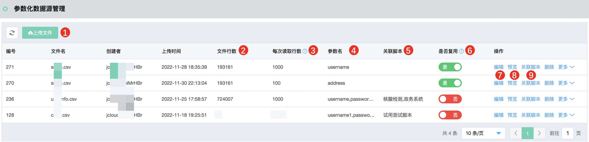

# 参数化数据源
平台提供统一的参数化数据管理功能，用户上传的参数化数据由平台解析后存储和管理。参数化数据支持非消耗型，即可循环重复使用；消耗型，即每条数据使用后删除。
用户上传的脚本通过 **${参数化变量名}** 使用参数化数据。

### 注意：
1.  用户如想使用参数化数据，必须通过此处上传参数化数据并关联到脚本。
2.  用户如脚本中包含CSV Data Set Config，并引用了此组件中的参数化名，仅上传脚本后是无法正确压测的，必须在此处上传参数化文件并正确指定参数化名。脚本中的CSV Data Set Config不用手动删除，平台发压时会自动禁用此组件，通过平台自身组件提供参数化数据。

### 示例一：
- 用户的本地jmeter脚本未使用参数化数据，本地调试通过后可以把希望引用参数化的地方更新为如${username}之后上传，然后在参数化数据源管理处上传csv文件并定义参数化名称为username，那么在平台调试和压测时均可以使用到参数化数据。

### 示例二：
- 用户的本地jmeter脚本通过CSV Data Set Config使用了参数化数据username，本地调试通过后把脚本上传至平台，然后在参数化数据源管理处上传csv文件并定义参数化名称为username，那么在调试和压测时均可以使用到参数化数据【压测和调试时用户脚本中的CSV Data Set Config是被禁用的，实际参数化数据由平台的组件提供】。

## 参数化数据源-参数化数据列表
### 操作步骤
1. 用户可在创建脚本或编辑脚本时直接上传和管理参数化数据，也支持在此处统一进行上传和管理后再关联到脚本。
2. 参数化数据列表页的操作说明如下。

|序号|数据/操作项|说明|
|---|---|---|
|1|上传文件|上传包含参数化数据的csv文件|
|2|文件行数|平台解析成功的参数化数据行数|
|3|每次读取行数|平台在压测执行时动态获取参数化数据，此数值为每次获取时获取的参数化数据量。如果设置的较小会造成平台频繁获取参数化数据导致性能较差，建议除了不容易准备的消耗型数据适当调小以外，无特殊需求保留默认的10000即可|
|4|参数名|参数化变量名|
|5|关联脚本|此参数化数据已关联的脚本，关联的脚本可以通过${参数化变量名}使用参数化数据|
|6|是否复用|是，代表可重复使用的数据；否，代表消耗型数据，使用过的数据会被删除|
|7|编辑|可重新设置每次读取行数和每一列的参数化名，需要重点关注：如果参数化名改了，注意关联的脚本中实际使用的参数化名称，和此处保持一致才能正常引用|
|8|预览|可查看前10条数据|
|9|关联脚本|选择关联的脚本，即希望使用此参数化的脚本。因设计原因，2022年12月2日21点前创建的脚本无法关联，如有必要请重新上传脚本后关联|

此外，可以通过更多按钮提供下载、清空（清空所有数据）、追加（按照原文件格式追加新的数据，注意追加的文件中不能包含列名，否则会被作为一条参数化数据）等操作。

