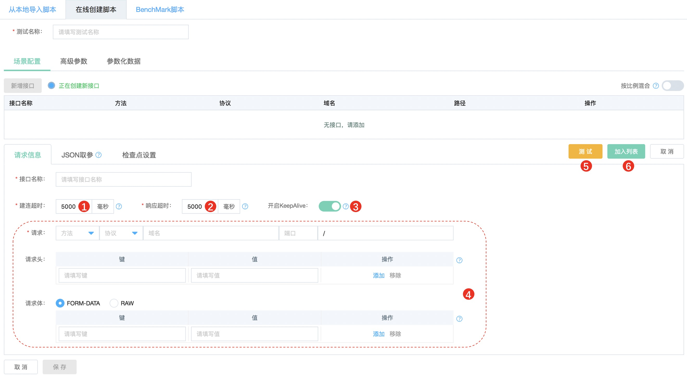
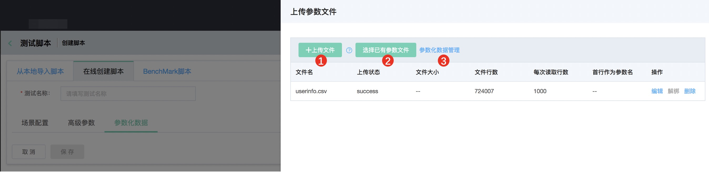
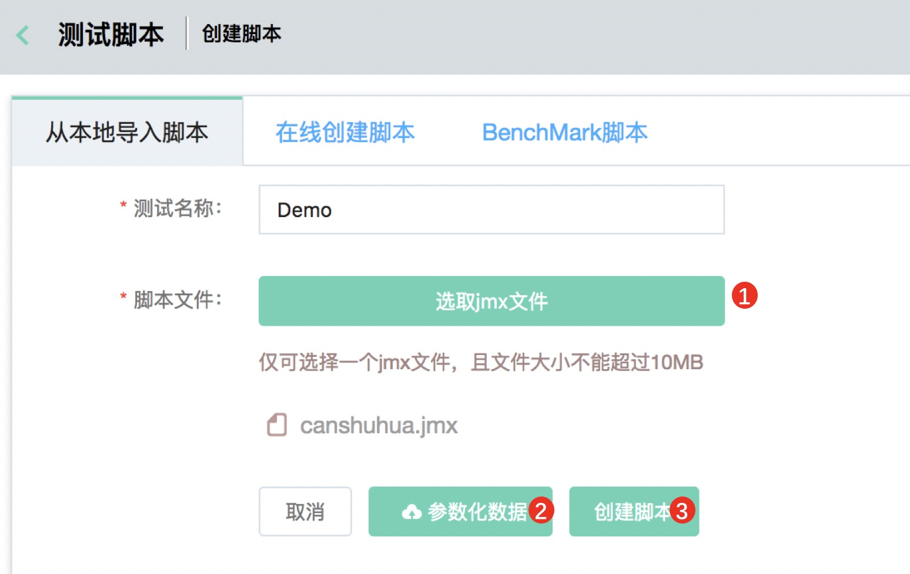
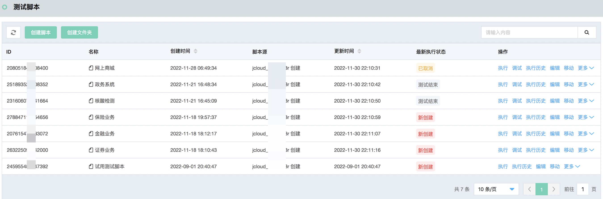
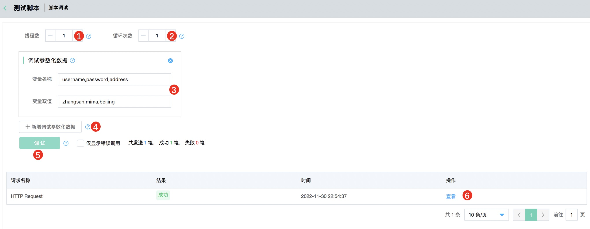

# 脚本创建
创建性能测试脚本是使用京东云性能测试服务的第一步，本文将帮助您了解性能测试脚本的一些背景知识，以及如何创建一个性能测试脚本。
## 性能测试脚本
要发起一次性能压测，首先要创建一个性能测试脚本，性能测试服务支持在线创建性能测试脚本；同时也支持直接导入在线下调试通过的jmeter脚本和相关参数化文件、插件。
- 在线创建测试脚本：支持http/https请求、JSON取参、检查点；支持参数化文件、域名绑定、自定义变量；支持混合场景的比例设置。
- jmeter脚本导入：如果在线创建脚本无法满足测试需求，比如需要测试非http/https协议，对其他jmeter组件有需求等，可以在线下完成jmeter脚本的创建和调试工作，然后把jmx和参数化文件等一起上传到性能测试平台。

## 在线创建测试脚本
### 操作步骤
1.  登录性能测试控制台，在左侧导航栏单击测试脚本，点击创建脚本，选择在线创建脚本Tab页。
2.  填写测试名称，如某系统/接口618大促压测。
3.  点击新增接口，填写接口名称后按照如下说明完成单个接口请求信息的填写。

|序号|填写项|说明|
|---|---|---|
|1|建连超时|连接超时，等待连接打开的毫秒数|
|2|响应超时|响应超时，等待响应的毫秒数|
|3|开启KeepAlive|开启后该接口会设置请求头：Connection: keep-alive，即使用长连接|
|4|请求信息|填写被测接口的具体信息|
|5|测试|根据当前填写的实际值进行接口验证，验证时暂不支持参数化、断言、jmeter自定义函数等|
|6|加入列表|当前接口设置完成后，点击加入待保存列表|

4.  JSON取参设置（同jmeter的JSON Extractor），按照如下说明完成JSON取参的相关设置。

|序号|填写项|说明|
|---|---|---|
|1|变量名称|分号分隔，包含JSON路径表达式的结果（必须匹配JSON路径表达式的数量）|
|2|JSON路径表达式|分号分隔，JSON路径表达式（必须匹配变量数量）|
|3|匹配数字|0-随机、N-提取第N个结果、-1-提取所有结果，它们将被命名为：<参数名>_N（其中N为1~结果数）  如未匹配到，此变量会被设置为NOT FOUND|

5.  检查点设置（同jmeter的Response Assertion），按照如下说明完成检查点的设置，如添加多个检查点，实际结果全部匹配才会判断为检查成功。

|序号|填写项|说明|
|---|---|---|
|1|检查点类型|目前支持响应状态码和响应文本|
|2|匹配规则|匹配、包含、相等|
|3|匹配内容|要匹配的状态码或者响应文本的内容|

6.  通过步骤3-5可以完成单个接口相关信息的配置，可添加多个接口至测试脚本中。后续步骤讲解参数化文件和高级参数的使用。
7.  参数化文件（同jmeter的CSV Data Set Config），按照如下说明完成参数化文件的相关设置。

|序号|填写项|说明|
|---|---|---|
|1|上传文件|仅支持csv文件。顺序读取文件中的行，并根据以逗号分隔的参数名称进行分割，总大小不能超过50MB 请确保文件中每一行的列数相同且均以逗号为分隔符|
|2|选择已有参数文件|可选择已上传的参数化文件关联到此脚本|
|3|参数化数据管理|提供统一管理参数化数据的功能|

8.  高级参数，目前包含域名绑定（同jmeter DNS Cache Manager）和自定义变量（同jmeter User Defined Variables），相关说明如下。

|序号|填写项|说明|
|---|---|---|
|1|是否绑定|已经加入到列表中的请求包含的域名会自动在此处展示，按照需要选择是否绑定|
|2|域名或IP|已选择绑定的域名要解析到的域名或者IP|
|3|自定义变量|自定义参数名称和参数值，在此自定义的参数名称可以在“场景配置-请求信息”中以${参数名称}进行引用，且在执行页面的“运行时参数”处修改值，避免编辑和更新脚本|

9.  按比例混合，当有多个url加入列表后，此项如果不勾选，单个并发用户会顺序、循环执行这些url，为了模拟真实业务场景的比例，可以勾选后设置访问百分比，确保所有url的百分比相加为100%。

## 从本地导入脚本
### 操作步骤
1.  本地下载安装JMETER，通过JMeter编写和调试自己的脚本。 （请使用最近的JMeter 5.0版本，避免脚本版本不兼容带来的问题。安装使用很简单，网上有大量的教程可参考）。
2.  脚本调试通过后，把jmx文件、csv文件根据如下说明上传到平台。

|序号|填写项|说明|
|---|---|---|
|1|选取文件|选取本地的jmx文件（必须有且只能有1个）|
|2|参数化数据|管理参数化数据，也可以在脚本创建完成后再通过脚本编辑的操作进行参数化数据管理|
|3|创建|根据上传的文件生成性能测试脚本|

备注：如果有第三方或者自定义插件jar包，务必通过平台左侧导航栏的插件管理上传，上传后本账号下所有脚本共享使用。

## Benchmark脚本
### 操作步骤
1.  Benchark脚本为调度开源专项测试工具对被测对象展开性能测试，目前支持redis-benchmark和esrally。
2.  目前Benchmark压测仅支持vpc内发压，需要定制压测机镜像，有需求请提工单咨询。

## 脚本列表页
### 操作步骤
1.  创建脚本成功后会自动跳转到脚本列表页，在左侧导航栏单击测试脚本同样可以进入测试脚本列表页。
2.  脚本列表页的各数据项和各操作说明如下。

|序号|数据/操作项|说明|
|---|---|---|
|1|创建脚本|点击后进入创建脚本页面，可直接在线创建脚本，也可以本地使用jmeter调试通过后直接上传至平台|
|2|创建文件夹|如测试脚本较多，可以通过创建文件夹来组织和管理脚本|
|3|ID|测试脚本的ID|
|4|名称|测试脚本的名称|
|5|创建时间|测试脚本的创建时间|
|6|更新时间|测试脚本最近一次更新的时间，更新包括脚本创建、脚本更新和脚本执行操作|
|7|最新执行状态|脚本最新一次的执行状态|
|8|操作|适用于此脚本的操作列表|
|9|执行|使用此脚本执行压测|
|10|调试|压测前调试脚本的功能，支持单笔调试和多笔调试|
|11|执行历史|此脚本的所有执行历史记录|
|12|编辑|编辑此脚本，如果是在线创建的，点击编辑后支持在线界面编辑；如果是本地上传的，会直接展示jmx原始文件，支持直接编辑|
|13|移动|移动此脚本到预期的文件夹内，前提是已经创建了文件夹|
|14|更多-创建定时|使用此脚本创建定时任务|
|15|更多-下载脚本|下载此脚本，如果有参数化文件，会以zip包的形式和jmx脚本一起下载|
|16|更多-删除脚本|删除此脚本|

## 脚本调试
### 操作步骤
1.  在正式压测前可以通过调试功能确认脚本的连通性和正确性等，支持单笔调试和多笔调试。
2.  调试的操作说明如下。

|序号|数据/操作项|说明|
|---|---|---|
|1|线程数|调试使用的线程数，取值范围1-100|
|2|循环次数|单线程循环的次数，取值范围1-100|
|3|调试参数化数据|自动读取已关联的参数化数据，仅线程数和循环次数均为1的时候显示|
|4|新增调试参数化数据|针对暂未关联参数化数据，但希望先调试的场景，此处可以通过平台填充仅调试使用的参数化数据|
|5|调试|调试执行。如用到参数化数据，单次调试时，使用此界面的参数化数据。多次调试时，使用关联的参数化数据。|
|6|详情|查看请求详情|