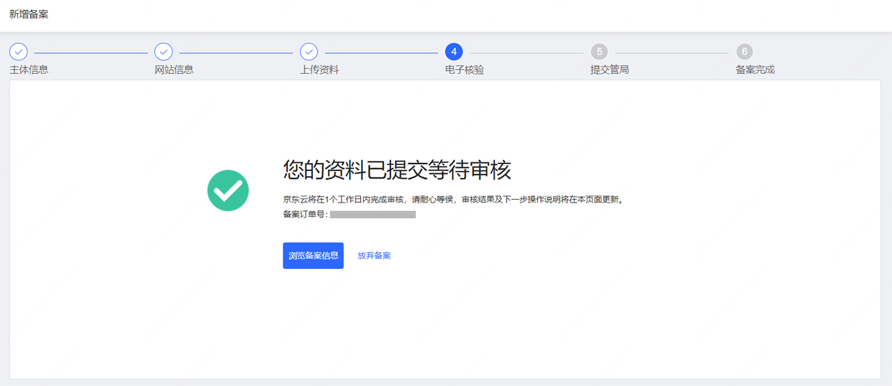

# 京东云备案电子核验流程

-  打开[**京东云官网**](https://www.jdcloud.com/)首页,点击右上角处**备案**按钮
  
 

- 进入登录页面，选择您可登录的方式登录系统

 
  
- 进入备案系统，开始备案

  
- 填写备案信息，系统校验类型

 
  
- 填写备案主体信息

  
- 填写备案网站信息

  
- 上传域名证书以及互联网信息服务备案承诺书

  
  
- 准备进入电子核验阶段，需要使用手机下载京东云APP

  
  
- 点击图片上的“+”，弹出电子核验专属二维码

  
  
- 使用京东云APP扫描二维码，进入证件识别环节。

- 小提示：非企业（营业执照）单位备案可选择本地上传主体证件。

 
    
    

 
- 身份证件识别成功后进入视频验证环节，需网站负责人本人完成操作，核验前请仔细阅读提示内容。

- 核验时注意人物背景需为白色！光线不能太暗或太亮，面部不要存在遮挡物。

 
 
- 阅读并同意《人脸识别服务协议》后，正式进入视频验证环节。

- 小技巧：拍摄之前选择好拍摄位置，保持身体稳定，成像效果会更好哦~

 
 
- 全部上传完毕后，可以在电脑端看到上传的图片，核对无误可点击下一步

- 核对信息无误后，勾选“我已阅读并同意《信息安全管理协议》和《协助更改备案信息服务在线服务条款》”，点击提交信息即可成功提交至京东云初审。

 
 
 
 
 
 
