# 京东云有过备案记录看这里

- 登录京东云备案系统，找到备案入口

  打开[**京东云官网**](https://www.jdcloud.com/)首页,点击右上角处**备案**按钮

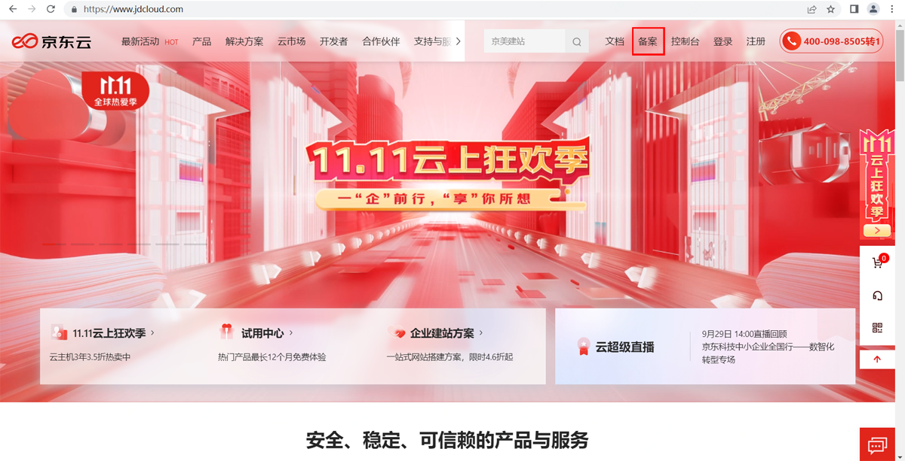

- 进入登录页面，选择您可登录的方式登录系统

  **温馨提示：一个账号仅支持备案一个主体，子账号不持支备案**

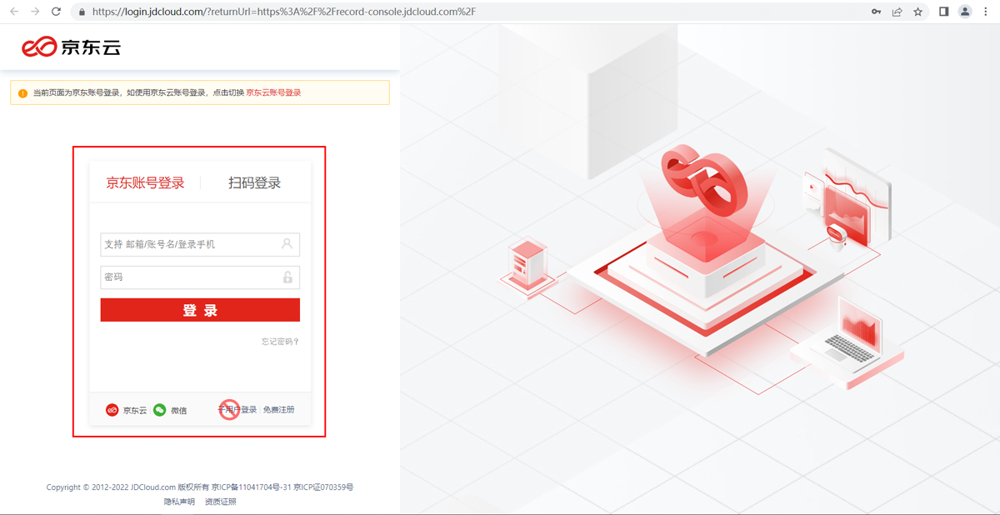

- 核对账号登录是否正确
 
  登入后您将看到如下页面，含有备案主办单位信息及网站信息，请核对主办单位名称、主体备案号等信息是否是您本次需要操作的对象，若不是请核对登录的账号是否正确。

____________

## **新增网站&新增接入网站**

- 您本次备案的**域名没有备案号且需要备案到此主办单位下**，请点击**新增网站**，
  
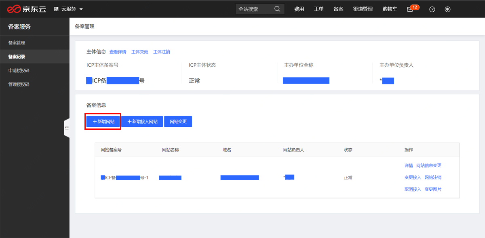

- 若本次备案的**域名存在备案号且归属于此主办单位下**，请点击**新增接入网站**
  
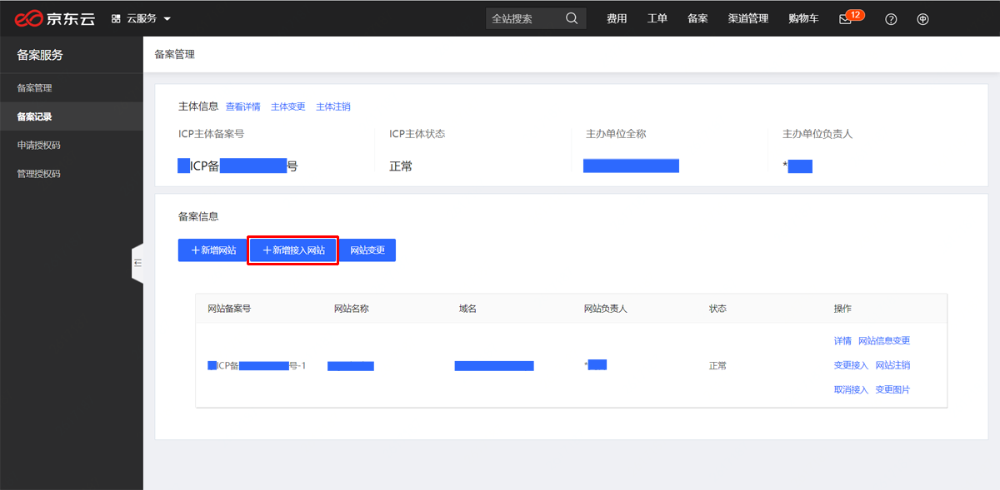
  

- 确认备案类型

 如果您不确定您的域名是否存在备案号或不清楚匹配关系，可通过[工信部网站](https://beian.miit.gov.cn/#/Integrated/index)查询

 按照您的实际情况点击“新增网站”或“新增接入网站”，点击后会出现信息核对页面，请仔细核对信息是否正确，若信息正确请点击“信息准确，下一步”；若信息错误请参考“主体变更”流程

- 填写网站信息及网站负责人信息

  **网站负责人需完成后续核验单签署等工作，请根据实际情况填写，若网站负责人与主体负责人为同一人，可勾选“同主体负责人”。**

  **如有多个网站提交申请，可单击“继续添加网站”按钮添加；若仅备案一个网站，点击下方“下一步”即可进入下一环节。**

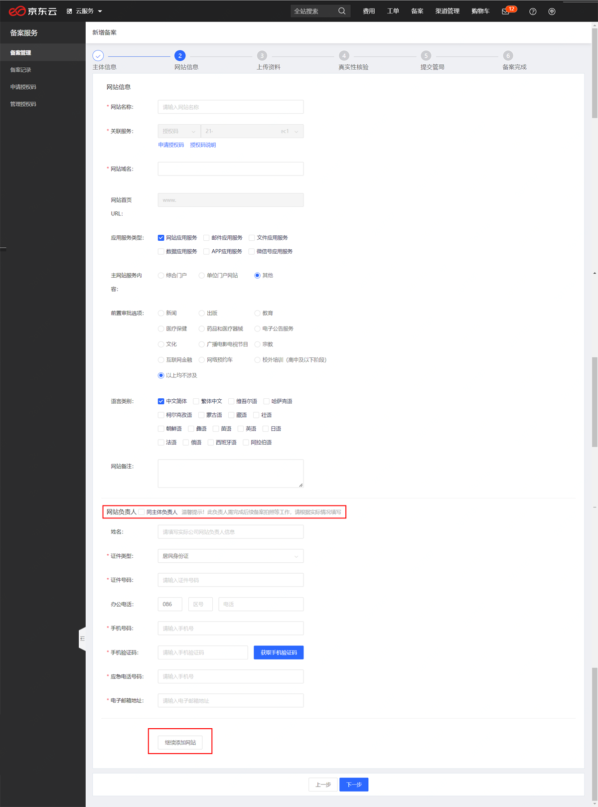  

- 上传图片资料

  按照系统提示及下方提示上传对应图片，上传完毕后点击“下一步”

  **温馨提示：所有图片请上传原件彩色扫描件，图片需清晰完整，无遮挡，无反光；有效期需大于3个月。**

  **核验单：点击蓝色字体[《网站备案信息真实性核验单》](https://docs.jdcloud.com/cn/icp-license-service/check-list-download)下载，打印纸质文件，参考[核验单填写示例](https://docs.jdcloud.com/cn/icp-license-service/quanguo-check-list) 填写**

  **域名证书：需要联系您的域名注册商获取。**

  **辅助材料：非必填项，如您有其他图片材料可在此补充上传**

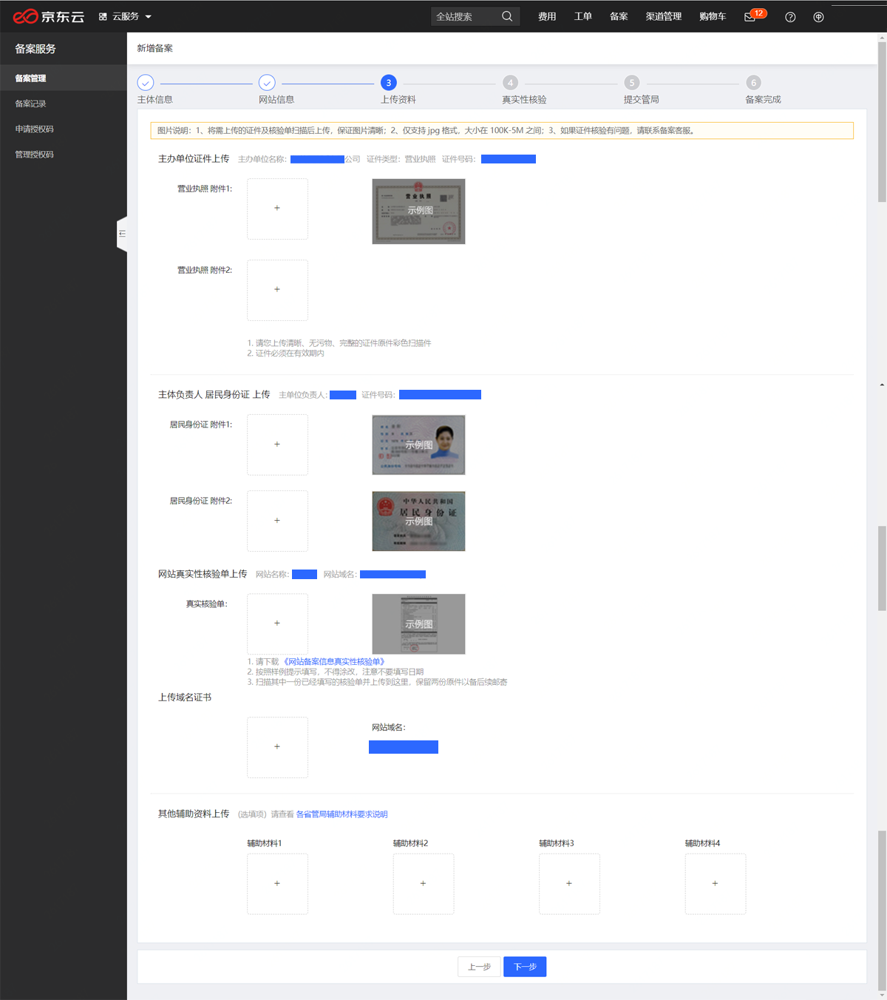  

- 核对备案信息，提交初审

  浏览备案信息页，查看填写的备案信息是否有错误，若有需要修改地方可点“编辑”修改，若没有问题，勾选下方的“我已阅读并同意《信息安全管理协议》和《协助更改备案信息服务在线服务条款》”后，点击“提交信息”

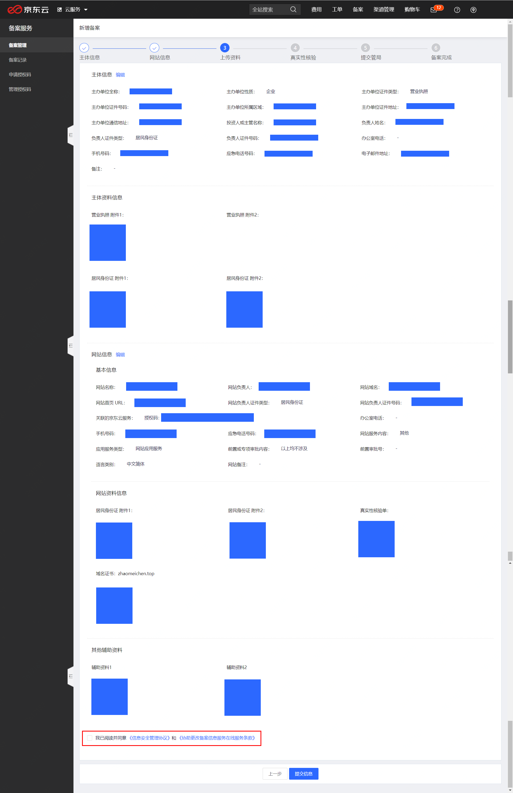

- 提交信息后会出现“工信部短信核验”有关弹窗提示，点击“继续提交” 

  **温馨提示：未验证、超时验证均会导致备案失败,请务必在24小时内完成短信核验。相关详细说明请查看[备案短信核验说明](https://docs.jdcloud.com/cn/icp-license-service/recording-sms-verification-instructions)**

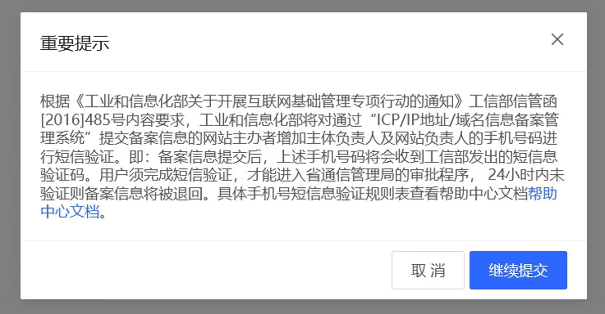

- 点击“继续提交”将把备案信息提交至京东云，等待审核即可。

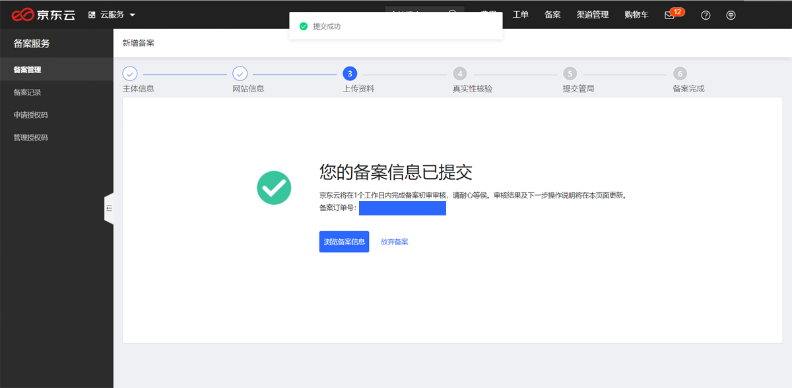

- 若您接到初审通过的通知，按照系统提示继续完成真实性核验即可；若您接到初审失败的通知，您可通过左侧“备案管理”或“备案记录”按钮查看备案记录，点击“继续备案”可查看具体驳回原因.

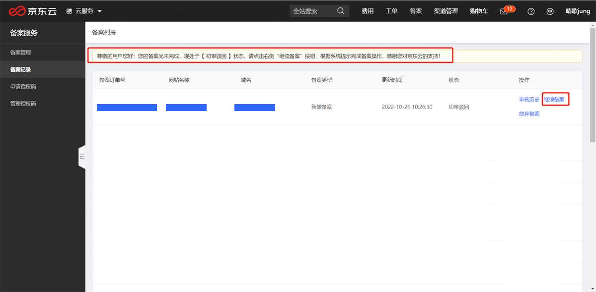

- 驳回原因可在此处查看，按照驳回原因修改信息，修改完毕后点击“修改信息提交”

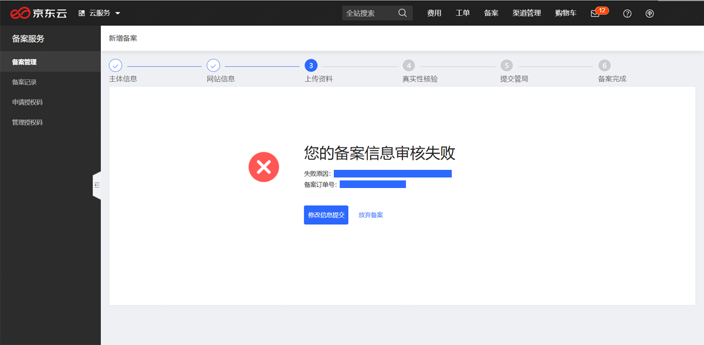

- 提交管局审核

   若您接到提交管局审核的通知，约5-10分钟后会收到工信部下发的核验短信，请在24小时内完成短信核验，您的备案信息才能成功上报至地方通信管理局审核。

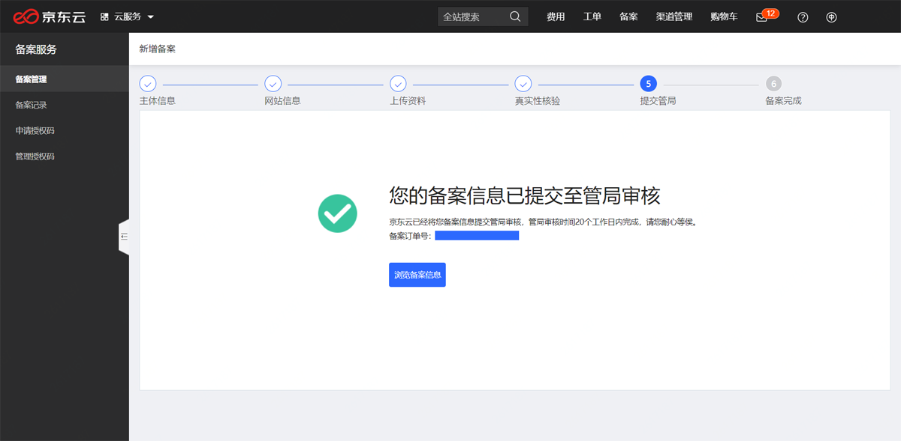

- 查看管局审核结果

  若管局审核失败，系统提示页面如下,可在“备案管理”或“备案记录”按钮查看备案记录，点击“继续备案”可查看具体驳回原因,按照驳回原因点击“修改信息提交”

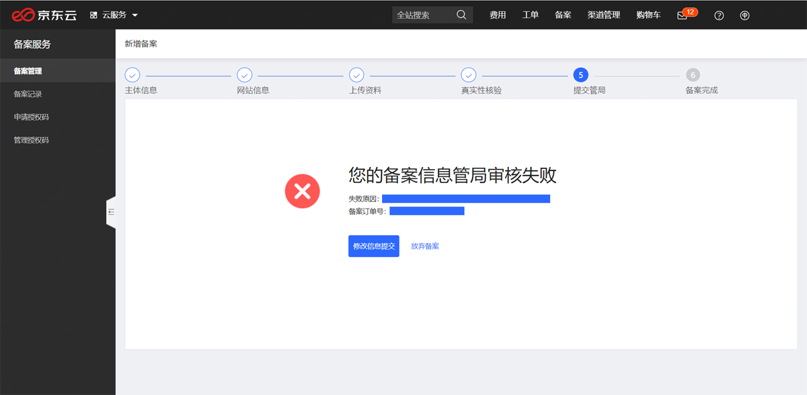

   若管局审核成功，您可在后台查看到您的备案号等相关信息。

____________

## 主体变更

- 主体变更**支持仅变更备案主体信息**，**也可以选择变更主体信息和网站信息**

  包含主办单位名称、主体负责人信息等主体信息，以及主体下所有网站的网站名称、网站负责人信息、IP地址等网站信息；

- 变更主体发起位置

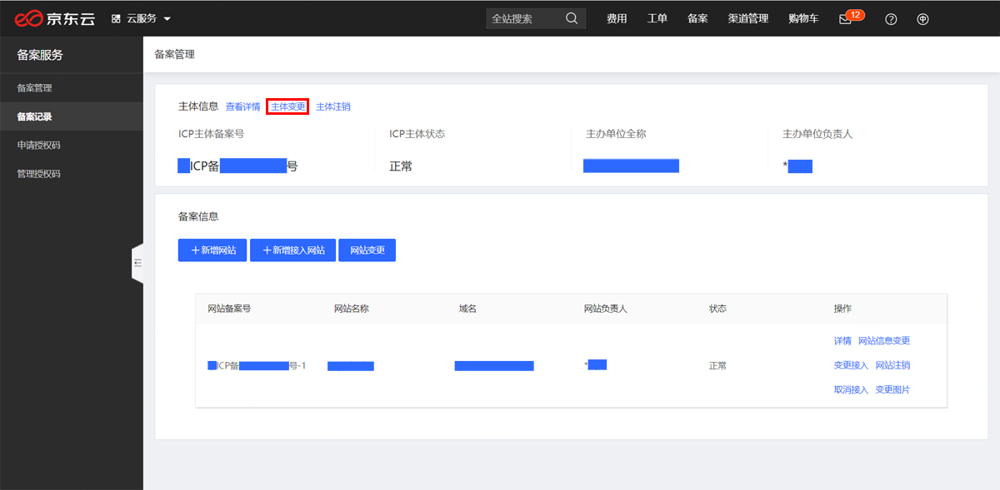

- 请确认是否修改网站信息

  主体信息提交变更后，会弹窗提示“请确认是否修改网站信息”，若网站信息（如网站负责人身份证件、联系方式、网站名称、IP等）不需要变更，可以选择“否”；
  
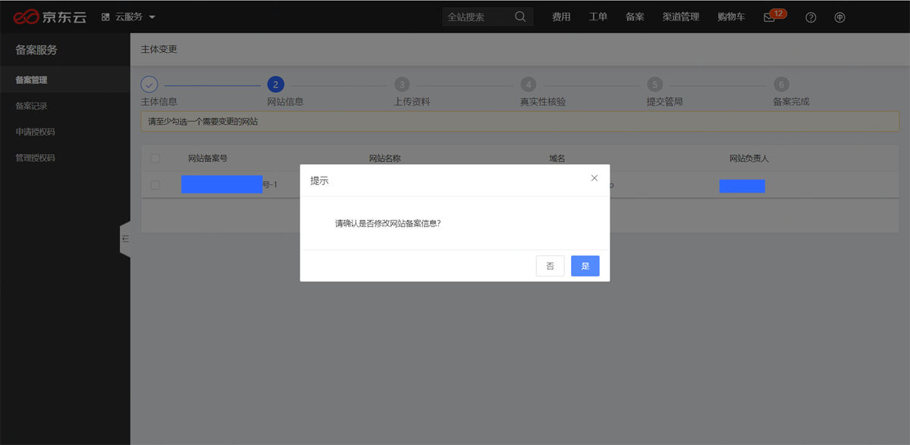

## 网站变更

- 网站信息变更：仅可修改选中网站的网站名称、网站负责人信息、IP地址等网站信息，不能修改主办单位信息。

## 变更接入

- 变更接入：仅IP地址需要更新，其他信息无需变更时，可选择变更接入（仅支持京东云有效公网IP）。

## 变更图片

- 变更图片：图片类材料过期，其他信息无需变更时，可选择仅变更图片。

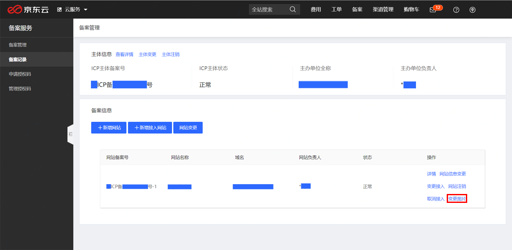

——————————————————

## 注销备案& 取消备案

**说明③ 主体注销&网站注销&取消接入**

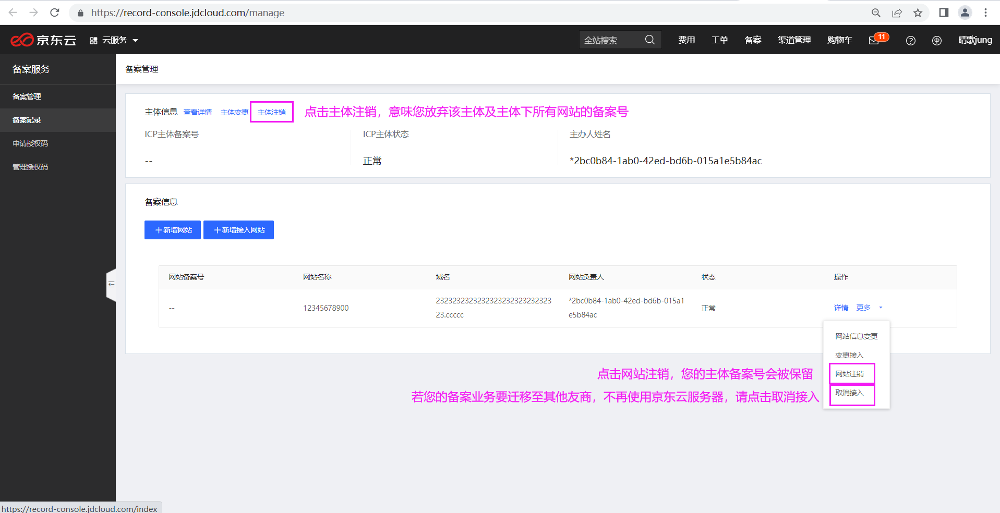

**温馨提示：注销过程不可逆，备案号被注销后网站将不能开通访问！**

- 主体注销：**此主体及主体下所有域名的备案号都将被注销！** 注销过程中不可撤回！注销成功后网站将不能开通访问！

- 网站注销：**仅注销您本次选择网站的备案号，该网站下的域名将失去备案号。** 注销过程中不可撤回！注销成功后此网站将不能开通访问！

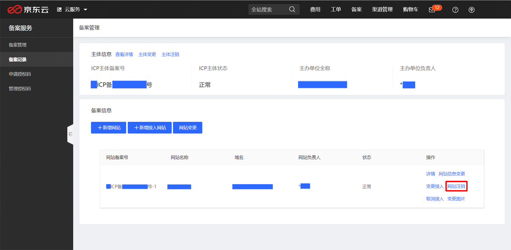

- 取消接入：是指将您的备案信息从京东云的备案系统中删除，取消接入成功后如果您继续使用京东云接入商的服务器，您的网站将会被阻断访问；如果此网站（此域名）在其他服务商处存在备案，您的备案号不会被注销；如果您的备案信息没有对应的接入商，根据相关法律法规，相关部门可能会注销您的备案号，届时您的网站将不能开通访问！

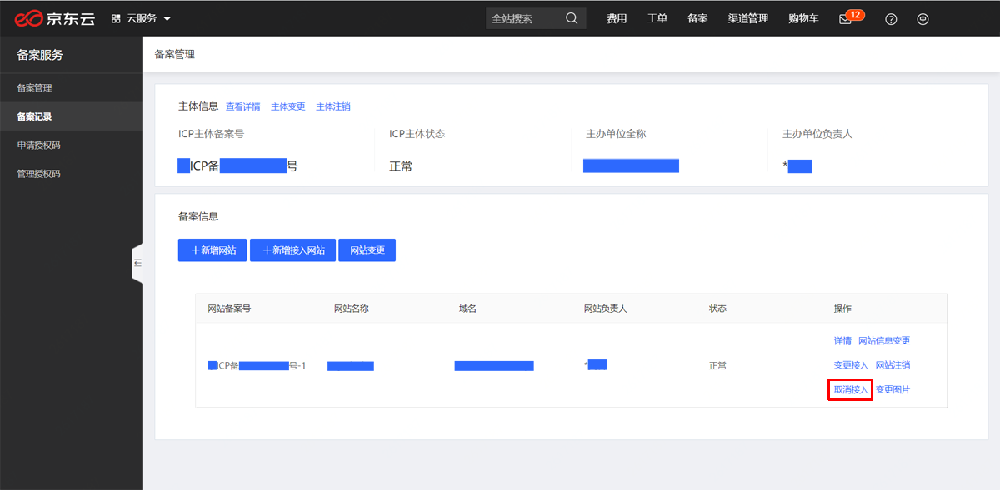

- 注销过程中，请仔细阅读信息提示卡内容明，知晓注销后果后点击“确认注销”。

- 注销成功后，**主体负责人会收到工信部下发的短信、邮件通知**，“备案管理”页面也将失去对应的备案信息。
