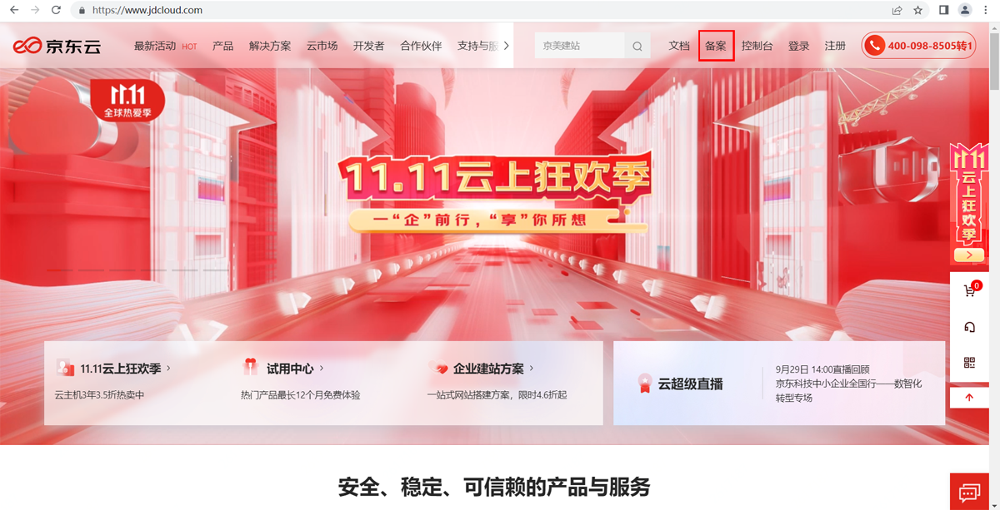
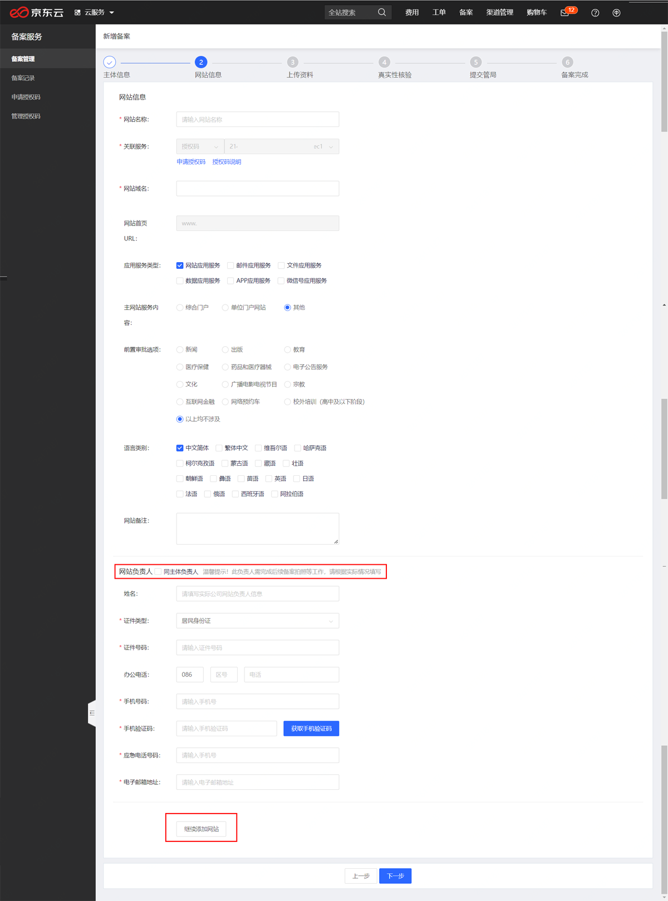
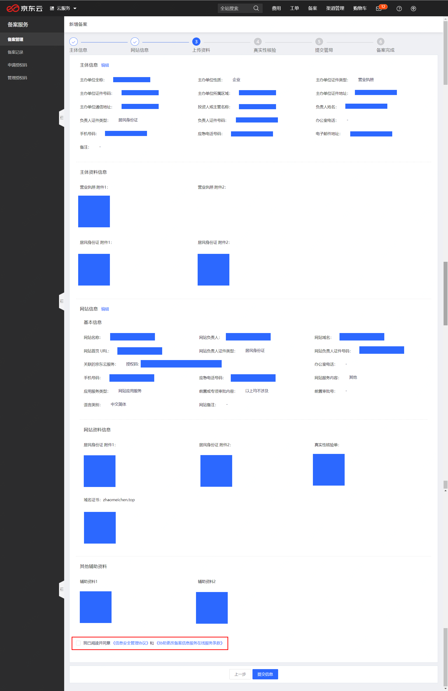
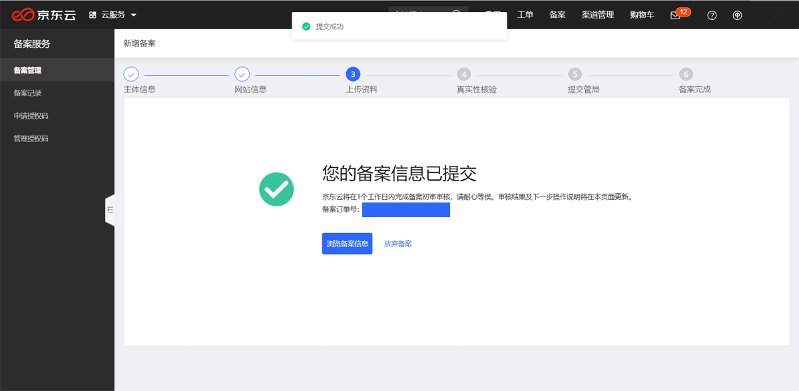
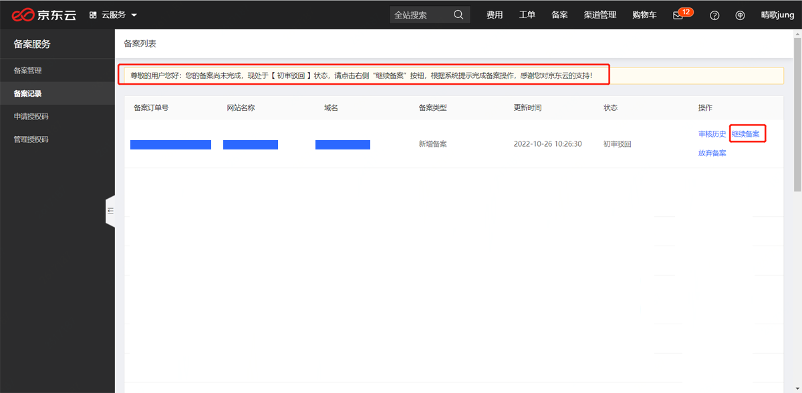
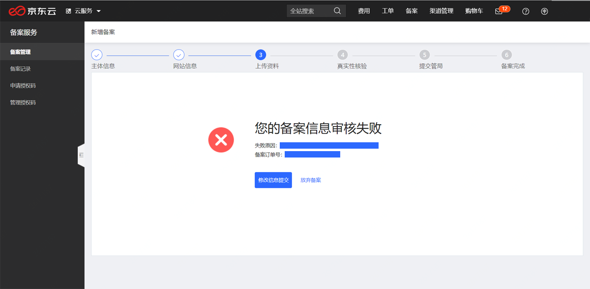
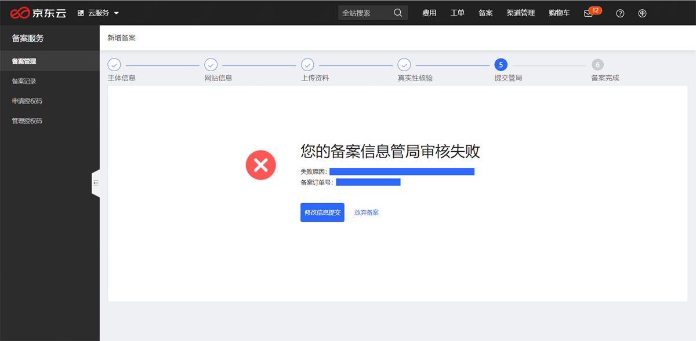

# 第一次来京东备案看这里

**温馨提示：备案类型会由系统自动判断，无论什么备案类型，流程都是唯一的，按照下方流程指引操作即可。**

- 登录京东云备案系统，找到备案入口

  打开[**京东云官网**](https://www.jdcloud.com/)首页,点击右上角处**备案**按钮

- 进入登录页面，选择您可登录的方式登录系统

  **温馨提示：一个账号仅支持备案一个主体，子账号不持支备案**

- 填写备案信息，验证备案类型

  进入备案系统后会显示如下页面，点击“开始备案”

- 按照提示选择、填写真实有效的信息，完成信息验证，填写后点“验证”按钮进入下一步

- 填写主办单位信息及主体负责人信息

  按照提示填写真实有效的信息，企业备案主体负责人建议填写法人，个人备案填写个人信息即可；填写完毕后点击“下一步”
  
  

- 填写网站信息及网站负责人信息
  
  **网站负责人需完成后续备案拍照、核验单签署等工作，请根据实际情况填写，若网站负责人与主体负责人为同一人，可勾选“同主体负责人”。**

  **如有多个网站提交申请，可单击“继续添加网站”按钮添加；若仅备案一个网站，点击下方“下一步”即可进入下一环节。**

  

- 上传图片资料

  按照系统提示及下方提示上传对应图片，上传完毕后点击“下一步”

  **温馨提示：所有图片请上传原件彩色扫描件，图片需清晰完整，无遮挡，无反光；有效期需大于3个月。**

  **核验单：点击蓝色字体[《网站备案信息真实性核验单》](https://docs.jdcloud.com/cn/icp-license-service/check-list-download)下载，打印纸质文件，参考[核验单填写示例](https://docs.jdcloud.com/cn/icp-license-service/quanguo-check-list) 填写**

  **域名证书：需要联系您的域名注册商获取。**

  **辅助材料：非必填项，如您有其他图片材料可在此补充上传**

  

- 核对备案信息，提交初审

  浏览备案信息页，查看填写的备案信息是否有错误，若有需要修改地方可点“编辑”修改，若没有问题，勾选下方的“我已阅读并同意《信息安全管理协议》和《协助更改备案信息服务在线服务条款》”后，点击“提交信息”

- 提交信息后会出现“工信部短信核验”有关弹窗提示，点击“继续提交” 

  **温馨提示：未验证、超时验证均会导致备案失败,请务必在24小时内完成短信核验。相关详细说明请查看[备案短信核验说明](https://docs.jdcloud.com/cn/icp-license-service/recording-sms-verification-instructions)**

- 点击“继续提交”将把备案信息提交至京东云，等待审核即可。

- 若您接到初审通过的通知，按照系统提示继续完成真实性核验即可；若您接到初审失败的通知，您可通过左侧“备案管理”或“备案记录”按钮查看备案记录，点击“继续备案”可查看具体驳回原因.

- 驳回原因可在此处查看，按照驳回原因修改信息，修改完毕后点击“修改信息提交”

- 提交管局审核

   若您接到提交管局审核的通知，约5-10分钟后会收到工信部下发的核验短信，请在24小时内完成短信核验，您的备案信息才能成功上报至地方通信管理局审核。

- 查看管局审核结果

  若管局审核失败，系统提示页面如下,可在“备案管理”或“备案记录”按钮查看备案记录，点击“继续备案”可查看具体驳回原因,按照驳回原因点击“修改信息提交”

   若管局审核成功，您可在后台查看到您的备案号等相关信息。

---

**完成备案后千万不要忽略做的事**

1、在网站底部标注备案号并设置超链接

根据《互联网信息服务管理办法》第十二条 “互联网信息服务提供者应当在其网站主页的显著位置标明其经营许可证编号或者备案编号。”

第二十二条“违反本办法的规定，未在其网站主页上标明其经营许可证编号或者备案编号的，由省、自治区、直辖市电信管理机构责令改正，处5000元以上5万元以下的罚款。”

工信部地址为：beian.miit.gov.cn

2、公安备案

依据《计算机信息网络国际联网安全保护管理办法》相关规定，各网站在工信部备案成功后，需在网站开通之日起 30 日内登录[**公安备案入口**](http://www.beian.gov.cn/portal/index.do)提交公安备案申请，点击**办事指南**下载查看相关操作指引文件。

