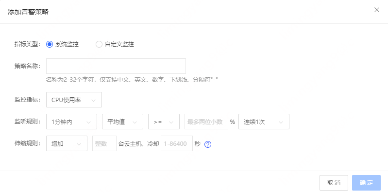
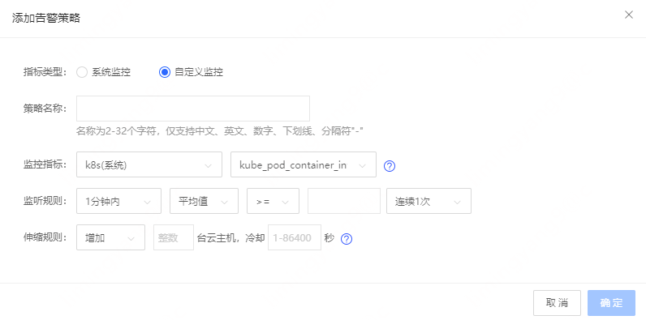
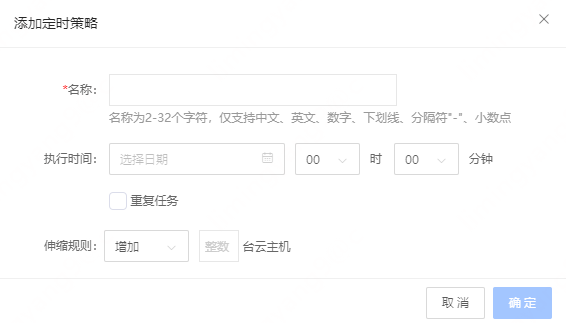

# 新增自动伸缩策略

开启自动伸缩后，您可按需配置自动伸缩策略，包括告警策略及定时策略。

## 告警策略

告警策略基于系统监控监控指标（如CPU、内存利用率）或自定义监控指标配置的告警策略来动态扩展伸缩组中的实例数，适用于监控指标与组内实例数量呈线性波动，通过监控告警来触发实例调整的场景。

### 操作步骤

1. 访问[高可用组控制台](https://cns-console.jdcloud.com/availabilitygroup/list)，即进入高可用组列表页面。或访问[京东云控制台](https://console.jdcloud.com)点击左侧导航栏【弹性计算】-【高可用组】进入高可用组列表页。 
2. 找到对应高可用组，点击名称进入详情页。
3. 点击【自动伸缩Tab】-【告警策略】-【添加】按钮。
4. 在弹出弹窗中设置告警策略，系统监控和自定义监控需要配置的告警策略有所不同，使用自定义监控时可查询云监控获取有效的命名空间和自定义指标，须注意在上报自定义监控时必须在 `dimensions` 中以 `"ag_id":"xxx"` 的格式将需要关联的高可用组ID上报至云监控，详细请参考 [自定义监控-上报监控数据](https://docs.jdcloud.com/cn/monitoring/reporting-monitoring-data)。当前统计周期支持1分钟、2分钟、5分钟、15分钟、30分钟及一小时。统计方法支持平均值、最小值及最大值。	

## 定时策略

定时策略将在您设置具体的时间及周期，定时增删高可用组内实例数，适用于可预测业务负载boding情况。
		
### 操作步骤

1. 访问[高可用组控制台](https://cns-console.jdcloud.com/availabilitygroup/list)，即进入高可用组列表页面。或访问[京东云控制台](https://console.jdcloud.com)点击左侧导航栏【弹性计算】-【高可用组】进入高可用组列表页。 
2. 找到对应高可用组，点击名称进入详情页。
3. 点击【自动伸缩Tab】-【定时策略】-【添加】按钮。
4. 在弹出弹窗中设置定时策略名称、执行时间和伸缩规则等信息。您也可以勾选【重复任务】以定义周期定时执行任务。	
5. 您需要指定定时任务的执行时间及具体的执行操作，如新增云主机数量或移除实例数。此外支持您对该策略设置重复周期及重复执行结束时间，当前支持按日、周及月在执行时间至重复结束时间之间重复执行定时操作。

