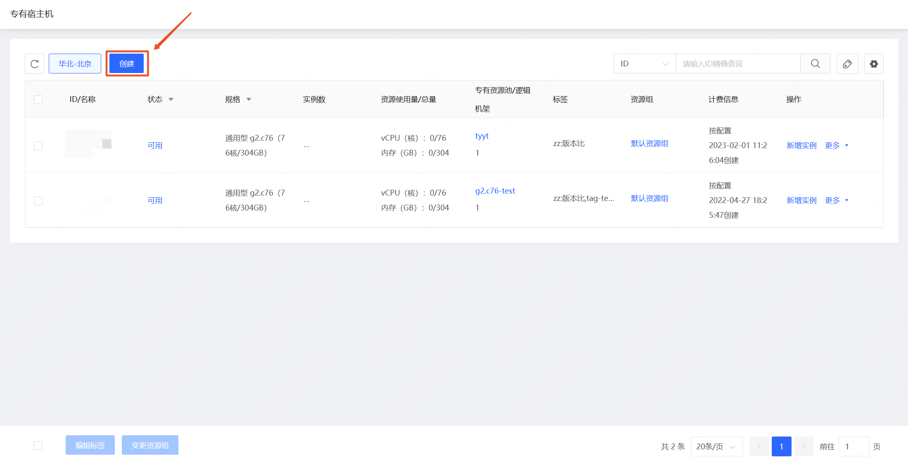
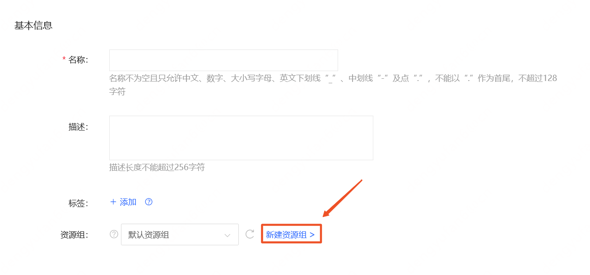

# 专有宿专有宿主机加入资源组

创建专有宿主机时，支持选择指定资源组添加，如不选择将加入“默认资源组”。

## 操作步骤

- 访问[专有宿主机控制台](https://cns-console.jdcloud.com/host/dedicatedHost/list)，即进入专有宿主机列表页面。或访问[京东云控制台](https://console.jdcloud.com)点击顶部导航栏 **弹性计算-专有宿主机** 进入专有宿主机列表页。
- 点击创建进入专有宿主机创建页。

- 在创建页面的 “基本信息” 中选择期望加入的资源组，如需新建请点击右侧的链接前往资源组页面进行创建。

