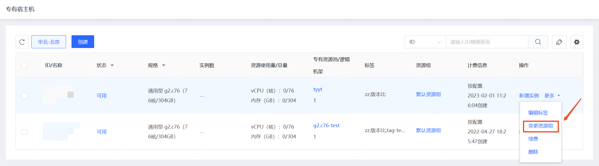
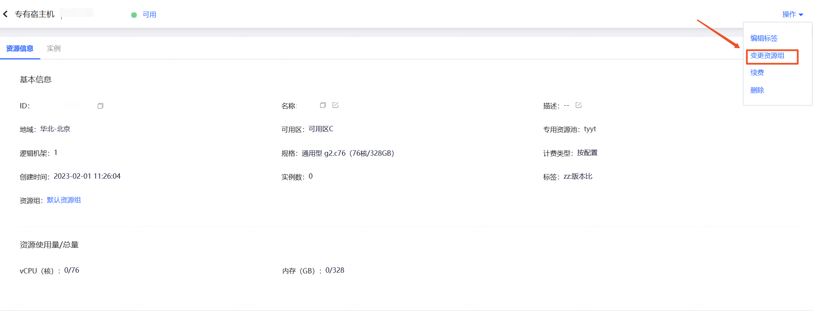
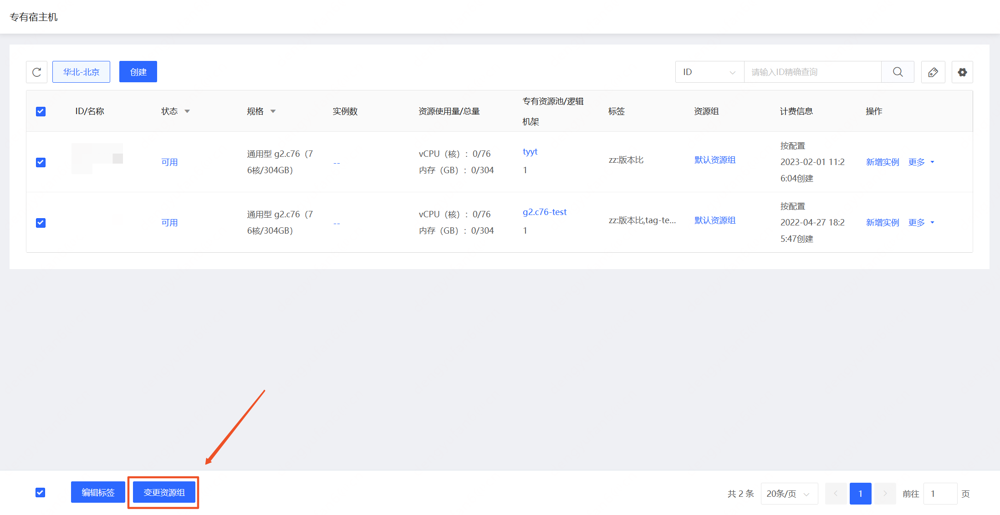
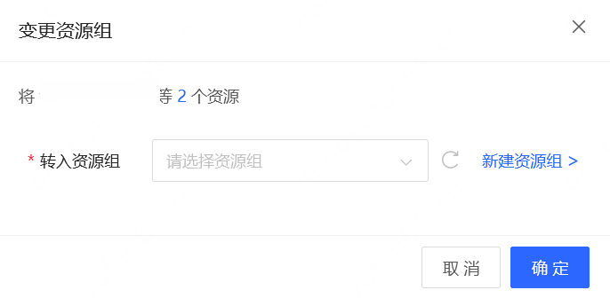

# 变更资源组

专有宿主机加入资源组后，您可参考下方操作变更专有宿主机所在资源组。

## 操作步骤

- 访问[专有宿主机控制台](https://cns-console.jdcloud.com/host/dedicatedHost/list)，即进入专有宿主机列表页面。或访问[京东云控制台](https://console.jdcloud.com)点击顶部导航栏 **弹性计算-专有宿主机** 进入专有宿主机列表页。

- 点击专有宿主机列表页【操作-更多-变更资源组】或进入专有宿主机详情页点击右上角的【操作-变更资源组】,即可变更单一专有宿主机所在的资源组。

 
 

- 在专有宿主机列表页勾选想要变更资源组的专有宿主机，点击下方横栏的【变更资源组】按钮，在弹窗中选择欲转入的目标资源组，即可批量变更多台专有宿主机所在的资源组。
 
 

