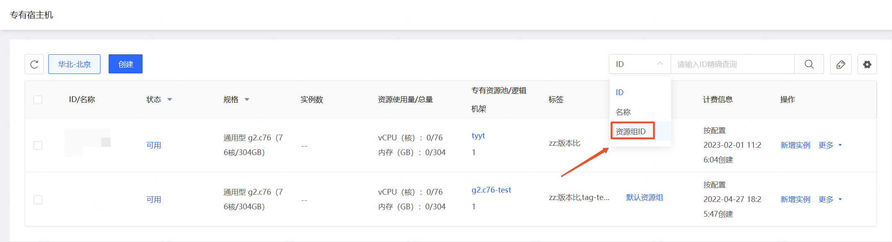

# 资源组筛选

可在专有宿主机控制台基于资源组ID对专有宿主机进行筛选。

## 操作步骤

- 访问[专有宿主机控制台](https://cns-console.jdcloud.com/host/dedicatedHost/list)，即进入专有宿主机列表页面。或访问[京东云控制台](https://console.jdcloud.com)点击顶部导航栏 **弹性计算-专有宿主机** 进入专有宿主机列表页。
- 在列表页右上角的搜索框中，下拉选择搜索条件-资源组ID，输入资源组ID后进行筛选。

