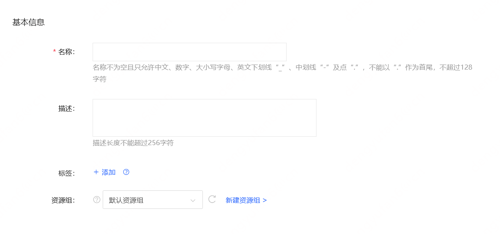

# 编辑标签
当您新建专有宿主机或已拥有专有宿主机时，可以通过编辑标签来实现实例与标签的绑定，对于已绑定标签的专有宿主机，当您需要更改其绑定标签情况时，也可通过编辑标签实现。

## 实例创建时绑定标签

### 前提条件及限制
* 单专有宿主机最多可绑定10个标签；
* 同一个资源，标签键不能重复，编辑前后标签键（Key）相同而值不同则将以新Value值覆盖旧Value值。

### 操作步骤

1. 访问[专有宿主机控制台](https://cns-console.jdcloud.com/host/dedicatedHost/list)，即进入专有宿主机列表页面。或访问[京东云控制台](https://console.jdcloud.com)点击顶部导航栏 **弹性计算-专有宿主机** 进入专有宿主机列表页。
2. 选择创建专有宿主机所属地域，点击 **创建** 按钮，进入专有宿主机购买页面。在基本信息中—标签中，点击“+添加” 按钮为您的专有宿主机资源添加标签。  
3.您可以选择通过现有标签或是标签模板新增标签，对于现有标签的标签键、标签值输入框，可以自定义新的标签键/值添加标签，也可以直接下拉选择已有标签，或是根据输入进行模糊匹配后选择添加。对于标签模板的标签键、标签值选择框，仅支持下拉选择预先创建好的标签键、标签值。您可以访问[标签模板控制台](https://tagservice-console.jdcloud.com/template-tag)新建标签模板。如果标签参数不合法，请根据标签框下方提示进行对应修改，每个资源最多绑定 10 个标签。

>注意：
>* 当进行新增标签键或新增标签值时，在您手动输入新增内容之后，请通过回车或鼠标选中的方式触发您的新增操作，确保新输入内容能够保存且显示在当前输入框中。

4. 完成标签编辑并且填写完成专有宿主机创建页面的其他信息后，点击**立即购买**创建资源。 

5. 创建后您可以通过专有宿主机列表页/详情页查看标签与专有宿主机是否绑定成功，也可以单击专有宿主机列表上方的【标签筛选】按钮 [筛选专有宿主机](Filter-by-Tag.md)。若未显示标签信息项，可通过自定义列表选择显示标签信息项。如果发现本次创建资源未与标签成功绑定，请参考 [专有宿主机创建后编辑标签](Edit-Tag#user-content-1) 重新进行标签绑定操作。

## 专有宿主机创建后编辑标签

### 前提条件及限制
* 专有宿主机状态不为 **删除中**；
* 单专有宿主机最多可绑定10个标签；
* 同一个资源，标签键不能重复，编辑前后标签键（Key）相同而值不同则将以新Value值覆盖旧Value值。

### 操作步骤

1. 访问[专有宿主机控制台](https://cns-console.jdcloud.com/host/dedicatedHost/list)，即进入专有宿主机列表页面。或访问[京东云控制台](https://console.jdcloud.com)点击顶部导航栏 **弹性计算-专有宿主机** 进入专有宿主机列表页。
2. 选择地域后在专有宿主机列表中选择编辑标签的专有宿主机，确认其状态不为为 **删除中**。
3. 单专有宿主机操作：点击 **操作-更多-编辑标签** 按钮，或点击专有宿主机名称进入详情页后点击 **操作-编辑标签** 按钮。
4. 在弹出的 **编辑标签** 弹窗里，当前标签默认显示专有宿主机当前已绑定的标签，以及该标签所绑定的资源数量。
5. 可以根据现有标签直接下拉选择，也可以根据输入进行模糊匹配后选择对应标签键/值（Key-Value）进行添加，还可以通过标签模板下拉选择预先创建好的标签键/值进行添加，点击 **添加** 后将显示在当前标签内。  
6. 单击 **确定**，将按照当前标签内显示情况完成编辑标签。

>注意：
>* 点击 **添加** 按钮不触发编辑标签，只有点击 **确定** 按钮才会触发编辑标签。系统会根据编辑后的标签对当前专有宿主机先解绑不再需要的标签，后绑定新标签/覆盖原有标签。
>* 例：专有宿主机机当前绑定了以下标签：“所有者：产品研发，用途：测试，操作人：管理员，环境：预发”，需要编辑成：“所有人：产品研发，用途：开发，操作人：管理员”，则将先操作解绑标签“环境：预发”，再操作绑定新标签/覆盖原有标签：“用途：开发”。若遇到网络抖动可能会遇到解绑成功而绑定/覆盖不成功的情况，此时还请再次操作编辑标签。

7. 完成编辑标签后，您可以通过专有宿主机列表页/详情页查看标签是否编辑成功，也可以单击实例列表上方的 **标签筛选** 按钮 [筛选专有宿主机](Filter-by-Tag.md)。请注意列表页若未显示标签信息项，可通过自定义列表选择显示标签。

## 相关参考
[根据标签筛选实例](Filter-by-Tag.md)

