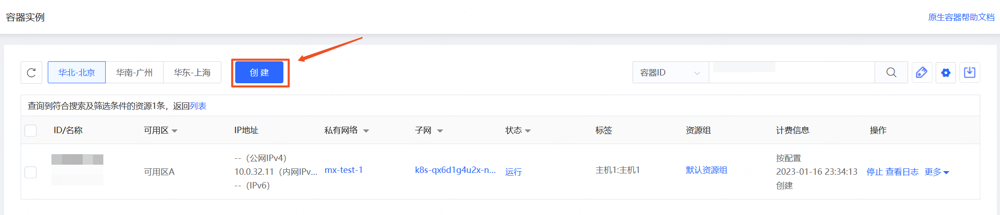
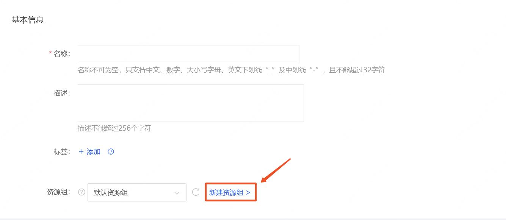

# 加入资源组

创建资源时，支持选择指定资源组添加，如不选择将加入“默认资源组”。

## 操作步骤

- 访问[容器实例控制台]( https://cns-console.jdcloud.com/host/container/list)或是[Pod控制台]( https://cns-console.jdcloud.com/host/pod/list)。或访问[京东云控制台](https://console.jdcloud.com)点击顶部导航栏 **弹性计算-原生容器-容器实例/Pod** 进入资源列表页。
- 点击创建进入资源创建页。

- 在创建页面的 “基本信息” 中选择期望加入的资源组，如需新建请点击右侧的链接前往资源组页面进行创建。

